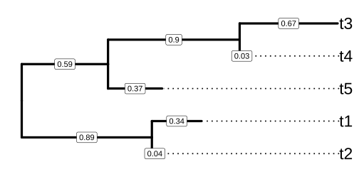
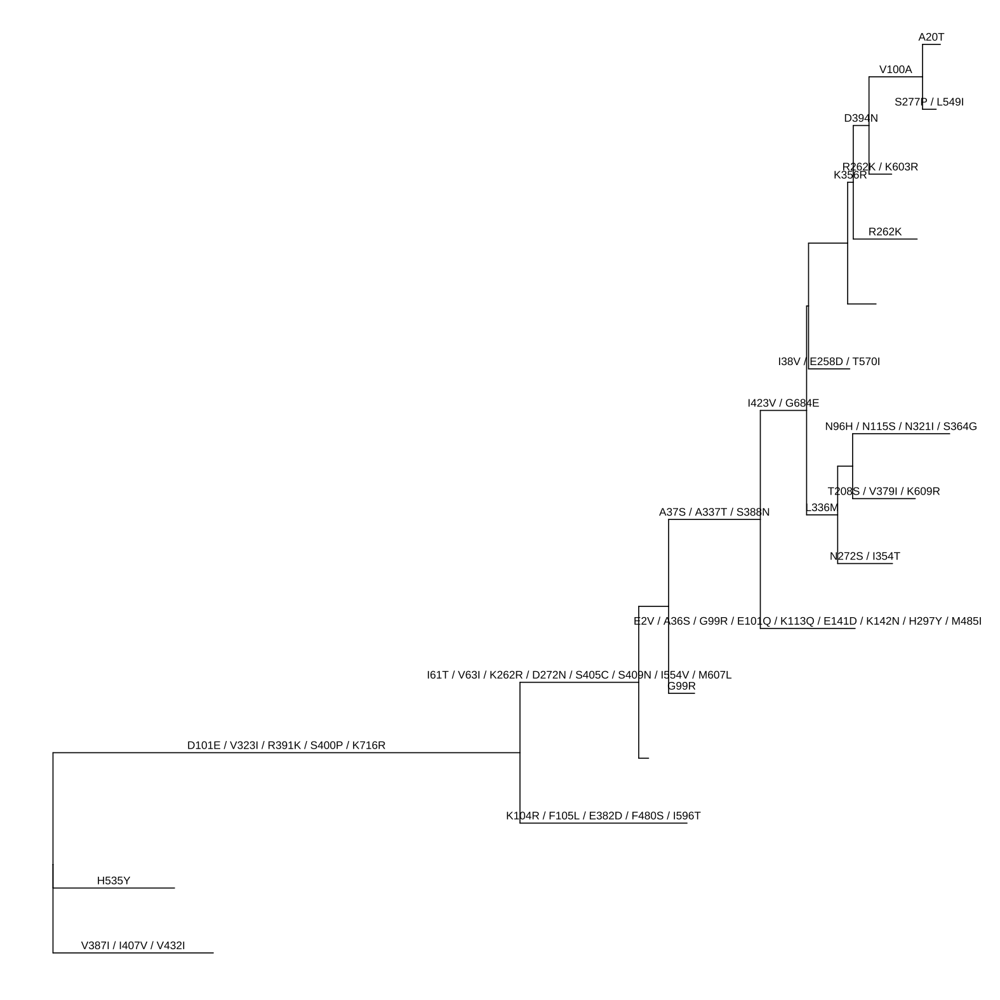

# 导入 tree 数据

2026-09-02⭐
@author Jiawei Mao
***
## 1. 系统发育树构建概述

系统发育树用于描述一组生物体之间的谱系（或亲缘）关系，通常基于这些生物体的基因序列来构建。如图 1.1 所示，有根系统发育树展示了一种进化历史模型：它通过树节点之间的祖先-后代关系，以及不同亲缘层级上“姐妹”或“旁系”生物体进行聚类来呈现这种关系。

在传染病研究中，系统发育树通常基于病原体的基因或基因组序列来构建，用以展示不同病原体样本之间的遗传相似程度。这有助于揭示潜在、未被观察到的流行病学关联，并追溯疫情爆发的可能源头。

![Components of a phylogenetic tree. External nodes (green circles), also called ‘tips’, represent actual organisms sampled and sequenced (e.g., viruses in infectious disease research). They are the ‘taxa’ in the terminology of evolutionary biology. The internal nodes (blue circles) represent hypothetical ancestors for the tips. The root (red circle) is the common ancestor of all species in the tree. The horizontal lines are branches and represent evolutionary changes (gray number) measured in a unit of time or genetic divergence. The bar at the bottom provides the scale of these branch lengths.](./images/phylogeny-1.svg)

> **图 1.1：系统发育树的组成**
>
> **外部节点**（绿色圆圈）也被称为“末端（tips）”，代表实际被采样和测序的生物体（例如在传染病研究中的病毒）。在进化生物学术语中，它们被称为“分类单元（taxa）”。
>
> **内部节点**（蓝色圆圈）代表末端节点的假想祖先。
>
> **根节点**（红色圆圈）则是树中所有物种的共同祖先。
>
> **水平线**称为“分支（branches）”，代表以时间单位或遗传分化程度来衡量的进化改变（灰色数字）。底部的横条（比例尺）提供了这些分支长度的标度。”

系统发育树可以利用遗传序列，通过基于距离的方法或基于特征的方法进行构建：

- **基于距离**的方法：包括非加权算术平均聚类法（UPGMA）和邻接法（Neighbor-joining, NJ），它们是基于序列间计算得出的成对遗传距离矩阵来进行推断的。
- **基于特征**的方法：包括最大简约法（MP）（Fitch, 1971）、最大似然法（ML）（Felsenstein, 1981）以及贝叶斯马尔可夫链蒙特卡洛法（BMCMC）（Rannala & Yang, 1996）。这些方法基于描述遗传特征进化过程的数学模型，并根据各自的最优标准来寻找最佳系统发育树。

**最大简约法**（MP）假设进化改变是罕见的，因此它旨在使特征状态的改变量（如 DNA 替换的数量）降至最低。这一标准类似于奥卡姆剃刀原理，即能够解释数据的最简单假设即为最佳假设。**非加权简约法**假设不同特征（核苷酸或氨基酸）发生突变的概率相等；而加权方法则假设突变的概率是不均等的（例如，密码子的第三位比其他位点更容易发生突变，且转换突变的频率高于颠换突变）。MP 方法的概念简单直观，这可能是它在生物学家中广受欢迎的原因，因为这些研究者往往更关注科学问题本身，而非分析的计算细节。然而，该方法存在几个缺点，特别是树的推断容易受到一种被称为“长枝吸引（LBA）”的系统性误差的影响，该误差会错误地将亲缘关系较远的谱系推断为关系较近（Felsenstein, 1978）。这是因为 MP 方法未能充分考虑到许多序列进化因素（如回复突变和平行进化），而这些因素很难从现有的遗传数据中直接观察到。

**最大似然法**（ML）和**贝叶斯马尔可夫链蒙特卡洛法**（BMCMC）是构建系统发育树最常用的两种方法，在科学文献中也最为常见。ML 和 BMCMC 方法都需要序列进化的替换模型。针对不同的序列数据，有不同的替换模型来描述 DNA、密码子和氨基酸的进化过程。常见的核苷酸替换模型包括 JC69、K2P、F81、HKY 和 GTR（Arenen, 2015）。这些模型还可以结合位点间速率变异（记为 +Γ）（Yang, 1994）以及不变位点的比例（记为 +I）（Shoemaker & Fitch, 1989）一起使用。先前的研究（Lemmon & Moriarty, 2004）表明，替换模型设定错误可能会导致系统发育推断产生偏差，因此建议通过程序化检验来选择最佳拟合的替换模型。

ML 方法的最优标准是寻找在给定序列数据下使似然值最大化的树。ML 方法的流程相对简单：计算某棵树的似然值，并不断优化其拓扑结构和分支长度（如果未固定，还包括替换模型参数），直到找到最佳树为止。通常使用启发式搜索（如 PhyML 和 RAxML 中实现的算法）来基于似然标准寻找最佳树。而贝叶斯方法则是基于给定的替换模型，通过 MCMC 采样树，从而找到使后验概率最大化的树。BMCMC 的优势之一在于，可以自然且便捷地从 MCMC 过程中的采样树里获取参数方差和树拓扑结构的不确定性（通过后验分支概率体现）。此外，拓扑结构的不确定性对其他参数估计的影响，也被自然地整合到了 BMCMC 的系统发育框架中。

在一棵简单的系统发育树中，与树的分支/节点相关联的数据可以是分支长度（表示遗传分化或时间分化），以及谱系支持度，例如通过自举法（bootstrapping）估算的自举值，或从 BMCMC 分析的采样树中汇总得出的后验分支概率。

## 2. 系统发育树文件格式

为了存储系统发育树及其节点和分支的相关数据，人们设计了多种文件格式。其中最常用的三种格式是 Newick 格式、NEXUS 格式（Maddison 等人，1997年）以及 Phylip 格式（Felsenstein，1989年）。此外，还有一些格式（如 NHX）是在 Newick 格式的基础上扩展而来的。

在进化生物学领域，大多数软件都支持将 Newick 和 NEXUS 格式作为输入文件。同时，部分软件工具（如 BEAST 和 MrBayes）通过引入新的规则或数据块来存储进化推断结果，从而输出了更新的标准文件。而在其他情况下（如 PAML 和 r8s），输出的日志文件则只能被其对应的单一软件所识别。

### 2.1 Newick 树格式

Newick 树格式是以计算机可读形式表示系统发育树的标准格式。



> **图 1.2：用于演示使用 Newick 文本编码树结构的示例树。** 末端节点（Tips）在右侧对齐，分支长度标注在每条分支的中间位置。

图 1.2 所示的有根树可以通过以下字符序列以 Newick 树文本的形式来表示。

```
((t2:0.04,t1:0.34):0.89,(t5:0.37,(t4:0.03,t3:0.67):0.9):0.59); 
```

Newick 树文本以分号（`;`）结尾。内部节点由一对匹配的圆括号表示，括号内包含该节点的直接后代节点。例如，`(t2:0.04,t1:0.34)` 表示 t2 和 t1 这两个直接后代的父节点。同级节点之间用逗号分隔，末端节点（tips）则直接使用其名称表示。分支长度（从父节点到子节点的距离）由子节点名称后跟一个冒号和实数来表示。与内部节点或分支相关联的单一数据（如自举值 bootstrap values）可作为节点标签进行编码，并以简单的文本或数字形式写在冒号之前。

Newick 树格式由 Meacham 于 1984 年为系统发育推断软件包（Phylogeny Inference Package，简称 PHYLIP）开发（Retief，2000年）。如今，Newick 格式已成为应用最广泛的树文件格式，被 PHYLIP、PAUP*（Wilgenbusch & Swofford，2003年）、TREE-PUZZLE（Schmidt 等人，2002年）、MrBayes 等众多软件程序所使用。而 Phylip 树格式则包含一个 Phylip 多序列比对（MSA）文件，以及基于该文件中比对序列构建的对应 Newick 树文本。

### 2.2 NEXUS 树格式

NEXUS 格式（Maddison 等人，1997年）将 Newick 树文本与相关信息整合在一起，并将其组织成被称为“块（blocks）”的独立单元。一个 NEXUS 块具有以下结构：

```
#NEXUS
...
BEGIN characters;
...
END;
```

例如，上述示例树可以保存为以下 NEXUS 格式：

```
#NEXUS
[R-package APE, Wed Jul 13 17:10:18 2022]

BEGIN TAXA;
    DIMENSIONS NTAX = 5;
    TAXLABELS
        t2
        t1
        t5
        t4
        t3
    ;
END;
BEGIN TREES;
    TRANSLATE
        1   t2,
        2   t1,
        3   t5,
        4   t4,
        5   t3
    ;
    TREE * UNTITLED = [&R]
((1:0.04,2:0.34):0.89,(3:0.37,(4:0.03,5:0.67):0.9):0.59);
END;
```

使用**方括号**来添加注释。大多数程序都能识别一些常用的块，例如 TAXA 块（包含分类单元信息）、DATA 块（包含数据矩阵，如序列比对结果）和 TREE 块（包含系统发育树，即 Newick 树文本）。

值得注意的是，NEXUS 块的种类非常多样，其中一些仅能被特定的单一程序识别。例如，由 PAUP* 导出的 NEXUS 文件包含一个 `paup` 块，用于存储 PAUP* 的命令；而 FigTree 导出的 NEXUS 文件则包含一个 `figtree` 块，用于存储可视化设置。NEXUS 格式将不同类型的数据组织到不同的块中，支持读取 NEXUS 格式的程序在解析时，能够识别并读取它们支持的块，同时忽略无法识别的块。这种机制非常巧妙，使得不同的程序可以共用同一种文件格式，且在遇到不支持的数据类型时也不会导致程序崩溃。

需要强调的是，大多数程序仅支持解析 TAXA、DATA 和 TREE 这三个块。因此，如果能有一个程序或平台可以通用读取 NEXUS 文件中的所有数据块，将对系统发育数据的整合工作大有裨益。

DATA 块被广泛用于存储序列比对结果。为此，用户也可以将树和序列数据以 Phylip 格式进行存储，其本质上分别对应 Phylip 多序列比对文件和 Newick 树文本。这种格式在 PHYLIP 软件中得到了应用。

### 2.3 New Hampshire 扩展格式（NHX）

Newick、NEXUS 和 Phylip 格式主要用于存储系统发育树以及与内部节点或分支相关的基本单一数据。除了上述在分支和节点上进行的单一数据注释外，基于 Newick 格式（又称 New Hampshire 格式）开发的 New Hampshire 扩展格式（NHX），引入了标签（tags）机制，以便将多个数据字段与树的节点（包括内部节点和末端节点）关联起来。标签放置在分支长度之后，且必须包裹在 `[&&NHX` 和 `]` 之间。由于 NEXUS 格式将方括号 `[` 和 `]` 之间的内容定义为注释，这种设计使得 NHX 能够与 NEXUS 格式保持兼容。NHX 也是 PHYLDOG（Boussau 等人，2013年）和 RevBayes（Höhna 等人，2016年）软件的输出格式。A Tree Viewer（ATV）（Zmasek & Eddy，2001年）是一款支持显示 NHX 格式注释数据的 Java 工具，但该软件包目前已停止维护。

以下是 NHX 定义文档中的一个示例树：

```
(((ADH2:0.1[&&NHX:S=human], ADH1:0.11[&&NHX:S=human]):0.05
[&&NHX:S=primates:D=Y:B=100],ADHY:0.1[&&NHX:S=nematode],
ADHX:0.12[&&NHX:S=insect]):0.1[&&NHX:S=metazoa:D=N],(ADH4:0.09
[&&NHX:S=yeast],ADH3:0.13[&&NHX:S=yeast],ADH2:0.12[&&NHX:S=yeast],
ADH1:0.11[&&NHX:S=yeast]):0.1[&&NHX:S=Fungi])[&&NHX:D=N];
```

### 2.4 Jplace 格式

为了存储映射到系统发育树上的下一代测序（NGS）短读长数据（用于宏基因组分类），Matsen（Matsen 等人，2012年）提出了 jplace 格式来记录此类系统发育放置（phylogenetic placements）结果。Jplace 格式基于 JSON，包含五个键（keys）：tree、fields、placements、metadata 和 version。其中:

- `tree` 的值包含树文本，它是对 Newick 树格式的扩展：在分支长度之后（如果可用）将边标签放在方括号内，并在边标签之后将边编号放在花括号内。
- `fields` 的值包含放置数据的表头信息。
- `placements` 的值是一个 pquery（放置查询）列表。每个 pquery 包含两个键：`p` 代表放置结果（placements），`n` 代表名称（name），或使用 `nm` 代表带有重复次数的名称（names with multiplicity）。`p` 的值则是 pquery 的放置结果列表。

以下是一个 jplace 示例文件：

```json
{
    "tree": "(((((((A:4{1},B:4{2}):6{3},C:5{4}):8{5},D:6{6}):
    3{7},E:21{8}):10{9},((F:4{10},G:12{11}):14{12},H:8{13}):
    13{14}):13{15},((I:5{16},J:2{17}):30{18},(K:11{19},
    L:11{20}):2{21}):17{22}):4{23},M:56{24});",
    "placements": [
    {"p":[24, -61371.300778, 0.333344, 0.000003, 0.003887], 
     "n":["AA"]
    },
    {"p":[[1, -61312.210786, 0.333335, 0.000001, 0.000003],
          [2, -61322.210823, 0.333322, 0.000003, 0.000003],
          [3, -61352.210823, 0.333322, 0.000961, 0.000003]],
     "n":["BB"]
    },
    {"p":[[8, -61312.229128, 0.200011, 0.000001, 0.000003],
          [9, -61322.229179, 0.200000, 0.000003, 0.000003],
          [10, -61342.229223, 0.199992, 0.000003, 0.000003]], 
    "n":["CC"]
    }
    ],
    "metadata": {"info": "a jplace sample file"},
    "version" : 2,
    "fields": ["edge_num", "likelihood", "like_weight_ratio", 
    "distal_length", "pendant_length"
    ]
}
```

Jplace 是 PPLACER（Matsen 等人，2010年）和进化放置算法（EPA）（Berger 等人，2011年）的输出格式。但这两款程序本身并不包含用于可视化放置结果的工具。为此，PPLACER 提供了一个名为 placeviz 的工具，可将 jplace 文件转换为 phyloXML 或 Newick 格式，进而通过 Archaeopteryx 软件进行可视化。

### 2.5 软件输出格式

**RAxML**（Stamatakis，2014年）可以通过将自举值（bootstrap values）存储为内部节点标签来输出 Newick 格式。RAxML 支持的另一种方式是将自举值放在分支长度之后的方括号内。然而，大多数支持 Newick 格式的软件并不支持这种写法，它们通常会忽略方括号中的内容。

[**BEAST**](https://www.beast2.org/)（Bouckaert 等人，2014年）的输出基于 NEXUS 格式，它同样在树模块（tree block）中引入方括号，用于存储由 BEAST 推断出的演化证据。如果特征值的长度大于 1（例如最高后验概率密度（HPD）或替换速率范围），方括号内还可以包含花括号。这些括号被放置在节点与分支长度之间（即如果存在标签，则放在标签之后、冒号之前）。由于方括号在 Newick 格式中并未被定义，且在 NEXUS 格式中是保留的注释字符，因此标准的 NEXUS 解析器通常会忽略这些信息。

以下是一个 BEAST 输出的 TREE 模块示例：

```
TREE * TREE1 = [&R] (((11[&length=9.47]:9.39,14[&length=6.47]:6.39)
[&length=25.72]:25.44,4[&length=9.14]:8.82)[&length=3.01]:3.1,
(12[&length=0.62]:0.57,(10[&length=1.6]:1.56,(7[&length=5.21]:5.19,
((((2[&length=3.3]:3.26,(1[&length=1.34]:1.32,(6[&length=0.85]:0.83,
13[&length=0.85]:0.83)[&length=2.5]:2.49)[&length=0.97]:0.94)
[&length=0.5]:0.5,9[&length=1.76]:1.76)[&length=2.41]:2.36,
8[&length=2.19]:2.11)[&length=0.27]:0.24,(3[&length=3.33]:3.31,
(15[&length=5.29]:5.27,5[&length=3.29]:3.27)[&length=1.04]:1.04)
[&length=1.98]:2.04)[&length=2.83]:2.84)[&length=5.39]:5.37)
[&length=2.02]:2)[&length=4.35]:4.36)[&length=0];
```

BEAST 的输出结果可以包含多种不同的进化推断信息，具体取决于在 BEAUti 中定义的模型。例如，在分子钟分析中，输出结果包含速率（rate）、长度（length）、高度（height）、后验概率（posterior）以及用于不确定性估计的相应最高后验概率密度（HPD）和范围。其中，rate 是分支的估计进化速率；length 是分支以年为单位的时间长度；height 是从该节点到根节点的时间；而 posterior 则是贝叶斯分支可信度值。

上述示例是一棵分子钟分析的输出树，理应包含这些推断信息。为了节省篇幅，上文仅展示了长度（length）的估计结果。此外，分子进化遗传学分析软件（MEGA）（Kumar 等人，2016年）也支持导出与 BEAST 兼容的 NEXUS 格式树文件（详见 1.3.2 节）。

[MrBayes](https://nbisweden.github.io/MrBayes/)（Huelsenbeck & Ronquist，2001年）是一款利用马尔可夫链蒙特卡洛（MCMC）方法从后验概率分布中进行抽样的程序。它的输出文件通过两组方括号分别对节点和分支进行注释。例如下面的例子，节点的方括号内包含后验分支概率，分支的方括号内包含分支长度的估计值：

```
  tree con_all_compat = [&U] (8[&prob=1.0]:2.94e-1[&length_mean=2.9e-1],
10[&prob=1.0]:2.25e-1[&length_mean=2.2e-1],((((1[&prob=1.0]:1.43e-1
[&length_mean=1.4e-1],2[&prob=1.0]:1.92e-1[&length_mean=1.9e-1])[&prob=1.0]:
1.24e-1[&length_mean=1.2e-1],9[&prob=1.0]:2.27e-1[&length_mean=2.2e-1])
[&prob=1.0]:1.72e-1[&length_mean=1.7e-1],12[&prob=1.0]:5.11e-1
[&length_mean=5.1e-1])[&prob=1.0]:1.76e-1[&length_mean=1.7e-1],
(((3[&prob=1.0]:5.46e-2[&length_mean=5.4e-2],(6[&prob=1.0]:1.03e-2
[&length_mean=1.0e-2],7[&prob=1.0]:7.13e-3[&length_mean=7.2e-3])[&prob=1.0]:
6.93e-2[&length_mean=6.9e-2])[&prob=1.0]:6.03e-2[&length_mean=6.0e-2],
(4[&prob=1.0]:6.27e-2[&length_mean=6.2e-2],5[&prob=1.0]:6.31e-2
[&length_mean=6.3e-2])[&prob=1.0]:6.07e-2[&length_mean=6.0e-2])[&prob=1.0]:,
1.80e-1[&length_mean=1.8e-1]11[&prob=1.0]:2.37e-1[&length_mean=2.3e-1])
[&prob=1.0]:4.05e-1[&length_mean=4.0e-1])[&prob=1.0]:1.16e+000
[&length_mean=1.162699558201079e+000])[&prob=1.0][&length_mean=0];
```

为了节省篇幅，上述示例中删去了大部分推断信息，仅保留了 `prob`（分支概率）和 `length_mean`（分支长度均值）。该文件的完整版本还包含用于概率推断的 `prob_stddev`（概率标准差）、`prob_range`（概率范围）、`prob(percent)`（概率百分比）、`prob+-sd`（概率加减标准差），以及每个分支的 `length_median`（分支长度中位数）和 `length_95%_HPD`（分支长度 95% 最高后验概率密度）。

支持 NEXUS 格式的软件在解析 BEAST 和 MrBayes 的输出文件时，通常会忽略这些推断信息（将其视为注释丢弃）。FigTree 支持解析带有推断信息的 BEAST 和 MrBayes 输出文件，并可用于在树上进行展示或注释。然而，要提取这些数据进行进一步分析仍然具有挑战性。

HyPhy（Pond 等人，2005年）可进行多种系统发育分析，包括祖先序列重建。在进行祖先序列重建时，这些序列和 Newick 树文本会以 NEXUS 格式存储，作为主要的分析输出。但它并未完全遵循 NEXUS 的定义，而是仅将祖先节点标签放在了 TAXA 块中，而非外部节点标签中。MATRIX 块包含了祖先节点的序列比对结果，但由于其中不包含节点标签，因此无法将其与 TREES 块中存储的树进行对应。以下是示例输出（为节省篇幅，仅展示了比对序列的前 72 个碱基对）：

```
#NEXUS

[
Generated by HYPHY 2.0020110620beta(MP) for MacOS(Universal Binary) 
    on Tue Dec 23 13:52:34 2014

]

BEGIN TAXA;
    DIMENSIONS NTAX = 13;
    TAXLABELS
        'Node1' 'Node2' 'Node3' 'Node4' 'Node5' 'Node12' 'Node13' 'Node15'
            'Node18' 'Node20' 'Node22' 'Node24' 'Node26' ;
END;

BEGIN CHARACTERS;
    DIMENSIONS NCHAR = 2148;
    FORMAT
        DATATYPE = DNA

        GAP=-
        MISSING=?
        NOLABELS
    ;

MATRIX
 ATGGAAGACTTTGTGCGACAATGCTTCAATCCAATGATCGTCGAGCTTGCGGAAAAGGCAATGAAAGAATAT
 ATGGAAGACTTTGTGCGACAATGCTTCAATCCAATGATCGTCGAGCTTGCGGAAAAGGCAATGAAAGAATAT
 ATGGAAGACTTTGTGCGACAATGCTTCAATCCAATGATCGTCGAGCTTGCGGAAAAGGCAATGAAAGAATAT
 ATGGAAGACTTTGTGCGACAATGCTTCAATCCAATGATCGTCGAGCTTGCGGAAAAGGCAATGAAAGAATAT
 ATGGAAGACTTTGTGCGACAATGCTTCAATCCAATGATTGTCGAGCTTGCGGAAAAGGCAATGAAAGAATAT
 ATGGAAGACTTTGTGCGACAATGCTTCAATCCAATGATCGTCGAGCTTGCGGAAAAGGCAATGAAAGAATAT
 ATGGAAGACTTTGTGCGACAATGCTTCAATCCAATGATCGTCGAGCTTGCGGAAAAGGCAATGAAAGAATAT
 ATGGAAGACTTTGTGCGACAATGCTTCAATCCAATGATCGTCGAGCTTGCGGAAAAGGCAATGAAAGAATAT
 ATGGAAGACTTTGTGCGACAATGCTTCAATCCAATGATCGTCGAGCTTGCGGAAAAGGCAATGAAAGAATAT
 ATGGAAGACTTTGTGCGACAATGCTTCAATCCAATGATCGTCGAGCTTGCGGAAAAGGCAATGAAAGAATAT
 ATGGAAGACTTTGTGCGACAATGCTTCAATCCAATGATCGTCGAGCTTGCGGAAAAGGCAATGAAAGAATAT
 ATGGAAGACTTTGTGCGACAATGCTTCAATCCAATGATCGTCGAGCTTGCGGAAAAGGCAATGAAAGAATAT
 ATGGAAGACTTTGTGCGACAGTGCTTCAATCCAATGATCGTCGAGCTTGCGGAAAAGGCAATGAAAGAATAT
END;

BEGIN TREES;
    TREE tree = (K,N,(D,(L,(J,(G,((C,(E,O)),(H,(I,(B,(A,(F,M)))))))))));
END;
```

此外，还有许多其他应用程序能够输出包含丰富信息的文本，这些文本中同样含有系统发育树及相关数据。例如，r8s（Sanderson，2003年）会在其日志文件中输出三棵树，分别为：按时间缩放的分支树（TREE）、按替换速率缩放的分支树（RATE）以及按绝对替换数缩放的分支树（PHYLO）。

最大似然系统发育分析软件（PAML）（Yang，2007年）是一个用于 DNA 或蛋白质序列系统发育分析的程序包。其中的两个主要程序 BASEML 和 CODEML 实现了多种模型。BASEML 利用多种可用的核苷酸替换模型（包括 JC69、K80、F81、F84、HKY85、T92、TN93 和 GTR）来估计树的拓扑结构、分支长度和替换参数。CODEML 则用于估计同义和非同义替换速率，并在密码子替换模型（Goldman & Yang，1994年）下对正选择进行似然比检验。

BASEML 会输出 mlb 文件，其中包含输入的序列（分类单元）比对结果、带有分支长度的系统发育树，以及估计的替换模型和其他参数。补充结果文件 rst 包含序列比对结果（如果执行了祖先序列重建，则还包含祖先序列），以及比对中每个位点演化的朴素经验贝叶斯（NBE）概率。CODEML 会输出 mlc 文件，其中包含树的结构以及同义和非同义替换速率的估计值。CODEML 同样会输出一个补充结果文件 rst，该文件与 BASEML 的类似，只是其“位点”被定义为密码子而非核苷酸。解析这些文件通常十分繁琐，往往需要多个后处理步骤，并且要求使用者具备编程专业知识（例如使用 Python 或 Perl）。

引入方括号来存储额外信息是非常普遍的做法，例如 RAxML 用于存储自举值（bootstrap value），NHX 格式用于注释，jplace 用于边标签，BEAST 用于进化估计等。然而，不同软件中放置方括号的位置并不一致，且方括号内的内容在存储关联数据时也遵循不同的规则，这使得解析关联数据变得十分困难。对于大多数软件而言，只要文件兼容，它们通常只会忽略方括号中的内容，仅解析树的结构。此外，有些文件中还包含无效字符（例如 jplace 格式树字段中的花括号），这甚至会导致标准的解析器无法解析树的结构。

从各种进化推断软件生成的不同分析输出中，提取有用的系统发育/分类单元相关信息，以便在同一棵系统发育树上进行展示和进一步分析，是一项非常困难的工作。FigTree 虽然支持 BEAST 的输出，但并不支持大多数其他包含进化推断或关联数据的软件输出。对于那些输出信息丰富的文本文件（如 r8s、PAML 等），任何树形查看软件都无法解析其树结构，用户需要具备一定的专业知识，才能从输出文件中手动提取系统发育树和其他有用的结果数据。然而，这种手动操作不仅效率低下，而且容易出错。

从该领域常用软件的不同分析输出中检索带有进化数据的系统发育树并非易事。其中一些文件（如 PAML 输出和 jplace 文件）缺乏用于解析的软件或编程库；而另一些文件（如 BEAST 和 MrBayes 输出）虽然可以解析，但由于进化推断信息存储在方括号中，大多数软件会将其作为注释省略。尽管 FigTree 支持可视化 BEAST 和 MrBayes 推断的进化统计数据，但不支持提取这些数据以供进一步分析。不同的软件包针对不同的分析实现了不同的算法（例如 PAML 用于计算 dN/dS，HyPhy 用于祖先序列重建，BEAST 用于天际线分析）。因此，在处理基因组序列数据时，迫切需要一种高效、灵活的方法来整合不同的分析推断结果，以实现全面的理解、比较和进一步分析。正是这一需求促使我们开发了该编程库，用于解析来自各种来源的系统发育树及相关数据。

## 3. 使用 treeio 获取树数据

系统发育树常用于展示物种间的进化关系。与分类单元（物种/菌株）相关的信息，可以在系统发育树描绘的进化历史背景下进行进一步分析。例如，可以通过研究树中流感病毒株的宿主信息，来了解某个病毒谱系的宿主范围。此外，与分类单元菌株直接相关的元数据（如分离宿主、时间、地点等）也常被用于进一步的进化或比较系统发育模型及分析，以推断其与病毒进化或传播过程相关的动态变化。所有这些元数据或其他表型、实验数据，通常作为与节点或分支相关的注释数据进行存储，并且往往由不同的分析程序以不一致的格式生成。

目前，将树数据导入 R 环境仍存在一定的局限性。虽然 `ape` 和 `phylobase` 等多个软件包可以导入 Newick 和 NEXUS 格式，`RNeXML` 可以解析 NeXML 格式，但该领域广泛使用的软件包的分析结果并未得到很好的支持。`phyext2` 和 `phytools` 可以解析 SIMMAP 的输出。尽管 `PHYLOCH` 能够导入 BEAST 和 MrBayes 的输出，但它仅解析了内部节点的属性，而忽略了末端节点（tip）的属性。导入其他许多软件的输出结果并提取关联数据，主要依赖于使用者的编程专业知识。此外，如何将外部数据（包括实验和临床数据）与系统发育树关联起来，也是进化生物学家面临的另一大障碍。

为了填补大多数树文件格式或软件输出无法在同一软件/平台内被解析的空白，研究人员开发了 R 语言包 `treeio`（Wang 等人，2020年），用于解析各种树文件格式以及常用进化分析软件的输出结果。`treeio` 包基于 R 编程语言开发。它不仅能解析树的结构，还能提取关联数据和进化推断信息，包括 NHX 注释、时钟速率推断（来自 BEAST 或 r8s 程序）、同义与非同义替换（来自 CODEML），以及祖先序列重建（来自 HyPhy、BASEML 或 CODEML）等。

目前，`treeio` 能够读取以下文件格式：Newick、NEXUS、New Hampshire 扩展格式（NHX）、jplace 和 Phylip；同时支持读取以下分析程序的数据输出：ASTRAL、BEAST、EPA、HyPhy、MEGA、MrBayes、PAML、PHYLDOG、PPLACER、r8s、RAxML 和 RevBayes 等。这得益于 `treeio` 中开发的多个解析函数（表 1.1）。

| 解析函数            | 描述                                                         |
| ------------------- | ------------------------------------------------------------ |
| `read.astral`       | 解析 ASTRAL 的输出结果                                       |
| `read.beast`        | 解析 BEAST 的输出结果                                        |
| `read.codeml`       | 解析 CodeML 的输出结果（rst 和 mlc 文件）                    |
| `read.codeml_mlc`   | 解析 mlc 文件（CodeML 的输出）                               |
| `read.fasta`        | 解析 FASTA 格式的序列文件                                    |
| `read.hyphy`        | 解析 HyPhy 的输出结果                                        |
| `read.hyphy.seq`    | 从 HyPhy 的输出中解析祖先序列                                |
| `read.iqtree`       | 解析 IQ-Tree 的 Newick 字符串，支持解析 SH-aLRT 和 UFBoot 支持值 |
| `read.jplace`       | 解析 jplace 文件，包括 EPA 和 pplacer 的输出结果             |
| `read.jtree`        | 解析 jtree 格式                                              |
| `read.mega`         | 解析 MEGA 的 NEXUS 输出                                      |
| `read.mega_tabular` | 解析 MEGA 的表格输出                                         |
| `read.mrbayes`      | 解析 MrBayes 的输出结果                                      |
| `read.newick`       | 解析 Newick 字符串，支持将节点标签解析为支持值               |
| `read.nexus`        | 解析标准 NEXUS 文件（从 ape 包重新导出）                     |
| `read.nhx`          | 解析 NHX 文件，包括 PHYLDOG 和 RevBayes 的输出               |
| `read.paml_rst`     | 解析 rst 文件（BaseML 或 CodeML 的输出）                     |
| `read.phylip`       | 解析 phylip 文件（phylip 比对结果 + Newick 字符串）          |
| `read.phylip.seq`   | 从 phylip 文件中解析多序列比对结果                           |
| `read.phylip.tree`  | 从 phylip 文件中解析 Newick 字符串                           |
| `read.phyloxml`     | 解析 phyloXML 文件                                           |
| `read.r8s`          | 解析 r8s 的输出结果                                          |
| `read.raxml`        | 解析 RAxML 的输出结果                                        |
| `read.tree`         | 解析 Newick 字符串（从 ape 包重新导出）                      |

`treeio` 包定义了用于系统发育树输入和输出的基础类和函数。它作为一个基础架构，使得常用软件推断出的进化证据能够在 R 环境中被使用。例如，由 CODEML 推断的 dN/dS 值或祖先序列，由 BEAST 推断的分支支持值（后验概率），以及由 EPA 和 PPLACER 进行的短读长放置（short read placement）结果。这些进化证据可以在 R 中进行进一步分析，并使用 `ggtree` 对系统发育树进行注释。

分析工具和模型的发展，给整合来自不同来源的多种数据和分析结果带来了挑战，以便在同一个系统发育树背景下进行综合分析。`treeio` 包提供了一个 `merge_tree` 函数，允许合并来自不同来源的树数据。此外，`treeio` 还支持将外部数据链接到系统发育树的结构上。

在完成解析后，带有相关数据的树结构会通过 `tidytree` 包中定义的 S4 类 `treedata` 进行存储。这些解析出的数据会被映射到 `treedata` 对象内部的树分支和节点上，因此可以高效地用于通过 `ggtree`（Yu 等人，2017年）和 `ggtreeExtra`（Xu, Dai 等人，2021年）对树进行可视化注释。这样一个用于系统发育数据解析、整合和注释的可编程平台，使我们能够更容易地识别进化动态和相关性模式（图 1.3）（Wang 等人，2020年）。


> **图 1.3：treeio 包概述及其与 tidytree 和 ggtree 的关系**
>
> treeio 支持从多种文件格式和软件输出中解析带有数据的树。`treedata` 对象用于存储带有节点/分支关联数据的系统发育树。treeio 提供了多种函数来操作带有数据的树。用户可以将 `treedata` 对象转换为整洁的数据框（tidy data frame，其中每一行代表树中的一个节点，每一列代表一个变量），并使用 `tidytree` 包中实现的整洁接口（tidy interface）来处理带有数据的树。
>
> 用户可以从 `treedata` 对象中提取树，并将其导出为 Newick 或 NEXUS 文件；也可以将树及其关联数据一起导出为单个文件（采用 BEAST NEXUS 或 jtree 格式）。存储在 `treedata` 对象中的关联数据可用于通过 `ggtree` 对树进行注释。
>
> 此外，`ggtree` 还支持多种树对象，包括用于微生物组数据的 `phyloseq` 对象和用于暴发数据的 `obkData` 对象。`phylo`、`multiPhylo`（ape 包）、`phylo4`、`phylo4d`（phylobase 包）、`phylog`（ade4 包）、`phyloseq`（phyloseq 包）以及 `obkData`（OutbreakTools 包）都是 R 社区定义的树对象，用于存储带有或不带有特定领域数据的树。所有这些树对象以及层次聚类结果（如 `hclust` 和 `dendrogram` 对象）均受 `ggtree` 支持。

### 3.1 treeio 概述

`treeio` 软件包定义了 S4 类，用于存储带有多种关联数据或协变量的系统发育树。这些关联数据可以来自不同的来源，包括各种分析软件的输出结果。该软件包还定义了对应的解析函数，用于解析带有注释数据的系统发育树，并将其作为数据对象存储在 R 环境中，以便进行后续的操作或分析（详见表 1.1）。此外，`treeio` 还定义了几个访问器函数，以方便获取树的注释数据，包括：

- **`get.fields`**：获取树对象中可用的注释特征。
- **`get.placements`**：获取系统发育放置结果（例如 PPLACER、EPA 等软件的输出）。
- **`get.subs`**：获取从父节点到子节点的遗传替换信息。
- **`get.tipseq`**：获取叶节点序列。

由 `ape` 软件包 (Paradis et al., 2004) 定义的 S3 类 `phylo` 在 R 社区及众多软件包中被广泛使用。由于 `treeio` 使用的是 S4 类，为了使其他现有的 R 包能够分析由 `treeio` 导入的树，`treeio` 提供了 `as.phylo` 函数，可将 `treeio` 生成的树对象转换为仅包含树拓扑结构而不含注释数据的 `phylo` 对象。反之，`treeio` 也提供了 `as.treedata` 函数，可将带有进化分析结果（例如由 `ape` 计算的 Bootstrap 支持率，或由 `phangorn` (Schliep, 2011) 推断的祖先状态等）的 `phylo` 对象转换为 `treedata` S4 对象。这使得将数据映射到树结构上，并使用 `ggtree` (Yu et al., 2017) 进行可视化变得更加容易。

为了允许在系统发育树中整合不同类型的数据，`treeio` (Wang et al., 2020) 提供了 `merge_tree` 函数（详见 2.2.1 节），用于合并从不同来源导入的进化统计数据或证据，这些来源包括常见的树文件和分析程序的输出（表 1.1）。此外，还有其他信息（如采样地点、分类学信息、实验结果和进化性状等）通常以用户自定义的格式存储在单独的文件中。在 `treeio` 中，我们可以使用标准的 R 语言 I/O 函数从用户文件中读取这些数据，并通过 `tidytree` 和 `treeio` 软件包中定义的 `full_join` 方法将它们附加到树对象上（另请参阅 `ggtree` 中定义的 `%<+%` 运算符）。附加后，这些数据将成为与节点或分支关联的属性，既可以与其他整合的数据进行比较，也可以在树上直观地展示出来 (Yu et al., 2018)。

为了方便存储与系统发育树关联的复杂数据，`treeio` 实现了 `write.beast` 和 `write.jtree` 函数，用于将 `treedata` 对象导出为单个文件（详见第 3 章）。

### 3.2 函数演示

#### 3.2.1 解析 BEAST 输出

```r
file <- system.file("extdata/BEAST", "beast_mcc.tree", package="treeio")
beast <- read.beast(file)
beast
```

```r
## 'treedata' S4 object that stored information
## of
##  '/home/ygc/R/library/treeio/extdata/BEAST/beast_mcc.tree'.
## 
## ...@ phylo:
## 
## Phylogenetic tree with 15 tips and 14 internal nodes.
## 
## Tip labels:
##   A_1995, B_1996, C_1995, D_1987, E_1996, F_1997, ...
## 
## Rooted; includes branch lengths.
## 
## with the following features available:
##   'height', 'height_0.95_HPD', 'height_median',
## 'height_range', 'length', 'length_0.95_HPD',
## 'length_median', 'length_range', 'posterior', 'rate',
## 'rate_0.95_HPD', 'rate_median', 'rate_range'.
```

**注意：** 由于 `%` 不是 R 语言变量名中的合法字符，所有包含 `x%` 的特征名称都会被自动转换为 `0.x`。例如，`length_95%_HPD` 将被更改为 `length_0.95_HPD`。

不仅树的拓扑结构，BEAST 推断出的所有特征都会被存储在这个 S4 对象中。这些特征可直接用于后续的树注释（如图 5.8 所示）。

#### 3.2.2 解析 MEGA 输出

分子进化遗传学分析软件 MEGA 支持将树导出为三种不同的格式：Newick、tabular 和 Nexus。其中，Newick 文件可以直接使用 `read.tree` 或 `read.newick` 函数进行解析。MEGA 导出的 Nexus 文件与 BEAST 的 Nexus 文件类似，`treeio` 为此提供了 `read.mega` 函数来进行解析。

```r
file <- system.file("extdata/MEGA7", "mtCDNA_timetree.nex", 
                    package = "treeio")
read.mega(file)
```

```
## 'treedata' S4 object that stored information
## of
##  '/home/ygc/R/library/treeio/extdata/MEGA7/mtCDNA_timetree.nex'.
## 
## ...@ phylo:
## 
## Phylogenetic tree with 7 tips and 6 internal nodes.
## 
## Tip labels:
##   homo_sapiens, chimpanzee, bonobo, gorilla,
## orangutan, sumatran, ...
## 
## Rooted; includes branch lengths.
## 
## with the following features available:
##   'branch_length', 'data_coverage', 'rate',
## 'reltime', 'reltime_0.95_CI', 'reltime_stderr'.
```

MEGA 的表格输出格式会将树及其关联信息（在本例中为分歧时间）以纯文本表格的形式存储。`read.mega_tabular` 函数可以同时解析树结构和表格数据。

```r
file <- system.file("extdata/MEGA7", "mtCDNA_timetree_tabular.txt", 
                    package = "treeio")
read.mega_tabular(file) 
```

```
## 'treedata' S4 object that stored information
## of
##  '/home/ygc/R/library/treeio/extdata/MEGA7/mtCDNA_timetree_tabular.txt'.
## 
## ...@ phylo:
## 
## Phylogenetic tree with 7 tips and 6 internal nodes.
## 
## Tip labels:
##   chimpanzee, bonobo, homo sapiens, gorilla,
## orangutan, sumatran, ...
## Node labels:
##   , , demoLabel2, , , 
## 
## Rooted; no branch lengths.
## 
## with the following features available:
##   'RelTime', 'CI_Lower', 'CI_Upper', 'Rate', 'Data
## Coverage'.
```

#### 3.2.3 解析 MrBayes 输出

尽管 MrBayes 生成的 Nexus 文件与 BEAST 的输出格式有所不同，但它们在结构上非常相似。因此，`treeio` 软件包提供了 `read.mrbayes()` 函数，该函数在内部实际上是调用 `read.beast()` 来解析 MrBayes 的输出文件。

```r
file <- system.file("extdata/MrBayes", "Gq_nxs.tre", package="treeio")
read.mrbayes(file)
```

```R
## 存储了以下文件信息的 'treedata' S4 对象：
##  '/home/ygc/R/library/treeio/extdata/MrBayes/Gq_nxs.tre'.
## 
## ...@ phylo:
## 
## 包含 12 个叶节点和 10 个内部节点的系统发育树。
## 
## 叶节点标签:
##   B_h, B_s, G_d, G_k, G_q, G_s, ...
## 
## 无根树；包含分支长度。
## 
## 提供以下特征（features）:
##   'length_0.95HPD'（分支长度95%最高后验密度区间）, 'length_mean'（分支长度均值）, 'length_median'（分支长度中位数）,
## 'prob'（概率）, 'prob_range'（概率范围）, 'prob_stddev'（概率标准差）, 'prob_percent'（概率百分比）,
## 'prob+-sd'（概率加减标准差）。
```

#### 3.2.4 解析 PAML 输出

PAML（Phylogenetic Analysis by Maximum Likelihood，基于最大似然法的系统发育分析）是一套用于 DNA 和蛋白质序列最大似然法系统发育分析的工具包。它的树搜索算法主要在 BASEML 和 CODEML 程序中实现。`treeio` 提供的 `read.paml_rst()` 函数可以解析 BASEML 和 CODEML 生成的 `rst` 文件。这两者的唯一区别在于序列中的空格：对于 BASEML，每 10 个碱基之间有一个空格；而对于 CODEML，每 3 个碱基（即一个密码子）之间有一个空格。

```r
brstfile <- system.file("extdata/PAML_Baseml", "rst", package="treeio")
brst <- read.paml_rst(brstfile)
brst
```

```
## 'treedata' S4 object that stored information
## of
##  '/home/ygc/R/library/treeio/extdata/PAML_Baseml/rst'.
## 
## ...@ phylo:
## 
## Phylogenetic tree with 15 tips and 13 internal nodes.
## 
## Tip labels:
##   A, B, C, D, E, F, ...
## Node labels:
##   16, 17, 18, 19, 20, 21, ...
## 
## Unrooted; includes branch lengths.
## 
## with the following features available:
##   'subs', 'AA_subs'.
```

同样地，我们也可以解析 CODEML 生成的 `rst` 文件。

```r
crstfile <- system.file("extdata/PAML_Codeml", "rst", package="treeio")
## type 参数可以是 "Marginal"（边缘重建）或 "Joint"（联合重建）
crst <- read.paml_rst(crstfile, type = "Joint")
crst
```

```
## 'treedata' S4 object that stored information
## of
##  '/home/ygc/R/library/treeio/extdata/PAML_Codeml/rst'.
## 
## ...@ phylo:
## 
## Phylogenetic tree with 15 tips and 13 internal nodes.
## 
## Tip labels:
##   A, B, C, D, E, F, ...
## Node labels:
##   16, 17, 18, 19, 20, 21, ...
## 
## Unrooted; includes branch lengths.
## 
## with the following features available:
##   'subs', 'AA_subs'.
```

通过边缘（marginal）或联合（joint）最大似然重建方法，BASEML 或 CODEML 推断出的祖先序列将被存储在 S4 对象中，并映射到树的内部节点上。`treeio` 会自动计算每条分支两端序列之间的替换情况。此外，它还会通过将核苷酸序列翻译为氨基酸序列来确定氨基酸的替换情况。这些计算出的替换信息也会被存储在 S4 对象中，以便后续高效地进行树的注释（如图 5.10 所示）。

CODEML 还会推断选择压力，并估算 dN/dS（非同义替换率与同义替换率的比值）、dN 和 dS。这些信息存储在输出文件 `mlc` 中，可以通过 `read.codeml_mlc()` 函数进行解析。

```r
mlcfile <- system.file("extdata/PAML_Codeml", "mlc", package="treeio")
mlc <- read.codeml_mlc(mlcfile)
mlc
```

```R
## 'treedata' S4 object that stored information
## of
##  '/home/ygc/R/library/treeio/extdata/PAML_Codeml/mlc'.
## 
## ...@ phylo:
## 
## Phylogenetic tree with 15 tips and 13 internal nodes.
## 
## Tip labels:
##   A, B, C, D, E, F, ...
## Node labels:
##   16, 17, 18, 19, 20, 21, ...
## 
## Unrooted; includes branch lengths.
## 
## with the following features available:
##   't', 'N', 'S', 'dN_vs_dS', 'dN', 'dS', 'N_x_dN',
## 'S_x_dS'.
```

如前所述，`rst` 和 `mlc` 文件可以分别解析，也可以使用 `read.codeml()` 函数将它们合并解析。

```r
## tree 参数可以是 "rst" 或 "mlc"，用于指定使用哪个文件中的树作为对象中的基础树
ml <- read.codeml(crstfile, mlcfile, tree = "mlc")
ml
```

```R
## 'treedata' S4 object that stored information
## of
##  '/home/ygc/R/library/treeio/extdata/PAML_Codeml/rst',
##  '/home/ygc/R/library/treeio/extdata/PAML_Codeml/mlc'.
## 
## ...@ phylo:
## 
## Phylogenetic tree with 15 tips and 13 internal nodes.
## 
## Tip labels:
##   A, B, C, D, E, F, ...
## Node labels:
##   16, 17, 18, 19, 20, 21, ...
## 
## Unrooted; includes branch lengths.
## 
## with the following features available:
##   'subs', 'AA_subs', 't', 'N', 'S', 'dN_vs_dS', 'dN',
## 'dS', 'N_x_dN', 'S_x_dS'.
```

`rst` 和 `mlc` 文件中的所有特征都被整合进了一个单一的 S4 对象中，因此可以直接用于进一步的注释和可视化。例如，我们可以在同一棵系统发育树上同时注释并展示 dN/dS（来自 `mlc` 文件）和氨基酸替换（衍生自 `rst` 文件）(Yu et al., 2017)。

#### 3.2.5 解析 HyPhy 输出

HyPhy（Hypothesis testing using Phylogenies，基于系统发育树的假设检验）是一款用于分析遗传序列的软件包。HyPhy 推断出的祖先序列存储在 Nexus 输出文件中，该文件同时包含了树的拓扑结构和祖先序列。要解析此数据文件，用户可以使用 `read.hyphy.seq()` 函数。

```r
ancseq <- system.file("extdata/HYPHY", "ancseq.nex", package="treeio")
read.hyphy.seq(ancseq)
```

```R
## 13 DNA sequences in binary format stored in a list.
## 
## All sequences of same length: 2148 
## 
## Labels:
## Node1
## Node2
## Node3
## Node4
## Node5
## Node12
## ...
## 
## Base composition:
##     a     c     g     t 
## 0.335 0.208 0.237 0.220 
## (Total: 27.92 kb)
```

若要将这些序列映射到进化树上，用户还需要提供一棵带有内部节点标签的树。如果用户想要确定序列替换情况，还需要提供叶节点序列。在这种情况下，替换情况将被自动确定，这与我们解析 CODEML 输出的过程类似。

```r
## 'treedata' S4 object that stored information
## of
##  '/home/ygc/R/library/treeio/extdata/HYPHY/labelledtree.tree'.
## 
## ...@ phylo:
## 
## Phylogenetic tree with 15 tips and 13 internal nodes.
## 
## Tip labels:
##   K, N, D, L, J, G, ...
## Node labels:
##   Node1, Node2, Node3, Node4, Node5, Node12, ...
## 
## Unrooted; includes branch lengths.
## 
## with the following features available:
##   'subs', 'AA_subs'.
```

#### 3.2.6 解析 r8s 输出

r8s 软件包使用参数、半参数和非参数方法来放宽分子钟假设，从而更好地估算分歧时间和演化速率 (Sanderson, 2003)。它会在日志文件中输出三棵树，分别为：用于时间树的 `TREE`、用于速率树的 `RATO`，以及用于绝对替换树的 `PHYLO`。

时间树按分歧时间进行缩放，速率树按替换速率进行缩放，绝对替换树按绝对替换数量进行缩放。解析该文件后，这三棵树都会被存储在一个 `multiPhylo` 对象中（图 4.15）。

```r
r8s <- read.r8s(system.file("extdata/r8s", "H3_r8s_output.log", package="treeio"))
r8s
## 3 phylogenetic trees (3棵系统发育树)
```

#### 3.2.7 解析 RAxML 自举分析（bootstrap）的输出

RAxML 的自举分析（bootstrapping）输出的 Newick 树文本是不标准的，因为它将自举支持率（bootstrap values）以方括号的形式存储在了分支长度之后。这种文件通常无法被传统的 Newick 解析器（例如 `ape::read.tree()`）正确解析。`read.raxml()` 函数能够读取此类文件，并将自举支持率作为一个额外的特征（feature）进行存储。这些特征可用于在树上显示自举值，或用于为树的分支着色等。

```r
raxml_file <- system.file("extdata/RAxML", 
                          "RAxML_bipartitionsBranchLabels.H3", 
                          package="treeio")
raxml <- read.raxml(raxml_file)
raxml
## 'treedata' S4 object that stored information
## of
##  '/home/ygc/R/library/treeio/extdata/RAxML/RAxML_bipartitionsBranchLabels.H3'.
## 
## ...@ phylo:
## 
## Phylogenetic tree with 64 tips and 62 internal nodes.
## 
## Tip labels:
##   A_Hokkaido_M1_2014_H3N2_2014,
## A_Czech_Republic_1_2014_H3N2_2014,
## FJ532080_A_California_09_2008_H3N2_2008,
## EU199359_A_Pennsylvania_05_2007_H3N2_2007,
## EU857080_A_Hong_Kong_CUHK69904_2006_H3N2_2006,
## EU857082_A_Hong_Kong_CUHK7047_2005_H3N2_2005, ...
## 
## Unrooted; includes branch lengths.
## 
## with the following features available:
##   'bootstrap'.
```

#### 3.2.8 解析 NHX 树

NHX（New Hampshire eXtended）通过引入 NHX 标签对传统的 Newick 格式进行了扩展。NHX 格式在系统发育学软件中被广泛使用，例如 PHYLDOG 和 RevBayes，主要用于存储统计推断的结果。以下代码导入了一个由 PHYLDOG 推断出的附带相关数据的 NHX 树（图 3.1A）。

```R
nhxfile <- system.file("extdata/NHX", "phyldog.nhx", package="treeio")
nhx <- read.nhx(nhxfile)
nhx
```

```
## 'treedata' S4 object that stored information
## of
##  '/home/ygc/R/library/treeio/extdata/NHX/phyldog.nhx'.
## 
## ...@ phylo:
## 
## Phylogenetic tree with 16 tips and 15 internal nodes.
## 
## Tip labels:
##   Prayidae_D27SS7@2825365, Kephyes_ovata@2606431,
## Chuniphyes_multidentata@1277217,
## Apolemia_sp_@1353964, Bargmannia_amoena@263997,
## Bargmannia_elongata@946788, ...
## 
## Rooted; includes branch lengths.
## 
## with the following features available:
##   'Ev', 'ND', 'S'.
```

#### 3.2.9 解析 Phylip 树

Phylip 格式包含以 Phylip 序列格式存储的分类单元多序列比对（MSA）数据，以及基于这些分类单元序列构建的对应 Newick 格式树文本。通过 `msaplot()` 函数，或者结合 `ggmsa` 软件包，我们可以根据树的拓扑结构对多序列比对结果进行排序，并使用 `ggtree` 将其显示在进化树的右侧（另请参阅 Yu, 2020 中的 Basic Protocol 5）。

```R
phyfile <- system.file("extdata", "sample.phy", package="treeio")
phylip <- read.phylip(phyfile)
phylip
```

```R
## 'treedata' S4 object that stored information
## of
##  '/home/ygc/R/library/treeio/extdata/sample.phy'.
## 
## ...@ phylo:
## 
## Phylogenetic tree with 15 tips and 13 internal nodes.
## 
## Tip labels:
##   K, N, D, L, J, G, ...
## 
## Unrooted; no branch lengths.
```

#### 3.2.10 解析 EPA 和 pplacer 的输出

EPA (Berger et al., 2011) 和 PPLACER (Matsen et al., 2010) 具有相同的输出文件格式，即 jplace 格式。这些文件可以使用 `read.jplace()` 函数进行解析。

```R
jpf <- system.file("extdata/EPA.jplace",  package="treeio")
jp <- read.jplace(jpf)
print(jp)
```

```r
## 'treedata' S4 object that stored information
## of
##  '/home/ygc/R/library/treeio/extdata/EPA.jplace'.
## 
## ...@ phylo:
## 
## Phylogenetic tree with 493 tips and 492 internal nodes.
## 
## Tip labels:
##   CIR000447A, CIR000479, CIR000078, CIR000083,
## CIR000070, CIR000060, ...
## 
## Rooted; includes branch lengths.
## 
## with the following features available:
##   'nplace'.
```

每条分支上的系统发育放置（进化放置）数量将被计算出来，并作为 `nplace` 特征进行存储。利用 `ggtree` (Yu et al., 2017)，可以将该特征映射到线条的粗细和/或颜色上。

#### 3.2.11 解析 jtree 格式

jtree 是一种基于 JSON 的格式，由 `treeio` 软件包 (Wang et al., 2020) 定义，旨在支持树数据的交换（详见第 3.3 节）。带有相关数据的系统发育树可以使用 `write.jtree()` 函数导出为单个 jtree 文件。由于 jtree 基于 JSON 格式，因此可以使用任何 JSON 解析器轻松读取。

jtree 格式包含三个键（keys）：`tree`、`data` 和 `meta-data`。

- **`tree` 的值**：包含扩展自 Newick 格式的树文本，其特点是在分支长度之后使用花括号 `{}` 包裹边（edge）的编号。
- **`data` 的值**：包含特定于节点或分支的数据。
- **`meta-data` 的值**：包含额外的元数据信息。

```R
jtree_file <- tempfile(fileext = '.jtree')
write.jtree(beast, file = jtree_file)
read.jtree(file = jtree_file)
```

```r
## 'treedata' S4 object that stored information
## of
##  '/tmp/RtmpfSfWKq/file1aaef15aa0d8e.jtree'.
## 
## ...@ phylo:
## 
## Phylogenetic tree with 15 tips and 14 internal nodes.
## 
## Tip labels:
##   K_2013, N_2010, D_1987, L_1980, J_1983, G_1992, ...
## 
## Rooted; includes branch lengths.
## 
## with the following features available:
##   'height', 'height_0.95_HPD', 'height_range',
## 'length', 'length_0.95_HPD', 'length_median',
## 'length_range', 'rate', 'rate_0.95_HPD',
## 'rate_median', 'rate_range', 'height_median',
## 'posterior'.
```

### 3.3 将其他树状对象转换为 phylo 或 treedata 对象

为了扩展 `treeio`、`tidytree` 和 `ggtree` 的应用范围，`treeio` 提供了多种 `as.phylo` 和 `as.treedata` 方法，用于将其他树状对象（如 `phylo4d` 和 `pml`）转换为标准的 `phylo` 或 `treedata` 对象。这样一来，用户可以轻松地将相关数据映射到树结构上，将带有或不带有数据的树导出为单个文件，并对带有或不带有数据的树进行操作和可视化。这些转换函数（表 1.2）使得使用 `tidytree` 通过 tidy 接口处理树数据，以及使用 `ggtree` 基于图形语法（grammar of graphics）可视化树成为可能。

**表 1.2：将树状对象转换为 phylo 或 treedata 对象**

| 转换函数 (Convert function) | 支持的对象 (Supported object) | 描述 (Description)                                  |
| --------------------------- | ----------------------------- | --------------------------------------------------- |
| `as.phylo`                  | `ggtree`                      | 将 `ggtree` 对象转换为 `phylo` 对象                 |
| `as.phylo`                  | `igraph`                      | 将 `igraph` 对象（仅支持树形图）转换为 `phylo` 对象 |
| `as.phylo`                  | `phylo4`                      | 将 `phylo4` 对象转换为 `phylo` 对象                 |
| `as.phylo`                  | `pvclust`                     | 将 `pvclust` 对象转换为 `phylo` 对象                |
| `as.phylo`                  | `treedata`                    | 将 `treedata` 对象转换为 `phylo` 对象               |
| `as.treedata`               | `ggtree`                      | 将 `ggtree` 对象转换为 `treedata` 对象              |
| `as.treedata`               | `phylo4`                      | 将 `phylo4` 对象转换为 `treedata` 对象              |
| `as.treedata`               | `phylo4d`                     | 将 `phylo4d` 对象转换为 `treedata` 对象             |
| `as.treedata`               | `pml`                         | 将 `pml` 对象转换为 `treedata` 对象                 |
| `as.treedata`               | `pvclust`                     | 将 `pvclust` 对象转换为 `treedata` 对象             |

在此，我们以 `phangorn` 软件包中定义的 `pml` 对象为例。`pml()` 函数用于在给定的序列比对和演化模型下计算系统发育树的似然值，而 `optim.pml()` 函数则用于优化不同的模型参数。其输出结果是一个 `pml` 对象，可以使用 `treeio` (Wang et al., 2020) 提供的 `as.treedata` 函数将其转换为 `treedata` 对象。存储在 `treedata` 对象中的氨基酸替换信息（由 `pml` 估算的祖先序列）可以使用 `ggtree` 进行可视化，如图 1.4 所示。

```R
library(phangorn)
treefile <- system.file("extdata", "pa.nwk", package="treeio")
tre <- read.tree(treefile)
tipseqfile <- system.file("extdata", "pa.fas", package="treeio")
tipseq <- read.phyDat(tipseqfile,format="fasta")
fit <- pml(tre, tipseq, k=4)
fit <- optim.pml(fit, optNni=FALSE, optBf=T, optQ=T,
                 optInv=T, optGamma=T, optEdge=TRUE,
                 optRooted=FALSE, model = "GTR",
                 control = pml.control(trace =0))

pmltree <- as.treedata(fit)
ggtree(pmltree) + geom_text(aes(x=branch, label=AA_subs, vjust=-.5))
```



> **图 1.4：将 pml 对象转换为 treedata 对象。** 这使得用户可以使用 `tidytree` 来处理树数据，同时也能使用 `ggtree` 和 `ggtreeExtra` 来可视化带有相关数据的树。

### 3.4 从 treedata 对象中获取信息

导入树之后，用户可能希望提取存储在 `treedata` 对象中的信息。`treeio` 提供了多种访问器方法（accessor methods），用于提取树的结构、存储在对象中的特征/属性及其对应的值。

`get.tree()` 或 `as.phylo()` 方法可以将 `treedata` 对象转换为 `phylo` 对象。`phylo` 是 R 语言生态中最基础的树对象，许多软件包都基于该对象进行工作。

```r
beast_file <- system.file("examples/MCC_FluA_H3.tree", package="ggtree")
beast_tree <- read.beast(beast_file)

# 或使用 get.tree
as.phylo(beast_tree)

beast_file <- system.file("examples/MCC_FluA_H3.tree", package="ggtree")
beast_tree <- read.beast(beast_file)

# 或使用 get.tree
print(as.phylo(beast_tree), printlen=3)
```

```R
## 
## Phylogenetic tree with 76 tips and 75 internal nodes.
## 
## Tip labels:
##   A/Hokkaido/30-1-a/2013, A/New_York/334/2004, A/New_York/463/2005, ...
## 
## Rooted; includes branch lengths.
```

`get.fields` 方法返回一个向量，包含存储在对象中并与系统发育树相关联的特征/属性名称。

```r
get.fields(beast_tree)
##  [1] "height"          "height_0.95_HPD"
##  [3] "height_median"   "height_range"   
##  [5] "length"          "length_0.95_HPD"
##  [7] "length_median"   "length_range"   
##  [9] "posterior"       "rate"           
## [11] "rate_0.95_HPD"   "rate_median"    
## [13] "rate_range"
```

`get.data` 方法返回一个包含所有关联数据的 tibble（一种增强型数据框）。

```r
get.data(beast_tree)
## # A tibble: 151 × 14
##    height height_0.95_HPD height_median height_range
##     <dbl> <list>                  <dbl> <list>      
##  1   19   <dbl [2]>                19   <dbl [2]>   
##  2   17   <dbl [2]>                17   <dbl [2]>   
##  3   14   <dbl [2]>                14   <dbl [2]>   
##  4   12   <dbl [2]>                12   <dbl [2]>   
##  5    9   <dbl [2]>                 9   <dbl [2]>   
##  6   10   <dbl [2]>                10   <dbl [2]>   
##  7   10   <dbl [2]>                10   <dbl [2]>   
##  8   10.8 <dbl [2]>                10.8 <dbl [2]>   
##  9    9   <dbl [2]>                 9   <dbl [2]>   
## 10    9   <dbl [2]>                 9   <dbl [2]>   
## # … with 141 more rows, and 10 more variables:
## #   length <dbl>, length_0.95_HPD <list>,
## #   length_median <dbl>, length_range <list>,
## #   posterior <dbl>, rate <dbl>, rate_0.95_HPD <list>,
## #   rate_median <dbl>, rate_range <list>, node <int>
```

如果用户仅对 `get.fields` 返回的特征/属性子集感兴趣，可以从 `get.data` 的输出中提取所需信息，或者直接使用 `[` 或 `[[` 对数据进行子集提取。

```r
beast_tree[, c("node", "height")]
## # A tibble: 151 × 2
##     node height
##    <int>  <dbl>
##  1    10   19  
##  2     9   17  
##  3    36   14  
##  4    31   12  
##  5    29    9  
##  6    28   10  
##  7    39   10  
##  8    90   10.8
##  9    16    9  
## 10     2    9  
## # … with 141 more rows
head(beast_tree)
## height_median1 height_median2 height_median3 
##             19             17             14 
## height_median4 height_median5 height_median6 
##             12              9             10
```

## 4. 总结

用于推断分子进化（如祖先状态重建、分子定年和选择压力分析等）的软件工具正不断涌现，但目前并没有一种单一的数据格式能够被所有不同的程序通用，且能够存储各种类型的系统发育数据。大多数软件包都有其独特的输出格式，且这些格式彼此之间互不兼容。解析这些软件的输出结果是一项具有挑战性的工作，这限制了联合使用不同工具进行分析。`treeio` 软件包 (Wang et al., 2020) 提供了一系列用于解析各类系统发育数据文件的函数（表 1.1），以及一组将树状对象转换为 `phylo` 或 `treedata` 对象的转换器（表 1.2）。通过这些功能，不同的系统发育数据得以整合，从而支持进一步的探索与比较。

迄今为止，分子进化领域的大多数软件工具都是相互孤立的，且它们的输入和输出文件往往无法完全兼容。这些软件专为特定的分析而设计，其输出结果通常无法被其他软件直接读取。目前，还没有专门设计的工具能够统一来自不同分析程序的推断数据。然而，高效地整合来自不同推断方法的数据，可以增强对研究目标的比较与理解，这有助于发现新的系统性规律并提出新的科学假设。

随着系统发育树在进化背景下识别模式的应用日益广泛，越来越多的不同学科开始在其研究中采用系统发育树。例如：

- **空间生态学家**可能会将生物的地理位置映射到其系统发育树上，以了解物种的生物地理学特征 (Schön et al., 2015)；
- **疾病流行病学家**可能会将病原体的采样时间和地点纳入系统发育分析，以推断疾病在时空维度上的传播动态 (Y.-Q. He et al., 2013)；
- **微生物学家**可能会确定不同病原体菌株的致病性，并将其映射到系统发育树上，以识别决定致病性的遗传因素 (Bosi et al., 2016)；
- **基因组科学家**可能会利用系统发育树辅助对其宏基因组测序数据进行分类学归类 (Gupta & Sharma, 2015)。

像 `treeio` 这样强大的工具，能够将不同类型的数据导入并映射到系统发育树上，这对于促进这些与系统发育相关的研究（或称为“系统发育动力学”，phylodynamics）至关重要。此类工具还有助于在最高层面上整合不同的元数据（如时间、地理、基因型、流行病学信息）和分析结果（如选择压力、进化速率），从而为研究生物提供全面的认知。在流感研究领域，已有尝试将不同的元数据和分析结果映射到同一棵系统发育树和进化时间尺度上，以此来研究流感病毒的系统发育动力学 (Lam et al., 2015)。