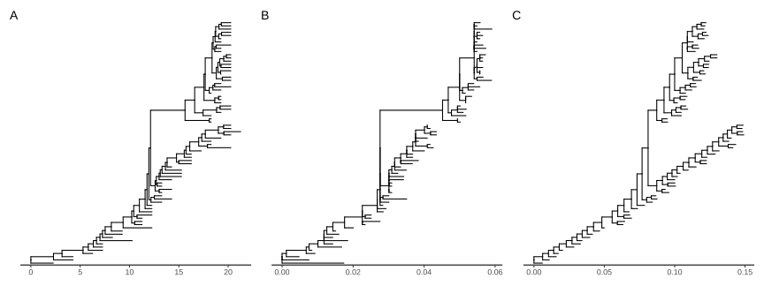
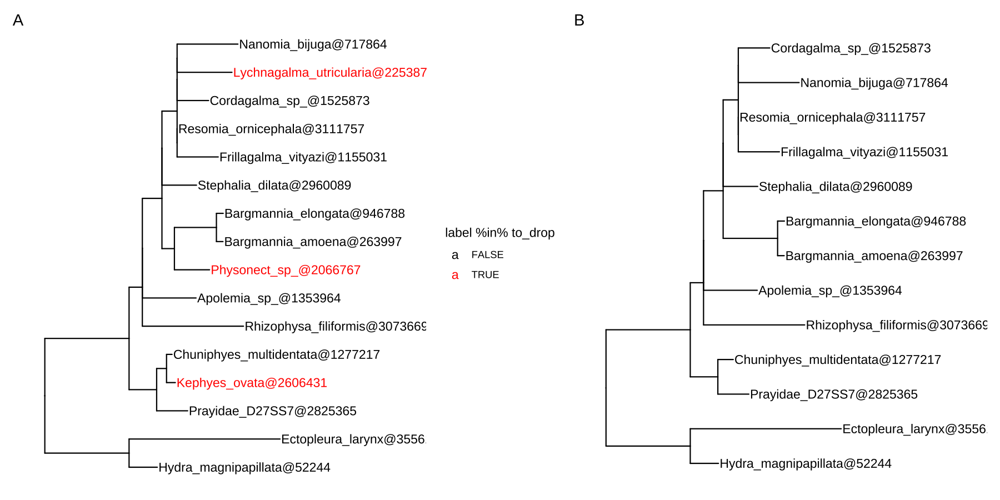
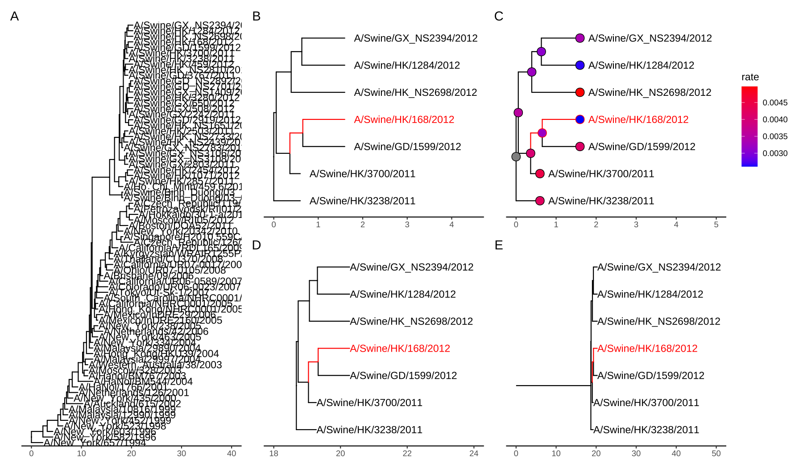
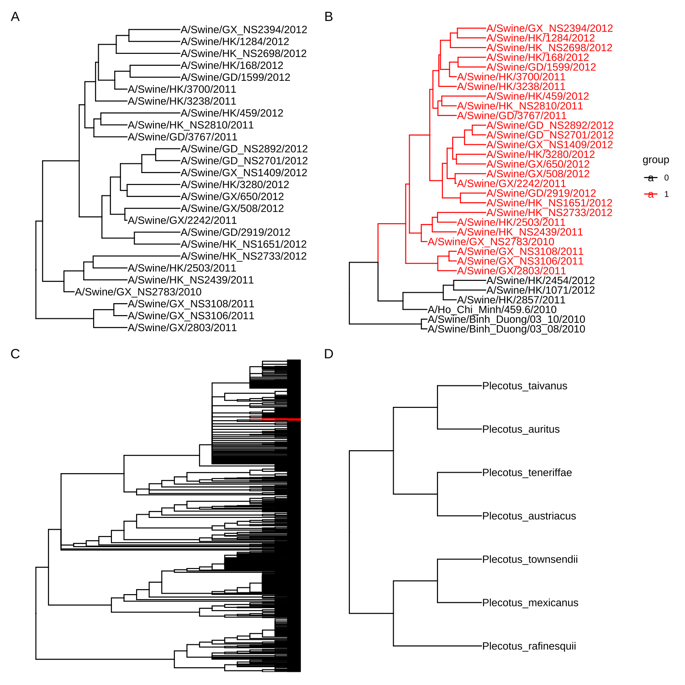
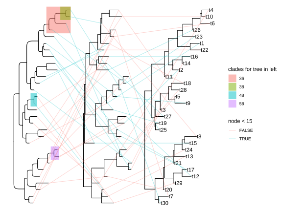

# 2. 树操作

@since 2026-09-24⭐
@author Jiawei Mao
***
## 2.1 使用 Tidy 接口操作树

由 `treeio` 解析或合并树，可以使用 `tidytree` 转换为 tidy 数据框。`tidytree` 提供了操作带关联数据树的 tidy 接口，从而可以使用 `tidyverse` 语句链接外部数据、合并进化数据。处理完树后，再转换回 `treedata` 对象并导出，供后续分析，或用 `ggtree` 和 `ggtreeExtra` 可视化。

### 2.1.1 phylo 对象

`ape` 包的 `phylo` 类是 R 系统发育分析的基础，该领域多数 R 包依赖它。`tidytree` 的 `as_tibble` 方法可将 `phylo` 转换为 tidy 数据框，即 `tbl_tree` 对象。

```r
library(ape)
set.seed(2017)
tree <- rtree(4)
tree
```

```R
# Phylogenetic tree with 4 tips and 3 internal nodes.
#
# Tip labels:
#  t4, t1, t3, t2
#
# Rooted; includes branch length(s).
```

```R
x <- as_tibble(tree)
x
```

```R
## # A tibble: 7 × 4
##   parent  node branch.length label
##    <int> <int>         <dbl> <chr>
## 1      5     1       0.435   t4   
## 2      7     2       0.674   t1   
## 3      7     3       0.00202 t3   
## 4      6     4       0.0251  t2   
## 5      5     5      NA       <NA> 
## 6      5     6       0.472   <NA> 
## 7      6     7       0.274   <NA>
```

使用`ape` 的 `as.phylo()` 可以将 `tbl_tree` 转换回 `phylo`。

```R
as.phylo(x)
```

```R
## 
## Phylogenetic tree with 4 tips and 3 internal nodes.
## 
## Tip labels:
##   t4, t1, t3, t2
## 
## Rooted; includes branch length(s).
```

使用 `tbl_tree` 可以使树的操作更有效、简便。例如，可以使用 `dplyr` 的 `full_join()` 将进化性状链接到系统发育树：

```r
# d 为 4 行 2 列的数据框，每行一个叶节点及其形状
d <- tibble(
  label = paste0("t", 1:4), # 生成字符向量 "t1", "t2", "t3", "t4"，作为4个叶节点标签
  trait = rnorm(4) # 生成 4 个服从标准正态分布的随机数，作为每个叶节点的性状值
)
y <- full_join(x, d, by = "label")
y
```

```
## # A tibble: 7 × 5
##   parent  node branch.length label  trait
##    <int> <int>         <dbl> <chr>  <dbl>
## 1      5     1       0.435   t4     0.943
## 2      7     2       0.674   t1    -0.171
## 3      7     3       0.00202 t3     0.570
## 4      6     4       0.0251  t2    -0.283
## 5      5     5      NA       <NA>  NA    
## 6      5     6       0.472   <NA>  NA    
## 7      6     7       0.274   <NA>  NA
```

### 2.1.2 treedata 对象

`tidytree` 定义的 `treedata` 类用于存储带关联数据的树。将外部数据映射到树后，可将 `tbl_tree` 转换为 `treedata`。

```r
as.treedata(y)
```

```
## 'treedata' S4 object'.
## 
## ...@ phylo:
## 
## Phylogenetic tree with 4 tips and 3 internal nodes.
## 
## Tip labels:
##   t4, t1, t3, t2
## 
## Rooted; includes branch lengths.
## 
## with the following features available:
##   'trait'.
```

`treeio` 用 `treedata` 存储 BEAST、EPA、HyPhy、MrBayes、PAML、PHYLDOG、PPLACER、r8s、RAxML 和 RevBayes 等软件的推断结果（详见第 1 章）。

`tidytree` 也提供 `as_tibble()` 方法，用于将 `treedata` 转换为 tidy 数据框，使树结构和进化推断结果均存储在 `tbl_tree` 中，便于统一操作。

```R
y %>% as.treedata %>% as_tibble
```

```
## # A tibble: 7 × 5
##   parent  node branch.length label  trait
##    <int> <int>         <dbl> <chr>  <dbl>
## 1      5     1       0.435   t4     0.943
## 2      7     2       0.674   t1    -0.171
## 3      7     3       0.00202 t3     0.570
## 4      6     4       0.0251  t2    -0.283
## 5      5     5      NA       <NA>  NA    
## 6      5     6       0.472   <NA>  NA    
## 7      6     7       0.274   <NA>  NA
```

### 2.1.3 访问相关节点

`dplyr` 语句可直接用于 `tbl_tree` 操作树数据。此外，`tidytree` 还提供  `child()`、`parent()`、`offspring()`、`ancestor()`、`sibling()` 和 `MRCA()` 等函数，这些语句接受一个 `tbl_tree` 和一个选定的节点（节点编号或标签）。

```r
child(y, 5)
```

```
## # A tibble: 2 × 5
##   parent  node branch.length label  trait
##    <int> <int>         <dbl> <chr>  <dbl>
## 1      5     1         0.435 t4     0.943
## 2      5     6         0.472 <NA>  NA
```

```R
parent(y, 2)
```

```
## # A tibble: 1 × 5
##   parent  node branch.length label trait
##    <int> <int>         <dbl> <chr> <dbl>
## 1      6     7         0.274 <NA>     NA
```

```R
offspring(y, 5)
```

```
## # A tibble: 6 × 5
##   parent  node branch.length label  trait
##    <int> <int>         <dbl> <chr>  <dbl>
## 1      5     1       0.435   t4     0.943
## 2      7     2       0.674   t1    -0.171
## 3      7     3       0.00202 t3     0.570
## 4      6     4       0.0251  t2    -0.283
## 5      5     6       0.472   <NA>  NA    
## 6      6     7       0.274   <NA>  NA
```

```R
ancestor(y, 2)
```

```
## # A tibble: 3 × 5
##   parent  node branch.length label trait
##    <int> <int>         <dbl> <chr> <dbl>
## 1      5     5        NA     <NA>     NA
## 2      5     6         0.472 <NA>     NA
## 3      6     7         0.274 <NA>     NA
```

```R
sibling(y, 2)
```

```
## # A tibble: 1 × 5
##   parent  node branch.length label trait
##    <int> <int>         <dbl> <chr> <dbl>
## 1      7     3       0.00202 t3    0.570
```

```R
MRCA(y, 2, 3)
```

```
## # A tibble: 1 × 5
##   parent  node branch.length label trait
##    <int> <int>         <dbl> <chr> <dbl>
## 1      6     7         0.274 <NA>     NA
```

所有这些方法在 `treeio` 中实现，可用于处理 `phylo` 和 `treedata` 对象。例如，输出所选内部节点 5 的子节点：

```R
child(tree, 5)
```

```
## [1] 1 6
```

注意，针对树的方法输出的是节点编号，而针对 `tbl_tree` 的方法输出的则是包含相关信息的 tibble。

## 2.2 数据整合

### 2.2.1 合并树数据

`treeio` 包可将各类系统发育数据导入 R。例如，由 CODEML 估算的 dN/dS 或祖先序列、BEAST/MrBayes 推断的进化枝支持值（后验概率），并支持将外部数据链接到树中。它还能合并多棵系统为一棵，同时保留各自节点/分支的特有属性，从而能够在同一分支上比较不同属性（如替换速率与 dN/dS）。

以下用猪/人流感 H3 数据集（76 条序列）演示。该数据集由 BEAST 重新分析以估计时间尺度，并通过 CODEML 估计同义和非同义替换。这里先用 `read.beast()` 读取 BEAST 输出，用 `read.codeml()` 读取 CODEML 的输出，得到两个 `treedata` 对象，再用 `merge_tree()` 将这两个包含各自特有数据的对象进行合并。

```R
beast_file <- system.file("examples/MCC_FluA_H3.tree", package="ggtree")
rst_file <- system.file("examples/rst", package="ggtree")
mlc_file <- system.file("examples/mlc", package="ggtree")
beast_tree <- read.beast(beast_file)
codeml_tree <- read.codeml(rst_file, mlc_file)

merged_tree <- merge_tree(beast_tree, codeml_tree)
merged_tree
```

```
## 'treedata' S4 object that stored information
## of
##  '/home/ygc/R/library/ggtree/examples/MCC_FluA_H3.tree',
##  '/home/ygc/R/library/ggtree/examples/rst',
##  '/home/ygc/R/library/ggtree/examples/mlc'.
## 
## ...@ phylo:
## 
## Phylogenetic tree with 76 tips and 75 internal nodes.
## 
## Tip labels:
##   A/Hokkaido/30-1-a/2013, A/New_York/334/2004,
## A/New_York/463/2005, A/New_York/452/1999,
## A/New_York/238/2005, A/New_York/523/1998, ...
## 
## Rooted; includes branch lengths.
## 
## with the following features available:
##   'height', 'height_0.95_HPD', 'height_median',
## 'height_range', 'length', 'length_0.95_HPD',
## 'length_median', 'length_range', 'posterior', 'rate',
## 'rate_0.95_HPD', 'rate_median', 'rate_range', 'subs',
## 'AA_subs', 't', 'N', 'S', 'dN_vs_dS', 'dN', 'dS',
## 'N_x_dN', 'S_x_dS'.
```

合并后，从 BEAST 和 CODEML 导入的所有节点/分支特有数据均可用。用 `tidytree` 将树转换为 tidy 数据框，并绘制六边形散点图，以比较 CODEML 推断的 dN/dS、dN 和 dS 与 BEAST 推断的同一分支上的替换速率（rate，替换数/位点/年）。

```r
library(dplyr)
df <- merged_tree %>% 
  as_tibble() %>%
  select(dN_vs_dS, dN, dS, rate) %>%
  subset(dN_vs_dS >=0 & dN_vs_dS <= 1.5) %>%
  tidyr::gather(type, value, dN_vs_dS:dS)
df$type[df$type == 'dN_vs_dS'] <- 'dN/dS'
df$type <- factor(df$type, levels=c("dN/dS", "dN", "dS"))
ggplot(df, aes(rate, value)) + geom_hex() + 
  facet_wrap(~type, scale='free_y') 
```


>  **图 2.1：dN/dS、dN 和 dS 与替换速率的相关性。** 合并 BEAST 和 CODEML 输出后，在相同分支上比较两个程序的分支特异性估计值（替换速率、dN/dS、dN 和 dS），并通过六边形散点图进行可视化。

皮尔逊相关性检验显示，dN 和 dS（并非 dN/dS）与替换速率显著关联（p-values）。

`merge_tree()` 可用于比较不同软件/模型的分析结果，整合不同分析发现，还支持外部数据，并可链式合并多棵树。

```r
phylo <- as.phylo(beast_tree)
N <- Nnode2(phylo)
d <- tibble(node = 1:N, fake_trait = rnorm(N), another_trait = runif(N))
fake_tree <- treedata(phylo = phylo, data = d)
triple_tree <- merge_tree(merged_tree, fake_tree)
triple_tree
```

```
## 'treedata' S4 object that stored information
## of
##  '/home/ygc/R/library/ggtree/examples/MCC_FluA_H3.tree',
##  '/home/ygc/R/library/ggtree/examples/rst',
##  '/home/ygc/R/library/ggtree/examples/mlc'.
## 
## ...@ phylo:
## 
## Phylogenetic tree with 76 tips and 75 internal nodes.
## 
## Tip labels:
##   A/Hokkaido/30-1-a/2013, A/New_York/334/2004,
## A/New_York/463/2005, A/New_York/452/1999,
## A/New_York/238/2005, A/New_York/523/1998, ...
## 
## Rooted; includes branch lengths.
## 
## with the following features available:
##   'height', 'height_0.95_HPD', 'height_median',
## 'height_range', 'length', 'length_0.95_HPD',
## 'length_median', 'length_range', 'posterior', 'rate',
## 'rate_0.95_HPD', 'rate_median', 'rate_range', 'subs',
## 'AA_subs', 't', 'N', 'S', 'dN_vs_dS', 'dN', 'dS',
## 'N_x_dN', 'S_x_dS', 'fake_trait', 'another_trait'.
```

上述展示的 `triple_tree` 包含从 BEAST 和 CODEML 获得的分析结果，以及外部来源的进化性状。所有这些信息都可以使用 `ggtree`  和 `ggtreeExtra` 来对树进行注释。

### 2.2.2 将外部数据链接到树

除上述与树相关的分析结果外，还有表型、实验、临床等异构数据也常需链接树。例如，病毒进化研究中树的节点可关联流行病学信息（如地理位置、年龄和亚型）；在比较基因组学将功能注释映射到基因树。

`treeio` 提供 `full_join()` 方法，可将外部数据链接到系统发育树，并存入 `phylo` 或 `treedata` 对象；将外部数据链接到 `phylo` 对象会得到 `treedata` 对象。`full_join` 方法也适用于 tidy 数据框（`tbl_tree` ）和 `ggtree`。

示例：计算自举值（bootstrap values），并按节点编号将这些值与树（`phylo`）合并。

```R
library(ape)
data(woodmouse)
d <- dist.dna(woodmouse)
tr <- nj(d)
bp <- boot.phylo(tr, woodmouse, function(x) nj(dist.dna(x)))
```

```
## 
Running bootstraps:       100 / 100
## Calculating bootstrap values... done.
```

```R
bp2 <- tibble(node=1:Nnode(tr) + Ntip(tr), bootstrap = bp)
full_join(tr, bp2, by="node")
```

```
## 'treedata' S4 object'.
## 
## ...@ phylo:
## 
## Phylogenetic tree with 15 tips and 13 internal nodes.
## 
## Tip labels:
##   No305, No304, No306, No0906S, No0908S, No0909S, ...
## 
## Unrooted; includes branch lengths.
## 
## with the following features available:
##   'bootstrap'.
```

另一示例：按末端标签（tip labels）将进化性状与树（`treedata`）合并。

```R
file <- system.file("extdata/BEAST", "beast_mcc.tree", package="treeio")
beast <- read.beast(file)
x <- tibble(label = as.phylo(beast)$tip.label, trait = rnorm(Ntip(beast)))
full_join(beast, x, by="label")
```

```
## 'treedata' S4 object that stored information
## of
##  '/home/ygc/R/library/treeio/extdata/BEAST/beast_mcc.tree'.
## 
## ...@ phylo:
## 
## Phylogenetic tree with 15 tips and 14 internal nodes.
## 
## Tip labels:
##   A_1995, B_1996, C_1995, D_1987, E_1996, F_1997, ...
## 
## Rooted; includes branch lengths.
## 
## with the following features available:
##   'height', 'height_0.95_HPD', 'height_median',
## 'height_range', 'length', 'length_0.95_HPD',
## 'length_median', 'length_range', 'posterior', 'rate',
## 'rate_0.95_HPD', 'rate_median', 'rate_range', 'trait'.
```

直接操作 `phylo` 对象的函数比较零散、繁琐。`treeio` 让合并各种来源的树数据更轻松。此外，`tidytree` 使 tidy 操作树更简便，并与 `dplyr`、`tidyr`、`ggplot2` 和 `ggtree` 等工具保持一致。

### 2.2.3 对分类群进行分组

`groupOTU()` 和 `groupClade()` 为树添加分类群分组信息。这些方法在 `tidytree`、`treeio` 和 `ggtree` 中均有实现，以支持 `tbl_tree`、`phylo`、 `treedata` 和 `ggtree` 对象。分组信息可直接用于树的可视化（如按分组信息着色，图 6.5）。

#### 2.2.3.1 groupClade

`groupClade()` 接受一个内部节点或内部节点向量，为指定进化枝添加分组信息。

```R
nwk <- '(((((((A:4,B:4):6,C:5):8,D:6):3,E:21):10,((F:4,G:12):14,H:8):13):
        13,((I:5,J:2):30,(K:11,L:11):2):17):4,M:56);'
tree <- read.tree(text=nwk)

groupClade(as_tibble(tree), c(17, 21))
```

```
## # A tibble: 25 × 5
##    parent  node branch.length label group
##     <int> <int>         <dbl> <chr> <fct>
##  1     20     1             4 A     1    
##  2     20     2             4 B     1    
##  3     19     3             5 C     1    
##  4     18     4             6 D     1    
##  5     17     5            21 E     1    
##  6     22     6             4 F     2    
##  7     22     7            12 G     2    
##  8     21     8             8 H     2    
##  9     24     9             5 I     0    
## 10     24    10             2 J     0    
## # … with 15 more rows
```

#### 2.2.3.2 groupOTU

```R
set.seed(2017)
tr <- rtree(4)
x <- as_tibble(tr)
## the input nodes can be node ID or label
groupOTU(x, c('t1', 't4'), group_name = "fake_group")
```

```
## # A tibble: 7 × 5
##   parent  node branch.length label fake_group
##    <int> <int>         <dbl> <chr> <fct>     
## 1      5     1       0.435   t4    1         
## 2      7     2       0.674   t1    1         
## 3      7     3       0.00202 t3    0         
## 4      6     4       0.0251  t2    0         
## 5      5     5      NA       <NA>  1         
## 6      5     6       0.472   <NA>  1         
## 7      6     7       0.274   <NA>  1
```

`groupClade()` 和 `groupOTU()` 均可用于 `tbl_tree`、`phylo` 和 `treedata` 以及 `ggtree` 对象。以下是将 `groupOTU()` 用于 `phylo` 树对象的示例。

```R
groupOTU(tr, c('t2', 't4'), group_name = "fake_group") %>%
  as_tibble
```

```
## # A tibble: 7 × 5
##   parent  node branch.length label fake_group
##    <int> <int>         <dbl> <chr> <fct>     
## 1      5     1       0.435   t4    1         
## 2      7     2       0.674   t1    0         
## 3      7     3       0.00202 t3    0         
## 4      6     4       0.0251  t2    1         
## 5      5     5      NA       <NA>  1         
## 6      5     6       0.472   <NA>  1         
## 7      6     7       0.274   <NA>  0
```

有关处理 `ggtree` 对象的另一个示例，请参阅 6.4 节。

`groupOTU` 会从输入的节点回溯至最近共同祖先（MRCA）。在此示例中，节点 1、4、5 和 6 被归为一组（4 (t2) -> 6 -> 5 且 1 (t4) -> 5）。

相关的操作分类单元（OTU）会被分组，它们不一定属于同一个进化枝。它们可以是单系群（clade）、多系群（polyphyletic）或并系群（paraphyletic）。

```R
cls <- list(c1=c("A", "B", "C", "D", "E"),
            c2=c("F", "G", "H"),
            c3=c("L", "K", "I", "J"),
            c4="M")

as_tibble(tree) %>% groupOTU(cls)
```

```
## # A tibble: 25 × 5
##    parent  node branch.length label group
##     <int> <int>         <dbl> <chr> <fct>
##  1     20     1             4 A     c1   
##  2     20     2             4 B     c1   
##  3     19     3             5 C     c1   
##  4     18     4             6 D     c1   
##  5     17     5            21 E     c1   
##  6     22     6             4 F     c2   
##  7     22     7            12 G     c2   
##  8     21     8             8 H     c2   
##  9     24     9             5 I     c3   
## 10     24    10             2 J     c3   
## # … with 15 more rows
```

如果在回溯至最近共同祖先时发生冲突，可用 `overlap` 参数处理：

- `"origin"`：先出现者优先
- `"overwrite"`：默认值，后出现的优先
- `"abandon"`：不参与分组

## 2.3 重置树根

系统发育树可以使用指定的外群重置树根（reroot）。`ape` 为 `phylo` 对象提供 `root()` 重置树根，而 `treeio` 为 `treedata` 提供 `root()` 设置树根，后者基于 `ape` 实现的 `root()` ，旨在为系统发育树重新置根时，确保与指定外群或指定节点相关的关联数据被正确映射。

先用 `left_join()` 将外部数据链接到树，并将所有信息存储在一个 `treedata` 对象 `trda` 中。

```R
library(ggtree)
library(treeio)
library(tidytree)
library(TDbook)

# load `tree_boots`, `df_tip_data`, and `df_inode_data` from 'TDbook'

trda <- tree_boots %>% 
        left_join(df_tip_data, by=c("label" = "Newick_label")) %>% 
        left_join(df_inode_data, by=c("label" = "newick_label"))
trda
```

```r
## 'treedata' S4 object'.
## 
## ...@ phylo:
## 
## Phylogenetic tree with 7 tips and 6 internal nodes.
## 
## Tip labels:
##   Rangifer_tarandus, Cervus_elaphus, Bos_taurus,
## Ovis_orientalis, Suricata_suricatta,
## Cystophora_cristata, ...
## Node labels:
##   Mammalia, Artiodactyla, Cervidae, Bovidae,
## Carnivora, Caniformia
## 
## Rooted; includes branch lengths.
## 
## with the following features available:
##   '', 'vernacularName', 'imageURL', 'imageLicense',
## 'imageAuthor', 'infoURL', 'mass_in_kg',
## 'trophic_habit', 'ncbi_taxid', 'rank',
## 'vernacularName.y', 'infoURL.y', 'rank.y',
## 'bootstrap', 'posterior'.
```

然后重置树根，关联数据也能正确映射到分支和节点上（图2.2）。该图使用 `ggtree` 可视化（第 4 章和第 5 章）。

```r
# reroot
trda2 <- root(trda, outgroup = "Suricata_suricatta", edgelabel = TRUE)
# The original tree
p1 <- trda %>%
      ggtree() +
      geom_nodelab(
        mapping = aes(
          x = branch,
          label = bootstrap
        ),
        nudge_y = 0.36
      ) +
      xlim(-.1, 4.5) +
      geom_tippoint(
        mapping = aes(
          shape = trophic_habit, 
          color = trophic_habit, 
          size = mass_in_kg
        )
      ) +
      scale_size_continuous(range = c(3, 10)) +
      geom_tiplab(
        offset = .14, 
      ) +
      geom_nodelab(
        mapping = aes(
          label = vernacularName.y, 
          fill = posterior
        ),
        geom = "label"
      ) + 
      scale_fill_gradientn(colors = RColorBrewer::brewer.pal(3, "YlGnBu")) +
      theme(legend.position = "right")  

# after reroot
p2 <- trda2 %>%
      ggtree() +
      geom_nodelab(
        mapping = aes(
          x = branch,
          label = bootstrap
        ),
        nudge_y = 0.36
      ) +
      xlim(-.1, 5.5) +
      geom_tippoint(
        mapping = aes(
          shape = trophic_habit,
          color = trophic_habit,
          size = mass_in_kg
        )
      ) +
      scale_size_continuous(range = c(3, 10)) +
      geom_tiplab(
        offset = .14,
      ) +
      geom_nodelab(
        mapping = aes(
          label = vernacularName.y,
          fill = posterior
        ),
        geom = "label"
      ) +
      scale_fill_gradientn(colors = RColorBrewer::brewer.pal(3, "YlGnBu")) +
      theme(legend.position = "right")

plot_list(p1, p2, tag_levels='A', ncol=2)
```


>  **图 2.2：对带有关联数据的树重新置根。** 原始树 (A) 和重置根后的树 (B) 均正确地将关联数据映射到了树的分支或节点上。(A) 和 (B) 分别展示了在以末端节点 ‘Suricata_suricatta’ 的引导分支进行置根之前和之后的状态。

`outgroup` 参数代表指定的新外群，它可以是节点标签（字符型）或节点编号。如果它是“单一”值，表示使用该末端分支下方的节点作为新根；如果它包含多个值，表示将使用这些值的最近共同祖先作为新根。需要注意的是，如果节点标签应被视为分支标签（edge labels），则应将 `edgelabel` 设置为 `TRUE`，以返回节点与关联数据之间的正确对应关系。有关重新置根的更多详细信息（包括注意事项和常见陷阱），请参阅综述文章 (Czech et al., 2017)。

## 2.4 缩放分支

系统发育数据可以进行合并以用于联合分析（如图 2.1 所示）。这些数据可以作为更复杂的注释显示在同一个树结构上，以帮助直观地观察它们的进化模式。存储在 `treedata` 对象中的所有数值数据都可以用于重新缩放树的分支。例如，CodeML 推断出 dN/dS、dN 和 dS，所有这些统计量都可以用作分支长度（图 2.3）。这些值同样可以用于对树进行着色（参见 4.3.4 节），并且可以投影到垂直维度上，从而创建二维树或表型图（phenogram）（参见 4.2.2 节以及图 4.5 和图 4.11）。

```r
p1 <- ggtree(merged_tree) + theme_tree2()
p2 <- ggtree(rescale_tree(merged_tree, 'dN')) + theme_tree2()
p3 <- ggtree(rescale_tree(merged_tree, 'rate')) + theme_tree2()

plot_list(p1, p2, p3, ncol=3, tag_levels='A')
```



**图 2.3：重新缩放树的分支。**  (A) 以时间（距根节点的年数）缩放分支的树； (B) 使用 dN 作为分支长度重新缩放的树； (C) 使用替换速率（substitution rates）重新缩放的树。

除了使用 `rescale_tree()` 函数修改树对象中的分支长度外，用户还可以直接在 `ggtree()` 中指定一个变量作为分支长度，如 4.3.6 节所示。

## 2.5 提取子集

### 2.5.1 移除叶节点（tips）

有时我们需要从系统发育树中移除选定的末端分支。原因有多种，包括序列质量低、序列组装错误、部分序列的比对错误、系统发育推断错误等。

假设我们要从树中移除三个末端分支（标为红色）（图 2.4A），`drop.tip()` 方法可以移除指定的末端分支并更新树（图 2.4B）。所有关联数据都会保留在更新后的树中。

```r
f <- system.file("extdata/NHX", "phyldog.nhx", package="treeio")
nhx <- read.nhx(f)
to_drop <- c("Physonect_sp_@2066767",
            "Lychnagalma_utricularia@2253871",
            "Kephyes_ovata@2606431")
p1 <- ggtree(nhx) + geom_tiplab(aes(color = label %in% to_drop)) +
  scale_color_manual(values=c("black", "red")) + xlim(0, 0.8)

nhx_reduced <- drop.tip(nhx, to_drop)
p2 <- ggtree(nhx_reduced) + geom_tiplab() + xlim(0, 0.8)  
plot_list(p1, p2, ncol=2, tag_levels = "A")
```



>  **图 2.4：从树中移除末端分支。**  (A) 原始树，其中三个末端分支（标为红色）待移除； (B) 更新后的树，已移除选定的末端分支。

### 2.5.2 按末端标签提取子集

树很大时，查看感兴趣的部分很苦难。`treeio` 的 `tree_subset()` 可提取树的子集并保持其结构。图 2.5A 中的 `beast_tree` 较拥挤，我们可以调高图形或缩小文本，但是当有大量末端分支时并不适用；若只关系某个末端分支周围的结构，就更不想在一棵庞大的树中费力寻找目标物种。

假设你对末端分支 `A/Swine/HK/168/2012` 感兴趣（图 2.5A），希望查看其直接近亲。`tree_subset()` 可满足该需求。

`tree_subset()` 默认会调用 `groupOTU()`，将指定末端分支从其他末端分支中分离并指定为一个组（图 2.5B）。在提取子集后，分支长度和关联数据均会保留（图 2.5C）。默认子集树的根节点锚定在 0，且所有距离都是相对于该根节点计算。若希望所有距离相对于原始根节点，可将 `root.position` 设置为子集树的根边（root edge），即原始根节点到子集树根节点的分支长度之和（图 2.5D 和 E）。

```r
beast_file <- system.file("examples/MCC_FluA_H3.tree", package="ggtree")
beast_tree <- read.beast(beast_file)

p1 = ggtree(beast_tree) + 
  geom_tiplab(offset=.05) +  xlim(0, 40) + theme_tree2()

tree2 = tree_subset(beast_tree, "A/Swine/HK/168/2012", levels_back=4)  
p2 <- ggtree(tree2, aes(color=group)) +
  scale_color_manual(values = c("black", "red"), guide = 'none') +
  geom_tiplab(offset=.2) +  xlim(0, 4.5) + theme_tree2() 

p3 <- p2 +   
  geom_point(aes(fill = rate), shape = 21, size = 4) +
  scale_fill_continuous(low = 'blue', high = 'red') +
  xlim(0,5) + theme(legend.position = 'right')

p4 <- ggtree(tree2, aes(color=group), 
          root.position = as.phylo(tree2)$root.edge) +
  geom_tiplab() + xlim(18, 24) + 
  scale_color_manual(values = c("black", "red"), guide = 'none') +
  theme_tree2()

p5 <- p4 + 
  geom_rootedge() + xlim(0, 50) 

plot_list(p1, p2, p3, p4, p5, 
        design="AABBCC\nAADDEE", tag_levels='A')
```



**图 2.5：提取特定末端分支的树子集。**  (A) 原始树； (B) 提取的子集树； (C) 带有数据的子集树； (D) 相对于原始位置可视化子集树，不包含根边（rootedge）； (E) 相对于原始位置可视化子集树，包含根边（rootedge）。

### 2.5.3 按内部节点编号提取子集

如果你对某个特定的进化枝（clade）感兴趣，可以将输入节点指定为内部节点编号。`tree_subset()` 函数会将该进化枝作为一个整体提取出来，并且可以向上回溯特定的层级，以查看该进化枝的直接近亲（图 2.6A 和 B）。我们可以使用 `tree_subset()` 函数放大选定的部分，并将整棵树与其局部放大图绘制在一起，这类似于 `ape::zoom()` 函数探索超大树的功能（图 2.6C 和 D）。此外，用户还可以使用 `viewClade()` 函数将树的可视化限制在特定的进化枝上，如 6.1 节所示。

```r
clade <- tree_subset(beast_tree, node=121, levels_back=0)
clade2 <- tree_subset(beast_tree, node=121, levels_back=2)
p1 <- ggtree(clade) + geom_tiplab() + xlim(0, 5)
p2 <- ggtree(clade2, aes(color=group)) + geom_tiplab() + 
  xlim(0, 9) + scale_color_manual(values=c("black", "red"))


library(ape)
library(tidytree)
library(treeio)

data(chiroptera)

nodes <- grep("Plecotus", chiroptera$tip.label)
chiroptera <- groupOTU(chiroptera, nodes)

clade <- MRCA(chiroptera, nodes)
x <- tree_subset(chiroptera, clade, levels_back = 0)

p3 <- ggtree(chiroptera, aes(colour = group)) + 
  scale_color_manual(values=c("black", "red")) +
  theme(legend.position = "none")
p4 <- ggtree(x) + geom_tiplab() + xlim(0, 6)
plot_list(p1, p2, p3, p4, 
  ncol=2, tag_levels = 'A')
```



>  **图 2.6：提取特定进化枝的树子集。**  (A) 提取一个进化枝； (B) 提取一个进化枝并向上回溯，以查看其直接近亲； (C) 查看一棵非常大的树； (D) 查看该树中选定的局部区域。

## 2.6 为可视化操作树

`ggtree` 提供了对树进行可视化的支持 (Yu et al., 2017)。尽管 `ggtree` 实现了多种用于结合数据探索树的方法，但你可能仍希望执行一些不被直接支持的操作。在这种情况下，你需要使用用于可视化的节点坐标位置来操作树数据。使用 `ggtree` 实现这一点非常简单。用户可以使用 `fortify()` 方法，该方法在内部调用 `tidytree::as_tibble()` 将树转换为 tidy 数据框，并添加用于绘制树的坐标位置列（即 `x`、`y`、`branch` 和 `angle`）。你也可以通过 `ggtree(tree)$data` 来访问这些数据。

下面是一个绘制两棵面对面（face-to-face）的树的示例，类似于 `ape::cophyloplot()` 函数生成的图形（图 2.7）。

```r
library(dplyr)
library(ggtree)

set.seed(1024)
x <- rtree(30)
y <- rtree(30)
p1 <- ggtree(x, layout='roundrect') + 
  geom_hilight(
         mapping=aes(subset = node %in% c(38, 48, 58, 36),
                     node = node,
                     fill = as.factor(node)
                     )
     ) +
    labs(fill = "clades for tree in left" )

p2 <- ggtree(y)

d1 <- p1$data
d2 <- p2$data

## reverse x-axis and 
## set offset to make the tree on the right-hand side of the first tree
d2$x <- max(d2$x) - d2$x + max(d1$x) + 1

pp <- p1 + geom_tree(data=d2, layout='ellipse') +      
  ggnewscale::new_scale_fill() +
  geom_hilight(
         data = d2, 
         mapping = aes( 
            subset = node %in% c(38, 48, 58),
            node=node,
            fill=as.factor(node))
  ) +
  labs(fill = "clades for tree in right" ) 

dd <- bind_rows(d1, d2) %>% 
  filter(!is.na(label))

pp + geom_line(aes(x, y, group=label), data=dd, color='grey') +
    geom_tiplab(geom = 'shadowtext', bg.colour = alpha('firebrick', .5)) +
    geom_tiplab(data = d2, hjust=1, geom = 'shadowtext', 
                bg.colour = alpha('firebrick', .5))
```


**图 2.7：绘制两棵面对面的系统发育树。** 使用 `ggtree()` 绘制一棵树（左侧），随后通过 `geom_tree()` 添加另一层树（右侧）。所绘制树的相对位置可以手动调整，并且为每棵树添加图层（例如，末端标签和高亮进化枝）是相互独立的。

在一个图中绘制多棵树并连接分类群非常容易；例如，绘制由流感病毒所有内部基因片段构建的树，并在树之间连接相同的病毒株 (Venkatesh et al., 2018)。图 2.8 演示了通过组合多个 `geom_tree()` 图层来绘制多棵树的用法。

```r
z <- rtree(30)
d2 <- fortify(y)
d3 <- fortify(z)
d2$x <- d2$x + max(d1$x) + 1
d3$x <- d3$x + max(d2$x) + 1

dd = bind_rows(d1, d2, d3) %>% 
  filter(!is.na(label))

p1 + geom_tree(data = d2) + geom_tree(data = d3) + geom_tiplab(data=d3) + 
  geom_line(aes(x, y, group=label, color=node < 15), data=dd, alpha=.3)
```



**图 2.8：并排绘制多棵系统发育树。** 使用 `ggtree()` 绘制一棵树，随后通过 `geom_tree()` 添加多个树图层。

## 2.7 总结

`treeio` 包使我们能够将多种与系统发育树相关的数据导入 R 中。然而，系统发育树的底层存储结构主要是为了便于计算机处理，对人类并不直观，且操作和探索树数据往往需要一定的专业知识。`tidytree` 包为探索树数据提供了符合 tidy（整洁）原则的接口，而 `ggtree` 则提供了一套实用工具，能够利用图形语法（grammar of graphics）来可视化和探索树数据。这一完整的工具包套件使得普通用户也能轻松地与树数据进行交互，并允许我们整合来自不同来源（例如实验结果或分析发现）的系统发育关联数据，从而为综合性和比较性研究创造了可能。更重要的是，这套工具包将系统发育分析成功纳入了 tidyverse 生态系统，无疑将我们对系统发育数据的处理水平提升到了一个新的高度。