# 4. 系统发育树可视化

@since 2026-09-24⭐
@author Jiawei Mao
***
## 4.1 简介

现有系统发育树可视化工具（如 TreeView、FigTree、TreeDyn 、Dendroscope 、EvolView、iTOL 等），大多仅支持有限的预定义注释功能和特定数据类型。随着系统发育树在跨学科研究中的应用日益广泛，研究者越来越需要将不同来源、不同类型的协变量和相关数据整合到树上，以便可视化和进一步分析。例如，流感病毒宿主范围广、基因型多样且动态，传播行为又与其进化密切相关。因此，除了针对特定分析和数据类型的独立工具外，分子进化研究者迫切需要一个强大、可编程平台，能在系统发育树上高度整合并可视化多类数据（原始数据或初步分析结果），以揭示其中的关联和规律。

为填补这一空白，我们开发了 `ggtree`。这是一个作为 Bioconductor 项目发布的 R 包，专为处理 `treedata` 对象而构建，它基于图形语法，利用 `ggplot2` 绘制和展示 tree。

R 在系统发育学中的应用日益普遍，但仍缺乏一个专为查看和注释系统发育树、尤其是整合复杂数据而设计的综合性软件包。多数 R 系统发育包侧重特定统计分析，而非通用的查看和注释树。`ape` 和 `phytools` 等虽然能显示和注释树，但是基于 R 的基础图形系统；`ape` 是系统发育分析和数据处理的基础包之一，但基础图形系统难以扩展，限制了能展示树图的复杂性。

`OutbreakTools` 和 `phyloseq` 虽然扩展了 `ggplot2` 来绘制系统发育树，利用 `ggplot2` 图形系统的快速自定义和探索设计。然而这两个包分别面向流行病学和微生物组数据，并非通用的树可视化和注释方案。

`ggtree` 同样继承了 `ggplot2` 的多功能性，它允许自由组合多个注释图层来构建复杂树图，并可以灵活映射不同来源导入的树相关数据。

## 4.2 ggtree 可视化系统发育树

`ggtree` 可以将多种来源和类型的关联数据注释到系统发育树上。这些数据可能来自用户或分析程序，可能与样本分类群相关（如进化速率、祖先序列等），也可能与内部节点或分支相关（如祖先菌株/物种、进化时间）。例如，病毒基因树中禽流感病毒的地理位置和祖先节点。

`ggtree` 基于 `ggplot2` 的图形语言，可定制性强、直观灵活。`ggplot2` 本身不支持树结构，`ggtree` 正好扩展了这一能力。同样基于 `ggplot2` 的 `OutbreakTools` 和 `phyloseq` 不支持添加注释图层，使得普通用户很难为无标签的树添加分类群等标签。

`ggtree` 通过 `geom_tree()` 扩展 `ggplot2`。可以用 `ggtree(tree_object)` 查看树，等基于 `ggplot(tree_object) + geom_tree() + theme_tree()`；注释图层用 `+` 逐一添加。`ggtree` 提供的常用图层包括：

- `geom_treescale()`：添加分支比例尺图例（如遗传距离、分歧时间等）；
- `geom_range()`：显示分支长度不确定性（如置信区间或范围等）；
- `geom_tiplab()`：添加分类群标签；
- `geom_tippoint()` 和 `geom_nodepoint()`：添加叶节点和内部节点符号；
- `geom_hilight()`：用矩形高亮进化枝；
- `geom_cladelab()`：用条形和文本标签注释特定进化枝。

`ggtree` 提供的几何图层完整列表见[表 5.1](./5.tree-annotation.md)。

查看树前需要将树文件解析到 R 中：

- `treeio` 可将不同软件的注释数据解析为 S4 系统发育数据对象，`ggtree` 软主要基于这些 S4 对象展示和注释树；
- 其他 R 包定义的树对象（如 `phylobase` 的 `phylo4` 和 `phylo4d`、`OutbreakTools` 的 `obkdata`、`phyloseq` 的 `phyloseq` 等）`ggtree` 也支持，其注释数据可直接用于注释树。

`ggtree` 的兼容性促进了数据与分析结果的整合。此外，`ggtree` 还支持树状图（dendrogram）和树图（tree graphs）等其他树状结构，。

### 4.2.1 基础树可视化

`ggtree` 扩展 `ggplot2` ，通过 `geom_tree()` 图层展示系统发育树（图 4.1A）。

```r
library(treeio)
library(ggtree)

nwk <- system.file("extdata", "sample.nwk", package = "treeio")
tree <- read.tree(nwk)

ggplot(tree, aes(x, y)) +
  geom_tree() +
  theme_tree()
```

`ggtree()` 是上述用法的快捷方式，效果完全相同。

`ggtree` 继承了 `ggplot2` 的全部优势。例如，可以像 `ggplot2` 一样修改线条颜色、大小和类型（图 4.1B）。

```r
library(treeio)
library(ggtree)

nwk <- system.file("extdata", "sample.nwk", package = "treeio")
tree <- read.tree(nwk)

ggtree(
  tree,
  color = "firebrick",
  size = 2, linetype = "dotted"
)
```

树默认以阶梯状排序（ladderize）展示；设置 `ladderize = FALSE` 可禁用（图 4.1C，另见 [FAQ A.5](./A.FAQ.md)）。

```r
ggtree(tree, ladderize=FALSE)
```

`branch.length` 参数控制分支缩放。设置为 `"none"` 时仅显示拓扑结构，即分支图（cladogram，图 4.1D）；也可以用其他数值变量缩放（如 dN/dS）。

```r
ggtree(tree, branch.length="none")
```


> **图 4.1：基础树可视化。** `ggtree` 默认输出的阶梯状排序效果（A）；设置颜色、大小、线型等（B）；未阶梯状排序的树（C）；仅显示拓扑结构、不含分支长度的分支图（D）。

### 4.2.2 系统发育树的布局

使用 `ggtree` 可轻松查看系统发育树，`ggtree` 支持多种布局（图 4.2）：

- 矩形："rectangular"，默认
- 圆角矩形："roundrect"
- 椭圆形："ellipse"
- 倾斜："slanted"
- 圆形："circular"
- 扇形："fan"
- 无根树（unrooted），包括：
  - 等角法："equal_angle"
  - 日光法："daylight"
- 时间尺度（time-scaled）
- 二维：two-dimensional layouts

以下是使用不同布局可视化树的示例：

```R
library(ggtree)
set.seed(2017-02-16)
tree <- rtree(50)
ggtree(tree)
ggtree(tree, layout="roundrect")
ggtree(tree, layout="slanted")
ggtree(tree, layout="ellipse")
ggtree(tree, layout="circular")
ggtree(tree, layout="fan", open.angle=120)
ggtree(tree, layout="equal_angle")
ggtree(tree, layout="daylight")

ggtree(tree, branch.length='none')
ggtree(tree, layout="ellipse", branch.length="none")
ggtree(tree, branch.length='none', layout='circular')
ggtree(tree, layout="daylight", branch.length = 'none')
```


> **图 4.2：树的布局。**
> **系统发育图**：矩形（A）、圆角矩形（B）、倾斜（C）、椭圆形（D）、圆形（E）和扇形（F）。
> **无根树**：等角法（G）和日光法（H）。
> **分支图**：矩形（I）、椭圆形（J）、圆形（K）和无根树（L）。分支图也支持倾斜和扇形布局。

通过修改比例尺或坐标系可获得更多布局（图 4.3）。

```R
ggtree(tree) + scale_x_reverse() # 反转 x 轴，树从右向左生长（根在右）
ggtree(tree) + coord_flip() # 翻转坐标系，树变为垂直生长（根在下）
ggtree(tree) + layout_dendrogram()
ggplotify::as.ggplot(ggtree(tree), angle=-30, scale=.9)
ggtree(tree, layout='slanted') + coord_flip()
ggtree(tree, layout='slanted', branch.length='none') + layout_dendrogram()
ggtree(tree, layout='circular') + xlim(-10, NA)
ggtree(tree) + layout_inward_circular()
ggtree(tree) + layout_inward_circular(xlim=15)
```

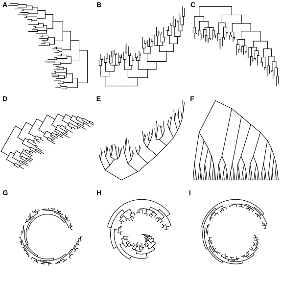

> **图 4.3：衍生树布局。** 从右到左的矩形布局（A），自下而上的矩形布局（B），自上而下的矩形布局（树状图/Dendrogram）（C），旋转矩形布局（D），自下而上的倾斜布局（E），自上而下的倾斜布局（分支图/Cladogram）（F），圆形布局（G），向内圆形布局（H 和 I）。

**系统发育图（Phylogram）**
默认按分支长度缩放，支持矩形、圆角矩形、倾斜、椭圆形、圆形和扇形布局（图 4.2A-F）。

**无根树布局（Unrooted layout）**
通过 `layout = "equal_angle"` 或 `"daylight"`  指定。等角法按子树叶节点数分配角度弧长、速度快，但叶节点易聚集（图 4.2G）。日光法先构建等角树，再迭代 “摆动” 子树使弧相等（图 4.2H）。

**分支图（Cladogram）**
设置 `branch.length = "none"`，仅展显示拓扑结构，适用于所有布局（图 4.2I-L）。

**时间尺度布局（Timescaled layout）**
需通过 `mrsd` （most recent sampling date）指定最近采样日期。`ggtree()` 根据采样时间（叶节点）和分歧时间（内部节点）对树进行缩放，并默认显示时间轴。可用 `deeptime` 包添加地质时间尺度（如纪和代）。

```r
beast_file <- system.file("examples/MCC_FluA_H3.tree", 
                          package="ggtree")
beast_tree <- read.beast(beast_file)
ggtree(beast_tree, mrsd="2013-01-01") + theme_tree2()
```


> **图 4.4：时间尺度布局。** X 轴为时间尺度（年），分歧时间由 BEAST 基于分子钟模型推断得出。

**二维树布局（Two-dimensional tree layout）**
二维树将树投影到二维空间：X 轴为分支尺度（如进化距离、分歧时间），Y 轴为表型或基因型性状。适合追踪病毒表型随病毒进化的变化。且数据点由树分支连接，优于传统无连接散点图。

示例使用人类和猪 H3 流感病毒的时间尺度树（图 4.4），并根据每个分类单元和血凝素蛋白祖先序列预测的 N-连接糖基化位点（NLG）数量对 Y 轴进行了缩放。NLG 位点是通过 NetNGlyc 1.0 Server 预测的。为了对 Y 轴进行缩放，需要将 `ggtree()` 函数中的 `yscale` 参数设置为数值型或分类型变量。如果 `yscale` 是分类型变量（如本例所示），用户应通过 `yscale_mapping` 变量来指定类别如何映射为数值。

```R
NAG_file <- system.file("examples/NAG_inHA1.txt", package="ggtree")

NAG.df <- read.table(NAG_file, sep="\t", header=FALSE, 
                     stringsAsFactors = FALSE)
NAG <- NAG.df[,2]
names(NAG) <- NAG.df[,1]

## separate the tree by host species
tip <- as.phylo(beast_tree)$tip.label
beast_tree <- groupOTU(beast_tree, tip[grep("Swine", tip)], 
                       group_name = "host")

p <- ggtree(beast_tree, aes(color=host), mrsd="2013-01-01", 
            yscale = "label", yscale_mapping = NAG) + 
  theme_classic() + theme(legend.position='none') +
  scale_color_manual(values=c("blue", "red"), 
                     labels=c("human", "swine")) +
  ylab("Number of predicted N-linked glycosylation sites")

## (optional) add more annotations to help interpretation
p + geom_nodepoint(color="grey", size=3, alpha=.8) +
  geom_rootpoint(color="black", size=3) +
  geom_tippoint(size=3, alpha=.5) + 
  annotate("point", 1992, 5.6, size=3, color="black") +
  annotate("point", 1992, 5.4, size=3, color="grey") +
  annotate("point", 1991.6, 5.2, size=3, color="blue") +
  annotate("point", 1992, 5.2, size=3, color="red") + 
  annotate("text", 1992.3, 5.6, hjust=0, size=4, label="Root node") +
  annotate("text", 1992.3, 5.4, hjust=0, size=4, 
           label="Internal nodes") +
  annotate("text", 1992.3, 5.2, hjust=0, size=4,
           label="Tip nodes (blue: human; red: swine)")
```

![Two-dimensional tree layout. The trunk and other branches are highlighted in red (for swine) and blue (for humans). The x-axis is scaled to the branch length (in units of year) of the timescaled tree. The y-axis is scaled to the node attribute variable, in this case, the number of predicted N-linked glycosylation sites (NLG) on the hemagglutinin protein. Colored circles indicate the different types of tree nodes. Note that nodes assigned the same x- (temporal) and y- (NLG) coordinates are superimposed in this representation and appear as one node, which is shaded based on the colors of all the nodes at that point.](./images/2d-1.svg)

> **图 4.5：二维树状布局。** 红色为猪，蓝色为人。X 轴为时间（年），Y 轴为血凝素蛋白上预测的 N-连接糖基化位点（NLG）数量。同坐标节点叠加显示，颜色为混色和。

二维树图能直观展示表型随进化的变化。本例中，人类 H3 甲型流感病毒二十年始终保持较高水平的 N-连接糖基化位点（8-9 个）；而传播至猪的独立谱系则下降至 5-6 个。已有假说认为，流感病毒血凝素蛋白上的高水平糖基化能提供更好的屏蔽效应，以保护抗原表位免受群体免疫的识别，因此在维持高水平群体免疫的人类群体中，针对当前流行的人类流感病毒株，这种特性具有选择优势。相反，对于刚刚跨越物种屏障并传播至猪群的新病毒谱系而言，高水平的表面聚糖所产生的屏蔽效应反而带来了选择劣势，因为受体结合结构域可能同样被屏蔽，这极大地影响了该谱系在适应新宿主物种过程中的病毒适应度（fitness）。另一示例可见图 4.12。

## 4.3 显示树组件

### 4.3.1 显示进化树比例尺（进化距离）

使用 `geom_treescale()` 图层添加进化树比例尺（图 4.6 A-C）。

```r
ggtree(tree) + geom_treescale()
```

主要参数：

- `x` 和 `y`：比例尺位置
- `width`：比例尺长度
- `fontsize`：文本大小
- `linesize`：线条粗细
- `offset`：线条与文本的相对位置
- `color`：比例尺颜色

```r
ggtree(tree) + geom_treescale(x=0, y=45, width=1, color='red')
ggtree(tree) + geom_treescale(fontsize=6, linesize=2, offset=1)
```

也可通过 `theme_tree2()` 添加 X 轴来显示比例尺（图 4.6 D），尤其适合时间尺度树。

```r
ggtree(tree) + theme_tree2()
```

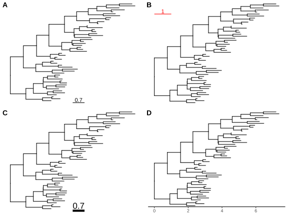

> **图 4.6：显示进化树比例尺。** `geom_treescale()` 自动添加表示进化距离的比例尺（A）。可以修改比例尺颜色、宽度和位置（B），以及比例尺和文本大小及相对位置（C）。另一种方案是启用 X 轴，适合时间尺度树（D）。

比例尺不局限于进化距离。`treeio` 可以使用其他数值变量重新缩放树（见 2.4 节），`ggtree` 也支持指定一个数值变量作为分支长度进行可视化（见 4.3 节）。

### 4.3.2 显示内部节点与叶节点

使用点图层可展示树的内部节点和末端节点，常用函数：

- `geom_nodepoint()`：为内部节点添加符号点
- `geom_tippoint()` ：为外部节点添加符号点
- `geom_point()`：为所有节点添加符号点

```R
library(treeio)
library(ggtree)

nwk <- system.file("extdata", "sample.nwk", package = "treeio")
tree <- read.tree(nwk)

ggtree(tree) +
  geom_point(aes(shape = isTip, color = isTip), size = 3)
```

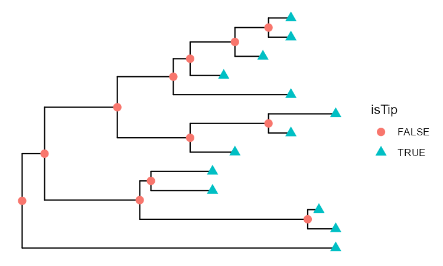

> **图 4.7：显示内部节点与叶节点。**
> (A) `geom_point()` 自动为所有节点添加符号点；

```R
library(treeio)
library(ggtree)

nwk <- system.file("extdata", "sample.nwk", package = "treeio")
tree <- read.tree(nwk)

p <- ggtree(tree) +
  geom_nodepoint(color = "#b5e521", alpha = 1 / 4, size = 10)

p + geom_tippoint(color = "#FDAC4F", shape = 8, size = 3)
```

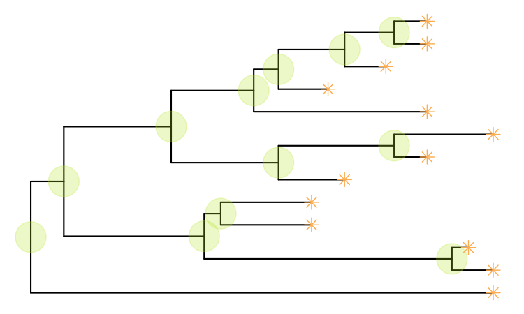

> **图 4.7：显示内部节点与叶节点。**
> (B) `geom_nodepoint()` 为内部节点添加符号点；`geom_tippoint()` 为叶节点添加符号点。

### 4.3.3 显示标签

可用 `geom_text()` 或 `geom_label()` 同时显示节点标签和末端标签，或用 `geom_tiplab()` 仅显示末端标签：

```r
library(ggtree)
set.seed(2017 - 02 - 16)
tree <- rtree(50)

p <- ggtree(tree) +
  geom_nodepoint(color = "#b5e521", alpha = 1 / 4, size = 10)
p + geom_tiplab(size = 3, color = "purple")
```

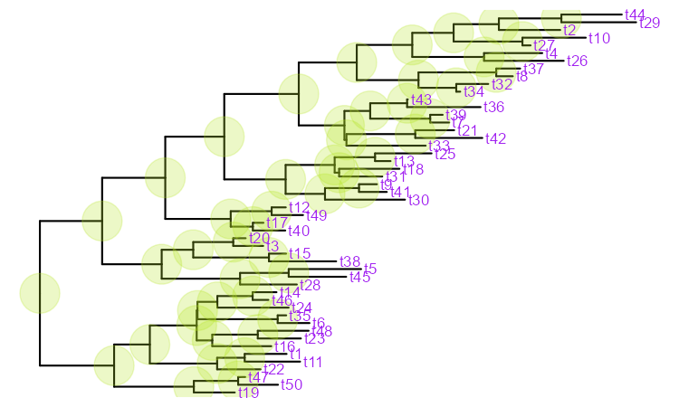

- `geom_tiplab()` 支持使用文本、标签和图像作为叶节点标签（详见第 7 章）
- `geom_nodelab()` 用于显示内部节点标签

在环形和无根布局中，`ggtree` 支持节点标签随分支角度旋转：

```r
library(ggtree)
set.seed(2017 - 02 - 16)
tree <- rtree(50)

p <- ggtree(tree, layout = "circular") +
  geom_tiplab(aes(angle = angle), color = "blue")
p
```

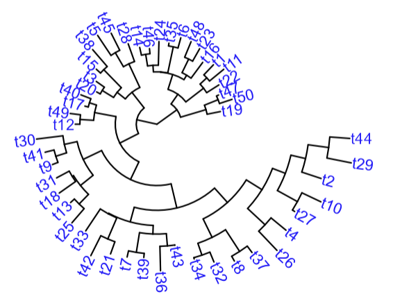

末端标签过长可能被截断，解决方法见 [FAQ](./A.FAQ.md)。另一种方案是将末端标签作为 **Y 轴标签显示**，但仅适用于矩形和树状图（dendrogram）布局，且需要使用 `theme()` 调整末端标签样式：

```r
library(ggtree)
set.seed(2017 - 02 - 16)
tree <- rtree(50)

p <- ggtree(tree) +
  geom_tiplab(as_ylab = TRUE, color = "firebrick")
p
```

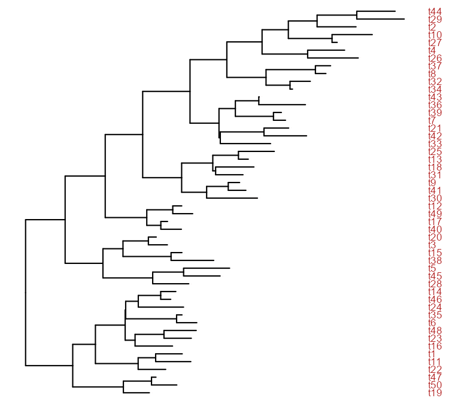

标签位置默认基于节点坐标，也可以改为基于分支/连线的中点（设置 `aes(x = branch)`）。便于标注从父节点到子节点的演化过渡。

### 4.3.4 显示根枝（Root-edge）

`ggtree()` 默认不绘制树根。可用 `geom_rootedge()` 显示树根（图 4.9A）；如果树中无根枝信息，则默认不显示（图 4.9B）。此时可以为树设置根枝（图 4.9C），或者直接在 `geom_rootedge()` 中指定根枝长度（图 4.9D）。较长的根枝有助于提高环形树的可读性（见 FAQ：扩大中心空间）。

```r
## 带有根枝 (root-edge = 1)
tree1 <- read.tree(text='((A:1,B:2):3,C:2):1;')
ggtree(tree1) + geom_tiplab() + geom_rootedge()

## 没有根枝
tree2 <- read.tree(text='((A:1,B:2):3,C:2);')
ggtree(tree2) + geom_tiplab() + geom_rootedge()

## 为树设置根枝
tree2$root.edge <- 2
ggtree(tree2) + geom_tiplab() + geom_rootedge()

## 仅在绘图时指定根枝长度
## 此操作将忽略 tree$root.edge 的值
ggtree(tree2) + geom_tiplab() + geom_rootedge(rootedge = 3)
```

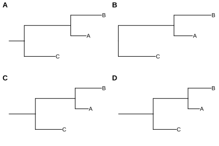

>  **图 4.9：显示根枝。** 
>
> - (A) 有根枝信息时，`geom_rootedge()` 将其显示；
> - (B) 无根枝信息，不显示；
> - (C) 可手动为树设置根枝；
> - (D) 或仅在绘图时指定根枝长度。

### 4.3.5 为树着色

在 `ggtree` 中为树着色只需用 `aes(color = VAR)` 将颜色映射到某个变量（数值或分类变量都行，图 4.10）。

```r
ggtree(beast_tree, aes(color = rate)) +
    scale_color_continuous(low = 'darkgreen', high = 'red') +
    theme(legend.position = "right")
```

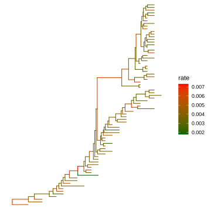

>  **图 4.10：按连续或离散特征为树着色。**  分支颜色由子节点关联的值决定。

可用任意特征（如后验概率、dN/dS 等）着色。连续变量可用 `continuous` 参数在分支上绘制渐变（图 4.11A）。若需细黑边框，可叠加一棵略粗的黑色树（图 4.11B）。

```r
library(ggtree)
library(treeio)
library(tidytree)
library(ggplot2)
library(TDbook)
## ref: http://www.phytools.org/eqg2015/asr.html
##
## load `tree_anole` and `df_svl` from 'TDbook'
svl <- as.matrix(df_svl)[, 1]
fit <- phytools::fastAnc(tree_anole, svl, vars = TRUE, CI = TRUE)

td <- data.frame(
  node = nodeid(tree_anole, names(svl)),
  trait = svl
)
nd <- data.frame(node = names(fit$ace), trait = fit$ace)

d <- rbind(td, nd)
d$node <- as.numeric(d$node)
tree <- full_join(tree_anole, d, by = "node")

p1 <- ggtree(tree, aes(color = trait),
  layout = "circular",
  ladderize = FALSE, continuous = "colour", size = 2
) +
  scale_color_gradientn(colours = c("red", "orange", "green", "cyan", "blue")) +
  geom_tiplab(hjust = -.1) +
  xlim(0, 1.2) +
  theme(legend.position = c(.05, .85))

p2 <- ggtree(tree, layout = "circular", ladderize = FALSE, size = 2.8) +
  geom_tree(aes(color = trait), continuous = "colour", size = 2) +
  scale_color_gradientn(colours = c("red", "orange", "green", "cyan", "blue")) +
  geom_tiplab(aes(color = trait), hjust = -.1) +
  xlim(0, 1.2) +
  theme(legend.position = c(.05, .85))

plot_list(p1, p2, ncol = 2, tag_levels = "A")
```

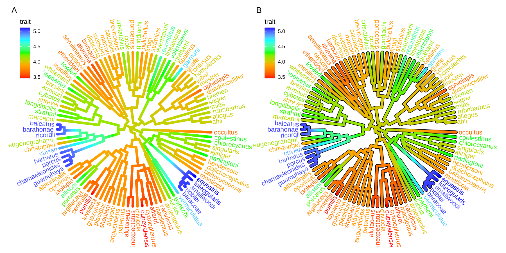

>  **图 4.11：分支上的连续状态渐变。**  分支颜色由祖先性状值到后代性状值渐变。

还可以使用二维树在垂直维度上展示表型，生成表型图（图 4.12）。可以使用 `ggrepel` 避免标签重叠（图 A.4）。

```r
ggtree(tree, aes(color = trait), continuous = 'colour', yscale = "trait") + 
    scale_color_viridis_c() + theme_minimal()
```

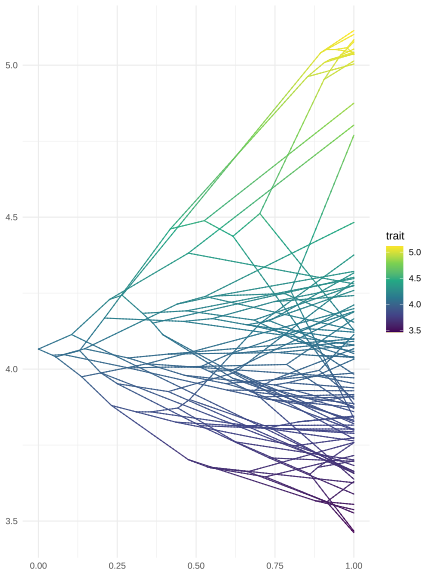

>  **图 4.12：表型图（Phenogram）。**  将树投影到水平轴为时间（或遗传距离）、垂直轴为表型的空间。

### 4.3.6 树的重新缩放（Rescale）

大多数系统发育树按进化距离（替换数/位点）缩放。在 `ggtree` 中，可用任何数值变量（如 dN/dS）重新缩放树。

下例展示一棵时间树（图 4.13A），其分支已按 BEAST 推断的替换速率重新缩放（图 4.13B）。

```R
library("treeio")
beast_file <- system.file("examples/MCC_FluA_H3.tree", package = "ggtree")
beast_tree <- read.beast(beast_file)
beast_tree
```

```R
## 'treedata' S4 object that stored information
## of
##  '/home/ygc/R/library/ggtree/examples/MCC_FluA_H3.tree'.
## 
## ...@ phylo:
## 
## Phylogenetic tree with 76 tips and 75 internal nodes.
## 
## Tip labels:
##   A/Hokkaido/30-1-a/2013, A/New_York/334/2004,
## A/New_York/463/2005, A/New_York/452/1999,
## A/New_York/238/2005, A/New_York/523/1998, ...
## 
## Rooted; includes branch lengths.
## 
## with the following features available:
##   'height', 'height_0.95_HPD', 'height_median',
## 'height_range', 'length', 'length_0.95_HPD',
## 'length_median', 'length_range', 'posterior', 'rate',
## 'rate_0.95_HPD', 'rate_median', 'rate_range'.
```

```R
p1 <- ggtree(beast_tree, mrsd = "2013-01-01") + theme_tree2() +
  labs(caption = "Divergence time")
p2 <- ggtree(beast_tree, branch.length = "rate") + theme_tree2() +
  labs(caption = "Substitution rate")
```

下例绘制由 CodeML 推断的树（图 4.13C），其分支可按 dN/dS 值重新缩放（图 4.13D）。

```r
mlcfile <- system.file("extdata/PAML_Codeml", "mlc", package="treeio")
mlc_tree <- read.codeml_mlc(mlcfile)
p3 <- ggtree(mlc_tree) + theme_tree2() +
    labs(caption="nucleotide substitutions per codon")
p4 <- ggtree(mlc_tree, branch.length='dN_vs_dS') + theme_tree2() +
    labs(caption="dN/dS tree")
```

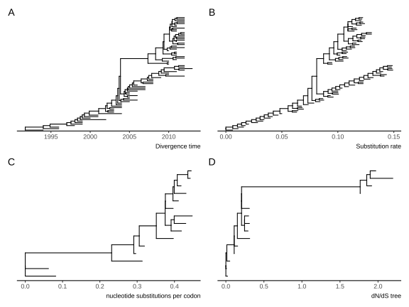

>  **图 4.13：重新缩放树的分支。**
>
> - (A) BEAST 推断的时间树；
> - (B) 按替换速率重新缩放的分支；
> - (C) CodeML 推断的树； 
> - (D) 按 dN/dS 值重新缩放的分支。

这能便捷地通过可视化探索树关联数据与树结构之间的关系。除了在绘制时指定 `branch.length` 外，还可以使用 `treeio` 的 `rescale_tree()` 函数修改树对象中的分支长度。以下命令生成的树与图 4.13B 完全相同。`rescale_tree()` 的文档见 2.4 节。

```r
beast_tree2 <- rescale_tree(beast_tree, branch.length='rate')
ggtree(beast_tree2) + theme_tree2()
```

### 4.3.7 修改主题组件

`theme_tree()` 定义空白画布，而 `theme_tree2()` 在此基础上添加了系统发育距离（X 轴）。两者都接受 `bgcolor` 参数设置背景颜色。任何 `ggplot2` 主题组件都可以应用于 `theme_tree()` 或 `theme_tree2()` 进行自定义（图 4.14）。

```r
set.seed(2019)
x <- rtree(30)
ggtree(x, color = "#0808E5", size = 1) + theme_tree("#FEE4E9")
ggtree(x, color = "orange", size = 1) + theme_tree('grey30')
```

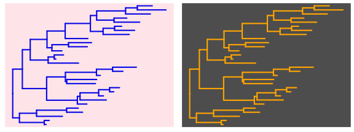

>  **图 4.14：主题示例。** 所有 `ggplot2` 主题组件都可以修改，并且所有 `ggplot2` 主题都可以应用于 `ggtree()` 的输出。

此外，还可以使用图像文件作为树的背景，具体示例请参见附录 B。

## 4.4 可视化树列表

`ggtree` 支持 `multiPhylo` 和 `treedataList` 对象，可同时查看多棵进化树，即可叠加显示，也可用 `facet_wrap()` 或 `facet_grid()` 分面板绘制（图 4.15）。

```r
## trees <- lapply(c(10, 20, 40), rtree)
## class(trees) <- "multiPhylo"
## ggtree(trees) + facet_wrap(~.id, scale="free") + geom_tiplab()

f <- system.file("extdata/r8s", "H3_r8s_output.log", package="treeio")
r8s <- read.r8s(f)
ggtree(r8s) + facet_wrap( ~.id, scale="free") + theme_tree2()
```

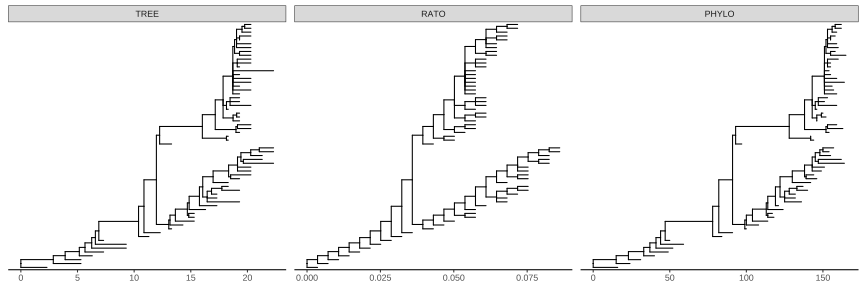

>  **图 4.15：可视化 multiPhylo 对象。** `ggtree()` 支持可视化 `multiPhylo` 或 `treedataList` 对象中的多棵树。

还可以同时查看上百棵 Bootstrap 树（图 4.16），便于寻找共识树和特征显著的树。共识树可用密度树（density tree）汇总（图 4.18）。

```r
btrees <- read.tree(system.file("extdata/RAxML", 
                                "RAxML_bootstrap.H3", 
                                package="treeio")
                    )
ggtree(btrees) + facet_wrap(~.id, ncol=10)
```


>  **图 4.16：同时可视化 100 棵 Bootstrap 树。**

### 4.4.1 用不同变量注释同一棵树

若要用不同变量注释同一棵树，可分别绘图后使用 `patchwork` 或 `aplot` 并排拼接。

另一种方法是利用 `ggtree` 绘制树列表，然后通过 `subset` 美学映射或 `td_filter()`，在指定面板中为所选变量添加注释图层（图 4.17）。`.id` 是内部保留变量，存储不同树的 ID。

```r
set.seed(2020)
x <- rtree(30)
d <- data.frame(label=x$tip.label, var1=abs(rnorm(30)), var2=abs(rnorm(30)))
tree <- full_join(x, d, by='label')
trs <- list(TREE1 = tree, TREE2 = tree)
class(trs) <- 'treedataList'
ggtree(trs) + facet_wrap(~.id) + 
  geom_tippoint(aes(subset=.id == 'TREE1', colour=var1)) + 
  scale_colour_gradient(low='blue', high='red') +  
  ggnewscale::new_scale_colour()  + 
  geom_tippoint(aes(colour=var2), data=td_filter(.id == "TREE2")) + 
  scale_colour_viridis_c()
```

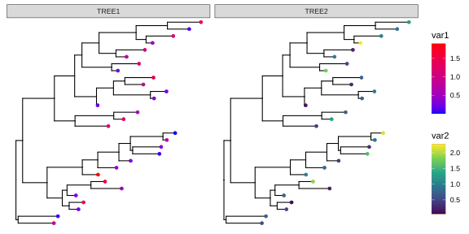

>  **图 4.17：用不同变量注释同一棵树。** 使用 `subset` 美学映射（TREE1 面板）或 `td_filter()`（TREE2 面板）筛选特定面板显示的变量。

### 4.4.2 DensiTree（密度树）

查看 Bootstrap 树的另一种方法是用 `ggdensitree()` 合并成密度树（图 4.18）。这有助于识别大量树之间的共识和差异。在绘制时，树会相互叠加，树的结构会发生旋转，以确保末端顺序一致。末端顺序由 `tip.order` 控制：默认 `tip.order = 'mode'` 末端按最常见拓扑结构排序；也可传入字符向量指定末端顺序，或传入整数 N 以第 N 棵树的末端顺序进行排序；传入 `mds` 给 `tip.order` 将基于末端之间路径长度的多维缩放（MDS）对末端进行排序；传入 `mds_dist` 则将基于末端之间距离的 MDS 对末端进行排序。

```r
ggdensitree(btrees, alpha=.3, colour='steelblue') + 
    geom_tiplab(size=3) + hexpand(.35)
```

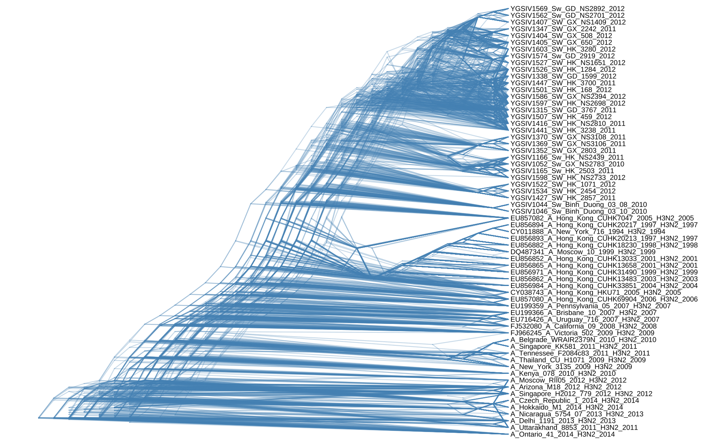

>  **图 4.18：DensiTree（密度树）。** 树叠加并旋转，确保末端顺序一致。

## 4.5 小结

使用 `ggtree` ，只需 `ggtree(tree)` 即可可视化系统发育树。它提供多种几何图层，展示树的各种组成部分，如叶节点标签、内外节点符号、根边（root-edge）等。关联数据可用于调整分支长度比例、着色，及将数据展示在树上。

以上所有操作都基于 `ggplot2` 的图形语法，因此叠加图层、自定义树形图（通过 `ggplot2` 的主题和标度）非常简单。此外，`ggtree` 还提供专为树注释设计的多种图层。

总之，`ggtree` 让系统发育树及其关联数据的展示非常便捷：生成简单图形轻而易举，复杂图形也只是图层的叠加。

