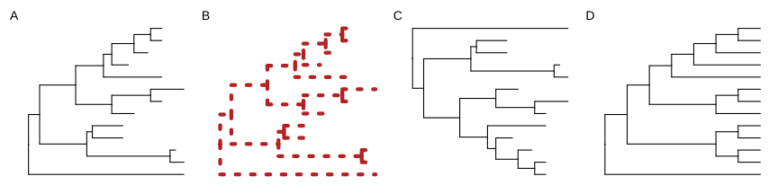
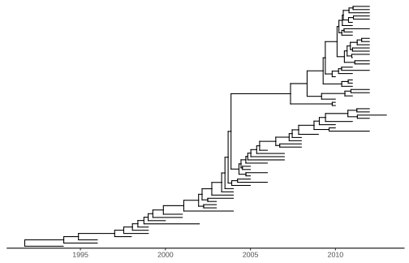

# 4. 系统发育树可视化

## 4.1 简介

目前有许多专门用于展示系统发育树的软件包和在线工具，例如 TreeView、FigTree、TreeDyn 、Dendroscope 、EvolView 和 iTOL 等。然而，只有少数工具（如 FigTree、TreeDyn 和 iTOL）允许用户利用树的特征为树添加注释，例如为分支着色、高亮显示特定的进化枝（clades）。但是，这些预定义的注释功能通常仅局限于某些特定的系统发育数据。

随着系统发育树在跨学科研究中的应用日益广泛，研究人员越来越需要将来自不同来源的各种类型的系统发育协变量（covariates）和其他相关数据整合到树中，以便进行可视化和进一步分析。例如，流感病毒具有广泛的宿主范围、多样且动态的基因型，以及大多与其自身进化密切相关的特征性传播行为。因此，除了专注于特定分析和数据类型的独立应用程序外，从事分子进化的研究人员迫切需要一个强大且可编程的平台。该平台需要能够在系统发育树上高度整合和可视化这些不同方面的数据（原始数据或来自其他初步分析的数据），从而帮助识别它们之间的关联和规律。

为了填补这一空白，我们开发了 `ggtree`。这是一个基于 R 编程语言的软件包，作为 Bioconductor 项目的一部分发布。`ggtree` 专为处理 `treedata` 对象而构建（详见第 1 章和第 9 章），它基于图形语法（grammar of graphics, Wilkinson et al., 2005），利用 `ggplot2` 软件包 (Wickham, 2016) 来绘制和展示树的图形。

R 语言在系统发育学中的应用正变得越来越普遍。然而，目前仍缺乏一个专为查看和注释系统发育树（尤其是在涉及复杂数据整合时）而设计的综合性软件包。R 语言中大多数系统发育包都侧重于特定的统计分析，而不是使用更通用的系统发育相关数据来查看和注释树。一些具备显示和注释树功能的软件包，包括 `ape` 和 `phytools` ，都是使用 R 语言的基础图形系统（base graphics system）开发的。特别是 `ape`，它是系统发育分析和数据处理的基础包之一。但是，基础图形系统相对难以扩展，限制了所展示树图的复杂性。

`OutbreakTools` (Jombart et al., 2014) 和 `phyloseq` (McMurdie & Holmes, 2013) 扩展了 `ggplot2` 来绘制系统发育树。`ggplot2` 图形系统允许用户快速自定义和探索设计方案。然而，这些软件包分别是为流行病学和微生物组数据设计的，其初衷并不是为树的可视化和注释提供通用的解决方案。

`ggtree` 软件包同样继承了 `ggplot2` 的多功能特性。更重要的是，它允许通过自由组合多个注释图层来构建复杂的树图（另见第 5 章），并且这些注释可以灵活地映射从不同来源导入的树相关数据。

## 4.2 使用 ggtree 可视化系统发育树

`ggtree` 软件包专为使用各种来源和不同类型的关联数据来注释系统发育树而设计。这些数据可能来自用户或分析程序，可能包括与真实样本分类群相关的进化速率、祖先序列等，也可能与代表假设祖先菌株/物种的内部节点相关，或者与指示进化时间进程的树分支相关 (Wang et al., 2020)。例如，数据可以是病毒基因树中采样的禽流感病毒的地理位置（由调查地点提供信息）和祖先节点（通过系统发生地理学推断得出）(Lam et al., 2012)。

`ggtree` 支持 `ggplot2` 的图形语言，这使得它具有高度的可定制性，且直观灵活。值得注意的是，`ggplot2` 本身并不提供针对树状结构的底层几何对象或其他支持，因此 `ggtree` 在这方面是一个非常有用的扩展。尽管另外两个与系统发育相关的 R 软件包 `OutbreakTools` 和 `phyloseq` 也是基于 `ggplot2` 开发的，但它们并不支持 `ggplot2` 语法中最有价值的部分——添加注释图层。例如，如果我们绘制了一棵没有分类群标签的树，对于对这些软件包底层架构知之甚少的普通 R 用户来说，`OutbreakTools` 和 `phyloseq` 并没有提供简单的方法来添加分类群标签图层。

`ggtree` 通过实现一个几何图层 `geom_tree()` 来扩展 `ggplot2`，以支持树结构的可视化。在 `ggtree` 中，查看系统发育树相对简单，可以通过命令 `ggplot(tree_object) + geom_tree() + theme_tree()` 实现，简写为 `ggtree(tree_object)`。注释图层可以通过 `+` 运算符逐一添加。为了方便树的可视化，`ggtree` 提供了多种几何图层，包括：

- `geom_treescale()`：用于添加树分支比例尺图例（如遗传距离、分歧时间等）；
- `geom_range()`：用于显示分支长度的不确定性（如置信区间或范围等）；
- `geom_tiplab()`：用于添加分类群标签；
- `geom_tippoint()` 和 `geom_nodepoint()`：用于添加叶节点和内部节点的符号；
- `geom_hilight()`：用于用矩形高亮显示进化枝；
- `geom_cladelab()`：用于用条形和文本标签注释选定的进化枝等。

`ggtree` 提供的所有几何图层的完整列表总结在表 5.1 中。

要查看系统发育树，我们首先需要将树文件解析到 R 中。`treeio` 软件包能够将来自不同软件输出的多种注释数据解析为 S4 格式的系统发育数据对象（另见第 1 章）。`ggtree` 软件包主要利用这些 S4 对象来显示和注释树。其他 R 软件包也定义了 S3/S4 类来存储带有特定领域相关数据的系统发育树，包括 `phylobase` 软件包中定义的 `phylo4` 和 `phylo4d`、`OutbreakTools` 软件包中定义的 `obkdata`，以及 `phyloseq` 软件包中定义的 `phyloseq` 等。所有这些树对象在 `ggtree` 中都受到支持，它们特定的注释数据可以直接在 `ggtree` 中用于注释树（另见第 9 章）。`ggtree` 的这种兼容性极大地促进了数据和分析结果的整合。此外，`ggtree` 还支持其他树状结构，包括树状图（dendrogram）和树图（tree graphs）。

### 4.2.1 基础树可视化

`ggtree` 软件包扩展了 `ggplot2` 软件包以支持查看系统发育树。它实现了 `geom_tree()` 图层用于展示系统发育树，如下方图 4.1A 所示。

```r
library("treeio")
library("ggtree")

nwk <- system.file("extdata", "sample.nwk", package="treeio") # treeio 中自带的文件
tree <- read.tree(nwk)

ggplot(tree, aes(x, y)) + geom_tree() + theme_tree()
```

`ggtree()` 函数为上述可视化树的快捷方式，其工作原理与上述方法完全相同。

`ggtree` 软件包充分利用了 `ggplot2` 的所有优势。例如，我们可以像使用 `ggplot2` 一样更改线条的颜色、大小和类型（图 4.1B）。

```r
ggtree(tree, color="firebrick", size=2, linetype="dotted")
```

默认情况下，树以阶梯状排序（ladderize）的形式查看。用户可以设置参数 `ladderize = FALSE` 来禁用此功能（图 4.1C，另见常见问题解答 A.5）。

```r
ggtree(tree, ladderize=FALSE)
```

`branch.length` 参数用于对分支（edge）进行缩放。用户可以设置参数 `branch.length = "none"` 来仅查看树的拓扑结构（即分支图 cladogram，图 4.1D），或者使用其他数值变量来对树进行缩放（例如 dN/dS，另见第 5 章）。

```r
ggtree(tree, branch.length="none")
```



> **图 4.1：基础树可视化。** 具有阶梯状排序（ladderized）效果的默认 `ggtree` 输出（A）；非变量设置（如颜色、大小、线型）的树（B）；未进行阶梯状排序的树（C）；仅展示树拓扑结构而不包含分支长度信息的分支图（cladogram）（D）。

### 4.2.2 系统发育树的布局

使用 `ggtree` 查看系统发育树非常简单，只需将树对象传递给 `ggtree()` 函数即可。我们为树的展示开发了多种布局类型（图 4.2），包括：矩形布局（rectangular，默认）、圆角矩形布局（roundrect）、椭圆形布局（ellipse）、倾斜布局（slanted）、圆形布局（circular）、扇形布局（fan）、无根树布局（unrooted，包含等角法 equal angle 和日光法 daylight methods）、时间尺度布局（time-scaled）以及二维布局（two-dimensional layouts）。

以下是使用不同布局可视化树的示例：

```R
library(ggtree)
set.seed(2017-02-16)
tree <- rtree(50)
ggtree(tree)
ggtree(tree, layout="roundrect")
ggtree(tree, layout="slanted")
ggtree(tree, layout="ellipse")
ggtree(tree, layout="circular")
ggtree(tree, layout="fan", open.angle=120)
ggtree(tree, layout="equal_angle")
ggtree(tree, layout="daylight")
ggtree(tree, branch.length='none')
ggtree(tree, layout="ellipse", branch.length="none")
ggtree(tree, branch.length='none', layout='circular')
ggtree(tree, layout="daylight", branch.length = 'none')
```


> **图 4.2：树的布局。**
> **系统发育图（Phylogram）**：矩形布局（A）、圆角矩形布局（B）、倾斜布局（C）、椭圆形布局（D）、圆形布局（E）和扇形布局（F）。
> **无根树（Unrooted）**：等角法（G）和日光法（H）。
> **分支图（Cladogram）**：矩形布局（I）、椭圆形布局（J）、圆形布局（K）和无根树布局（L）。此外，分支图也支持倾斜布局和扇形布局。

通过修改比例尺或坐标系可以获得更多布局（图 4.3）。

```R
ggtree(tree) + scale_x_reverse()
ggtree(tree) + coord_flip()
ggtree(tree) + layout_dendrogram()
ggplotify::as.ggplot(ggtree(tree), angle=-30, scale=.9)
ggtree(tree, layout='slanted') + coord_flip()
ggtree(tree, layout='slanted', branch.length='none') + layout_dendrogram()
ggtree(tree, layout='circular') + xlim(-10, NA)
ggtree(tree) + layout_inward_circular()
ggtree(tree) + layout_inward_circular(xlim=15)
```


> **图 4.3：衍生树布局。** 从右到左的矩形布局（A），自下而上的矩形布局（B），自上而下的矩形布局（树状图/Dendrogram）（C），旋转矩形布局（D），自下而上的倾斜布局（E），自上而下的倾斜布局（分支图/Cladogram）（F），圆形布局（G），向内圆形布局（H 和 I）。

**系统发育图（Phylogram）**
支持使用矩形（rectangular）、圆角矩形（roundrect）、倾斜（slanted）、椭圆形（ellipse）、圆形（circular）和扇形（fan）等布局来可视化系统发育图（默认情况下，分支长度按比例缩放），如图 4.2A-F 所示。

**无根树布局（Unrooted layout）**
支持通过等角算法（equal-angle）和日光算法（daylight）来绘制无根树（也称为“放射状/radial”布局）；用户可以在 `layout` 参数中传入 `"equal_angle"` 或 `"daylight"` 来指定无根树算法以可视化树。等角法由 Christopher Meacham 在 PLOTREE 中提出，后被整合到 PHYLIP 软件中 (Retief, 2000)。该方法从树的根部开始，根据每个子树中包含的叶节点（tips）数量，按比例为其分配角度弧。它从根向叶节点迭代，将分配给某个子树的角度进一步细分为其依赖的子树的角度。该方法计算速度快，已被许多软件包实现。如图 4.2G 所示，等角法的一个缺点是叶节点往往倾向于聚集在一起，从而留下许多未使用的空白空间。日光法首先通过等角法构建一棵初始树，然后依次遍历每个内部节点并“摆动（swinging）”子树，使得“日光”弧相等，从而对其进行迭代优化（图 4.2H）。该方法首次在 PAUP* 中实现。

**分支图（Cladogram）**
若要可视化不进行分支长度缩放、仅展示树拓扑结构的分支图，可将 `branch.length` 参数设置为 `"none"`，该设置适用于所有类型的布局（图 4.2I-L）。

**时间尺度布局（Timescaled layout）**
对于时间尺度树，必须通过 `mrsd` 参数（most recent sampling date，最近采样日期）指定最新的采样日期。`ggtree()` 将根据采样时间（叶节点）和分歧时间（内部节点）对树进行缩放，并默认在树的下方显示时间刻度轴。用户还可以使用 `deeptime` 软件包，在 `ggtree()` 绘制的图中添加地质时间尺度（例如纪和代）。

```r
beast_file <- system.file("examples/MCC_FluA_H3.tree", 
                          package="ggtree")
beast_tree <- read.beast(beast_file)
ggtree(beast_tree, mrsd="2013-01-01") + theme_tree2()
```



> **图 4.4：时间尺度布局。** X 轴为时间尺度（单位为年）。本例中的分歧时间是通过 BEAST 软件使用分子钟模型推断得出的。

**二维树布局（Two-dimensional tree layout）**
二维树是将系统发育树投影到一个二维空间中的可视化方法。该空间由相关的表型（数值型或分类型性状，位于 Y 轴）和树的分支尺度（如进化距离、分歧时间，位于 X 轴）共同定义。这里的表型可以是衡量树中分类单元及假想祖先的某种生物学特征的指标。这种布局非常适合用于追踪病毒表型或其他行为（Y 轴）随病毒进化（X 轴）而发生的变化。

事实上，在进化时间尺度上分析表型或基因型已被广泛应用于流感病毒进化的研究 (Neher et al., 2016)。不过，传统的分析图通常不具备树状结构，即数据点之间没有连线；而与我们提供的二维树布局不同，后者通过相应的树分支将数据点连接了起来。因此，我们提供的这种新布局将使此类数据分析变得更加简便，并且更易于扩展以处理大规模序列数据集。

在本示例中，我们使用了先前的人类和猪 H3 流感病毒的时间尺度树（图 4.4；数据发表于 Liang et al., 2014），并根据每个分类单元和血凝素蛋白祖先序列预测的 N-连接糖基化位点（NLG）数量对 Y 轴进行了缩放。NLG 位点是通过 NetNGlyc 1.0 Server 预测的。为了对 Y 轴进行缩放，需要将 `ggtree()` 函数中的 `yscale` 参数设置为数值型或分类型变量。如果 `yscale` 是分类型变量（如本例所示），用户应通过 `yscale_mapping` 变量来指定类别如何映射为数值。

```R
NAG_file <- system.file("examples/NAG_inHA1.txt", package="ggtree")

NAG.df <- read.table(NAG_file, sep="\t", header=FALSE, 
                     stringsAsFactors = FALSE)
NAG <- NAG.df[,2]
names(NAG) <- NAG.df[,1]

## separate the tree by host species
tip <- as.phylo(beast_tree)$tip.label
beast_tree <- groupOTU(beast_tree, tip[grep("Swine", tip)], 
                       group_name = "host")

p <- ggtree(beast_tree, aes(color=host), mrsd="2013-01-01", 
            yscale = "label", yscale_mapping = NAG) + 
  theme_classic() + theme(legend.position='none') +
  scale_color_manual(values=c("blue", "red"), 
                     labels=c("human", "swine")) +
  ylab("Number of predicted N-linked glycosylation sites")

## (optional) add more annotations to help interpretation
p + geom_nodepoint(color="grey", size=3, alpha=.8) +
  geom_rootpoint(color="black", size=3) +
  geom_tippoint(size=3, alpha=.5) + 
  annotate("point", 1992, 5.6, size=3, color="black") +
  annotate("point", 1992, 5.4, size=3, color="grey") +
  annotate("point", 1991.6, 5.2, size=3, color="blue") +
  annotate("point", 1992, 5.2, size=3, color="red") + 
  annotate("text", 1992.3, 5.6, hjust=0, size=4, label="Root node") +
  annotate("text", 1992.3, 5.4, hjust=0, size=4, 
           label="Internal nodes") +
  annotate("text", 1992.3, 5.2, hjust=0, size=4,
           label="Tip nodes (blue: human; red: swine)")
```

![Two-dimensional tree layout. The trunk and other branches are highlighted in red (for swine) and blue (for humans). The x-axis is scaled to the branch length (in units of year) of the timescaled tree. The y-axis is scaled to the node attribute variable, in this case, the number of predicted N-linked glycosylation sites (NLG) on the hemagglutinin protein. Colored circles indicate the different types of tree nodes. Note that nodes assigned the same x- (temporal) and y- (NLG) coordinates are superimposed in this representation and appear as one node, which is shaded based on the colors of all the nodes at that point.](./images/2d-1.svg)

> **图 4.5：二维树状布局。** 树干及其他分支以红色（代表猪）和蓝色（代表人类）高亮显示。X 轴按时间尺度树的分支长度（以年为单位）进行缩放。Y 轴按节点属性变量进行缩放，在本例中为血凝素蛋白上预测的 N-连接糖基化位点（NLG）数量。彩色圆圈表示不同类型的树节点。请注意，在此表示法中，被分配了相同 X 坐标（时间）和 Y 坐标（NLG）的节点会叠加在一起并显示为一个节点，该节点的颜色基于该位置上所有节点的颜色进行混合着色。

如图 4.5 所示，二维树状图非常擅长直观展示系统发育树中表型随进化的变化。在本例中可以看出，在过去二十年间，人类甲型流感病毒的 H3 基因始终保持着较高水平的 N-连接糖基化位点（n=8 至 9）；而在传播至猪群并在此定殖的独立病毒谱系中，该位点数量则显著下降至 5 或 6 个。事实上，已有假说认为，人类流感病毒血凝素蛋白上的高水平糖基化能提供更好的屏蔽效应，以保护抗原表位免受群体免疫的识别，因此在维持高水平群体免疫的人类群体中，针对当前流行的人类流感病毒株，这种特性具有选择优势。相反，对于刚刚跨越物种屏障并传播至猪群的新病毒谱系而言，高水平的表面聚糖所产生的屏蔽效应反而带来了选择劣势，因为受体结合结构域可能同样被屏蔽，这极大地影响了该谱系在适应新宿主物种过程中的病毒适应度（fitness）。二维树状图的另一个示例可见图 4.12。

## 4.3 显示树组件

### 4.3.1 显示进化树比例尺（进化距离）

要显示进化树比例尺（treescale），用户可以使用 `geom_treescale()` 图层（图 4.6 A-C）。

```r
ggtree(tree) + geom_treescale()
```

`geom_treescale()` 支持以下参数：

- `x` 和 `y`：用于设置比例尺的位置
- `width`：比例尺的长度
- `fontsize`：文本的大小
- `linesize`：线条的粗细
- `offset`：线条与文本的相对位置
- `color`：比例尺的颜色

```r
ggtree(tree) + geom_treescale(x=0, y=45, width=1, color='red')
ggtree(tree) + geom_treescale(fontsize=6, linesize=2, offset=1)
```

也可以通过添加 X 轴，使用 `theme_tree2()` 来显示进化树比例尺（图 4.6 D）。

```r
ggtree(tree) + theme_tree2()
```


> **图 4.6：显示进化树比例尺。** `geom_treescale()` 会自动添加一个表示进化距离的比例尺（A）。用户可以修改比例尺的颜色、宽度和位置（B），以及比例尺和文本的大小及它们的相对位置（C）。另一种可行的解决方案是启用 X 轴，这对于时间尺度树（timescaled tree）非常有用（D）。

进化树比例尺并不局限于表示进化距离。`treeio` 包可以使用其他数值变量对树进行重新缩放（详见 2.4 节），而 `ggtree` 允许用户指定一个数值变量作为分支长度来进行可视化（详见 4.3 节）。
