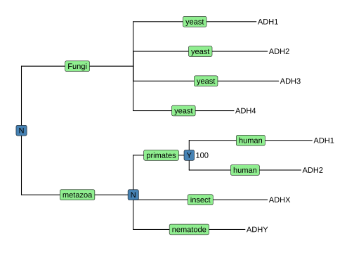
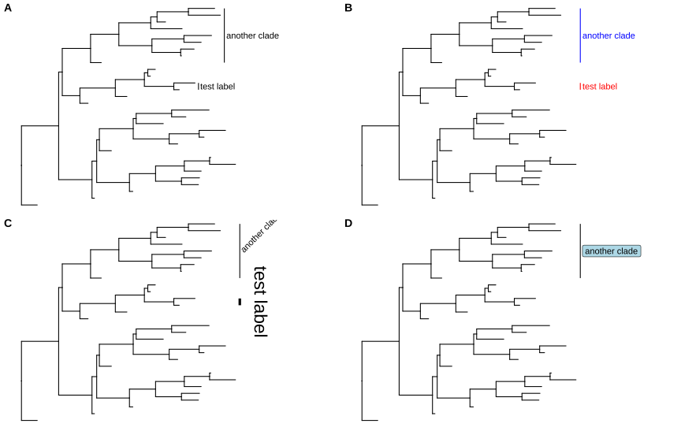
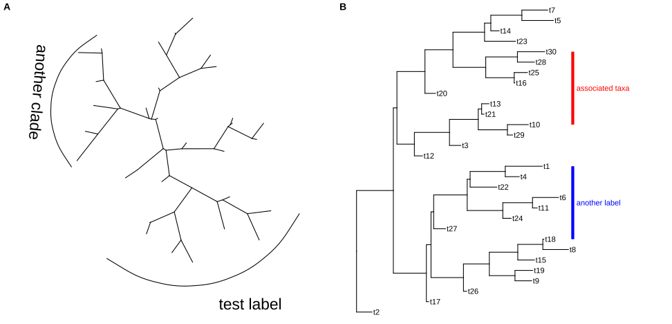
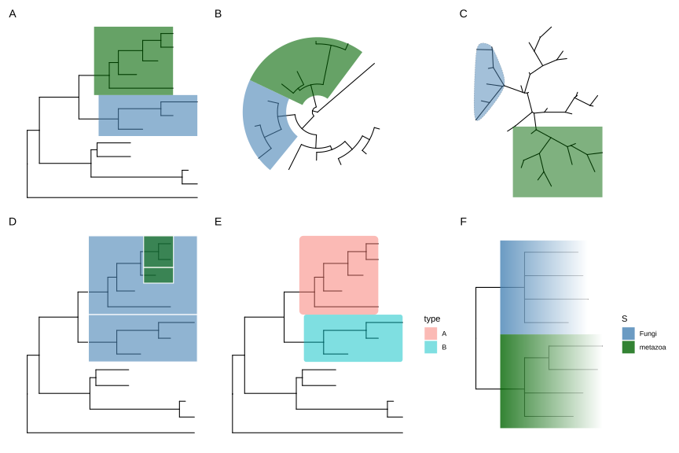
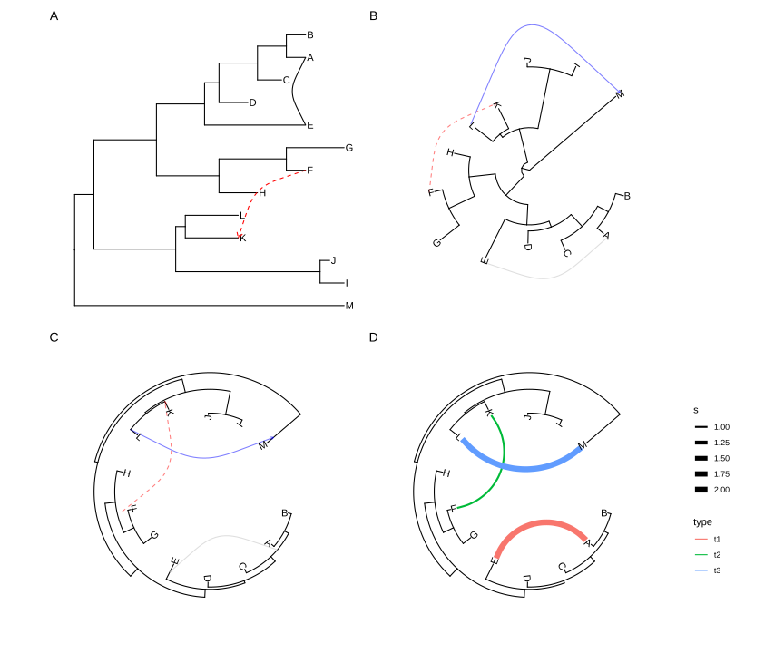
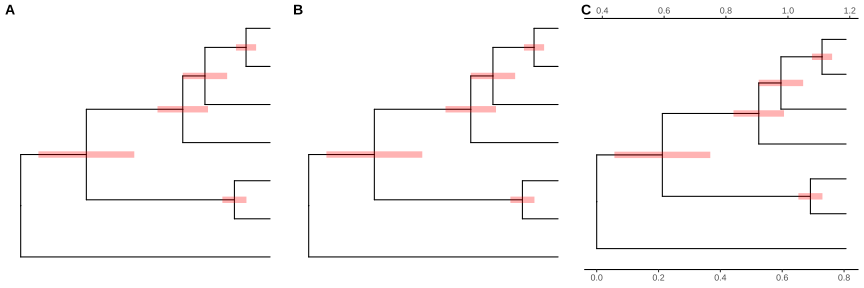
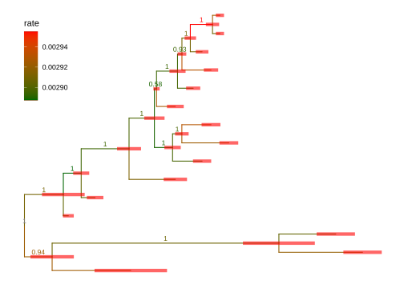
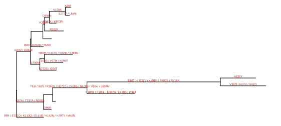
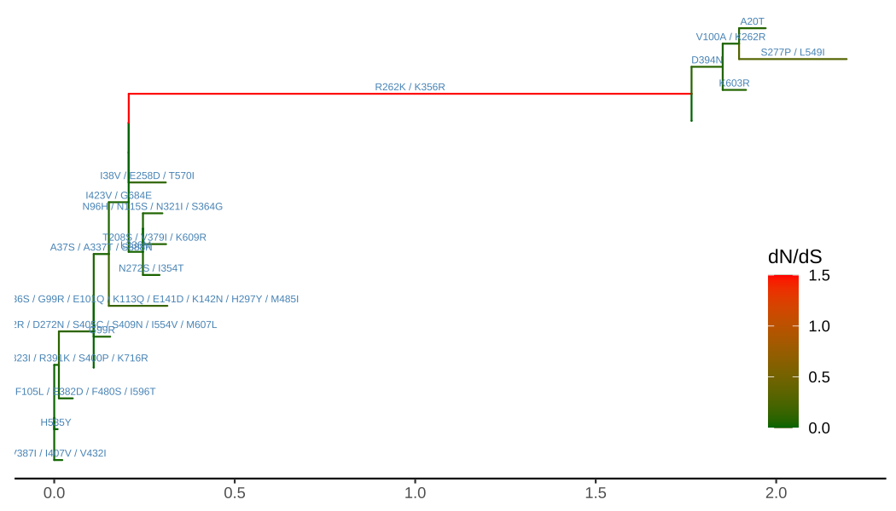

# 5. 系统发育树注释

@since 2026-09-24⭐
@author Jiawei Mao
***
## 5.1 使用图形语法可视化与注释树

`ggtree` 专为进化树的可视化与注释而设计，支持 `ggplot2` 的图形语法，用户可通过组合多个注释图层自由地可视化和注释树。

```r
library(ggtree)
treetext = "(((ADH2:0.1[&&NHX:S=human], ADH1:0.11[&&NHX:S=human]):
0.05 [&&NHX:S=primates:D=Y:B=100],ADHY:
0.1[&&NHX:S=nematode],ADHX:0.12 [&&NHX:S=insect]):
0.1[&&NHX:S=metazoa:D=N],(ADH4:0.09[&&NHX:S=yeast],
ADH3:0.13[&&NHX:S=yeast], ADH2:0.12[&&NHX:S=yeast],
ADH1:0.11[&&NHX:S=yeast]):0.1[&&NHX:S=Fungi])[&&NHX:D=N];"
tree <- read.nhx(textConnection(treetext))
ggtree(tree) + geom_tiplab() + 
  geom_label(aes(x=branch, label=S), fill='lightgreen') + 
  geom_label(aes(label=D), fill='steelblue') + 
  geom_text(aes(label=B), hjust=-.5)
```



>  **图 5.1：使用图形语法注释树。** 该 NHX 树通过 `+` 组合不同进行注释：物种信息标在分支中间；基因复制事件显示在最近共同祖先节点上；进化枝的 Bootstrap 支持值显示在进化枝附近。

此例展示如何用多个图层可视化 NHX 标签中的注释信息：

- 用 `geom_tiplab()` 显示末端标签（基因名）；
- 用 `geom_label()` 显示浅绿色的物种信息（S 标签）；
- 用另一个图层显示蓝色的基因复制事件信息（D 标签）；
- 使用 `geom_text()` 显示 Bootstrap 支持值（B 标签）。

如图 5.1 所示，`ggplot2` 的图层可直接用于 `ggtree`，但 `ggplot2` 没有为系统发育树提供专用图层。如末端标签、比例尺、高亮或进化枝标注。为此，`ggtree` 实现了多种专用图层（表 5.1），支持对树的各个部分进行灵活注释。

**表 5.1：`ggtree` 中定义的几何图层（Geom layers）。**

| 图层             | 描述                                                |
| ---------------- | --------------------------------------------------- |
| `geom_balance`   | 高亮内部节点的两个直接后代进化枝                    |
| `geom_cladelab`  | 使用条形图和文本（或图像）标注进化枝                |
| `geom_facet`     | 在特定面板（facet）中绘制关联数据，并使该图与树对齐 |
| `geom_hilight`   | 用矩形或圆形高亮特定进化枝                          |
| `geom_inset`     | 向节点添加插图                                      |
| `geom_label2`    | `geom_label` 修改版，支持 `subset` 美学映射         |
| `geom_nodepoint` | 用符号点注释内部节点                                |
| `geom_point2`    | `geom_point` 修改版，支持 `subset` 美学映射         |
| `geom_range`     | 条形图层，展示进化推断的不确定性                    |
| `geom_rootpoint` | 用符号点注释根节点                                  |
| `geom_rootedge`  | 为树添加根枝                                        |
| `geom_segment2`  | `geom_segment` 修改版，支持 `subset` 美学映射       |
| `geom_strip`     | 用条形图和可选文本标签标注关联分类群                |
| `geom_taxalink`  | 连接相关分类群                                      |
| `geom_text2`     | `geom_text` 修改版，支持 `subset` 美学映射          |
| `geom_tiplab`    | 末端标签图层                                        |
| `geom_tippoint`  | 使用符号点注释叶节点                                |
| `geom_tree`      | 树结构图层，支持多种布局                            |
| `geom_treescale` | 树枝比例尺图例                                      |

## 5.2 用于树注释的图层

### 5.2.1 彩色条带

`ggtree` 提供 `geom_cladelab()` 图层，用指示条和文本标签注释进化枝（clade）。传入内部节点编号即可自动为标注（图 5.2A）。关于如何获取内部节点编号见第 2 章。

```r
set.seed(2015-12-21)
tree <- rtree(30)
p <- ggtree(tree) + xlim(NA, 8)

p + geom_cladelab(node=45, label="test label") +
    geom_cladelab(node=34, label="another clade")
```

设置 `align = TRUE` 可对齐进化枝标签，使用 `offset` 调整位置，使用 `color` 设置指示条和文本的颜色（图 5.2B）。

```r
p + geom_cladelab(node=45, label="test label", align=TRUE,  
                  offset = .2, textcolor='red', barcolor='red') +
    geom_cladelab(node=34, label="another clade", align=TRUE, 
                  offset = .2, textcolor='blue', barcolor='blue')
```

`offset.text` 控制文本与指示条的相对位置，`angle` 控制角度；`barsize` 和 `fontsize` 控制指示条和文本的大小（图 5.2C）。

```r
p + geom_cladelab(node=45, label="test label", align=TRUE, angle=270, 
            hjust='center', offset.text=.5, barsize=1.5, fontsize=8) +
    geom_cladelab(node=34, label="another clade", align=TRUE, angle=45)
```

用 `geom_label()` 和 `fill` 设置带背景颜色的标签（图 5.2D）。

```r
p + geom_cladelab(node=34, label="another clade", align=TRUE, 
                  geom='label', fill='lightblue')
```



>  **图 5.2：标注进化枝。**  (A) 默认效果； (B) 对齐并着色； (C) 更改大小和角度； (D) 使用带背景色的 `geom_label()`。

`geom_cladelab()` 支持使用图像或 Phylopic 图标注释进化枝，并可以使用美学映射自动为进化枝添加指示条、文本标签或图像（图 5.3）。

```r
dat <- data.frame(node = c(45, 34), 
            name = c("test label", "another clade"))
# 当 geom="text"、geom="label" 或 geom="shadowtext" 时，需要提供 node 和 label。
p1 <- p + geom_cladelab(data = dat, 
        mapping = aes(node = node, label = name, color = name), 
        fontsize = 3)

dt <- data.frame(node = c(45, 34), 
                 image = c("7fb9bea8-e758-4986-afb2-95a2c3bf983d", 
                          "0174801d-15a6-4668-bfe0-4c421fbe51e8"), 
                 name = c("specie A", "specie B"))

# 当 geom="phylopic" 或 geom="image" 时，aes 中需要提供 image。
p2 <- p + geom_cladelab(data = dt, 
                mapping = aes(node = node, label = name, image = image), 
                geom = "phylopic", imagecolor = "black", 
                offset=1, offset.text=0.5)

# 图像的颜色或大小也可以进行映射。
p3 <- p + geom_cladelab(data = dt, 
              mapping = aes(node = node, label = name, 
                          image = image, color = name), 
              geom = "phylopic", offset = 1, offset.text=0.5)
```


>  **图 5.3：使用美学映射标注进化枝。**
>
> - (A) 用美学映射注释进化枝；
> - (B) 用图像或 Phylopic 注释进化枝； 
> - (C) 映射变量以更改文本或图像的颜色/大小。

`geom_cladelab()` 也支持无根树布局（图 5.4A）。

```r
ggtree(tree, layout="daylight") + 
  geom_cladelab(node=35, label="test label", angle=0, 
                  fontsize=8, offset=.5, vjust=.5)  + 
  geom_cladelab(node=55, label='another clade', 
                  angle=-95, hjust=.5, fontsize=8)
```

`geom_cladelab()` 专用于标注单系群（进化枝）。对于不构成单一进化枝的关联分类群，可用  `geom_strip()` 添加条带和可选标签，以标注多系群（Polyphyletic）或并系群（Paraphyletic）（图 5.4B）。

```r
p + geom_tiplab() + 
  geom_strip('t10', 't30', barsize=2, color='red', 
            label="associated taxa", offset.text=.1) + 
  geom_strip('t1', 't18', barsize=2, color='blue', 
            label = "another label", offset.text=.1)
```



>  **图 5.4：标注关联分类群。** 
>
> -  (A) `geom_cladelab()` 专用于标注单系群，支持无根树；
> -  (B) `geom_strip()` 可以标注所有类型的关联分类群，包括单系群、多系群和并系群。

### 5.2.2 高亮进化枝

`ggtree` 提供 `geom_hilight()` 图层，传入内部节点编号即可添加矩形图层以高亮选定进化枝（图 5.5）。

```r
nwk <- system.file("extdata", "sample.nwk", package="treeio")
tree <- read.tree(nwk)
ggtree(tree) + 
    geom_hilight(node=21, fill="steelblue", alpha=.6) +
    geom_hilight(node=17, fill="darkgreen", alpha=.6) 

ggtree(tree, layout="circular") + 
    geom_hilight(node=21, fill="steelblue", alpha=.6) +
    geom_hilight(node=23, fill="darkgreen", alpha=.6)
```

无根树也支持高亮，形状可选圆形（`'encircle'`）或矩形（`'rect'`）（图 5.5C）。

```r
## type 可以是 'encircle' 或 'rect'
pg + geom_hilight(node=55, linetype = 3) + 
  geom_hilight(node=35, fill='darkgreen', type="rect")
```

也可以通过设置不同颜色或线型来高亮进化枝（图6.2）。

`ggtree` 还提供 `geom_balance()` 专为高亮内部节点的相邻子进化枝（图 5.5D）。

```r
ggtree(tree) +
  geom_balance(node=16, fill='steelblue', color='white', alpha=0.6, extend=1) +
  geom_balance(node=19, fill='darkgreen', color='white', alpha=0.6, extend=1) 
```

`geom_hilight()` 支持使用美学映射自动高亮进化枝（图5.5E-F）。在笛卡尔坐标系中（如矩形布局），矩形可设为圆角（图 5.5E）或填充渐变色（图 5.5F）。

```r
## 使用外部数据
d <- data.frame(node=c(17, 21), type=c("A", "B"))
ggtree(tree) + geom_hilight(data=d, aes(node=node, fill=type),
                            type = "roundrect")

## 使用存储在树对象中的数据
x <- read.nhx(system.file("extdata/NHX/ADH.nhx", package="treeio"))
ggtree(x) + geom_hilight(mapping=aes(subset = node %in% c(10, 12), 
                                    fill = S),
                        type = "gradient", gradient.direction = 'rt',
                        alpha = .8) +
  scale_fill_manual(values=c("steelblue", "darkgreen"))
```



**图 5.5：高亮显示选定的进化枝。**  (A) 矩形布局； (B) 环形/扇形布局； (C) 无根树布局； (D) 同时高亮显示相邻的子进化枝； (E 和 F) 使用关联数据高亮进化枝。

### 5.2.3 分类群连接

某些进化事件（如基因重配、水平基因转移）无法同树形结构表示。`ggtree` 提供 `geom_taxalink()` 图层，可在任意两个节点之间绘制直线或曲线，通过连接分类群来表示进化事件。该图层适用于矩形（图 5.6A）、环形（图 5.6B）和内向环形（图 5.6C）布局；也可用于展示物种关系或相互作用。

`geom_taxalink()` 支持美学映射，需提供包含关联信息的 `data.frame`（图 5.6D）。

```r
p1 <- ggtree(tree) + geom_tiplab() + geom_taxalink(taxa1='A', taxa2='E') + 
  geom_taxalink(taxa1='F', taxa2='K', color='red', linetype = 'dashed',
    arrow=arrow(length=unit(0.02, "npc")))

p2 <- ggtree(tree, layout="circular") + 
      geom_taxalink(taxa1='A', taxa2='E', color="grey", alpha=0.5, 
                offset=0.05, arrow=arrow(length=unit(0.01, "npc"))) + 
      geom_taxalink(taxa1='F', taxa2='K', color='red', 
                linetype = 'dashed', alpha=0.5, offset=0.05,
                arrow=arrow(length=unit(0.01, "npc"))) +
      geom_taxalink(taxa1="L", taxa2="M", color="blue", alpha=0.5, 
                offset=0.05, hratio=0.8, 
                arrow=arrow(length=unit(0.01, "npc"))) + 
      geom_tiplab()

# 当树使用反向 x 轴创建时，
# 我们可以将 outward 设置为 FALSE，这将生成向内弯曲的连线。
p3 <- ggtree(tree, layout="inward_circular", xlim=150) +
      geom_taxalink(taxa1='A', taxa2='E', color="grey", alpha=0.5, 
                    offset=-0.2, outward=FALSE,
                    arrow=arrow(length=unit(0.01, "npc"))) +
      geom_taxalink(taxa1='F', taxa2='K', color='red', linetype = 'dashed', 
                    alpha=0.5, offset=-0.2, outward=FALSE,
                    arrow=arrow(length=unit(0.01, "npc"))) +
      geom_taxalink(taxa1="L", taxa2="M", color="blue", alpha=0.5, 
                    offset=-0.2, outward=FALSE,
                    arrow=arrow(length=unit(0.01, "npc"))) +
      geom_tiplab(hjust=1) 

dat <- data.frame(from=c("A", "F", "L"), 
                  to=c("E", "K", "M"), 
                  h=c(1, 1, 0.1), 
                  type=c("t1", "t2", "t3"), 
                  s=c(2, 1, 2))
p4 <- ggtree(tree, layout="inward_circular", xlim=c(150, 0)) +
          geom_taxalink(data=dat, 
                         mapping=aes(taxa1=from, 
                                     taxa2=to, 
                                     color=type, 
                                     size=s), 
                         ncp=10,
                         offset=0.15) + 
          geom_tiplab(hjust=1) +
          scale_size_continuous(range=c(1,3))
plot_list(p1, p2, p3, p4, ncol=2, tag_levels='A')
```



>  **图 5.6：连接相关分类群。** 可用于指示进化事件或物种关系。包括矩形（A）、环形（B）以及内向环形（C 和 D）。支持美学映射，可将变量映射为线条粗细和颜色（D）。

### 5.2.4 进化推断的不确定性

`geom_range()` 支持在节点上以水平条的形式显示区间（如最高后验密度区间、置信区间、取值范围等），区间中心默认与对应节点对齐（图 5.7A）。中心也可设置为均值、中位数（图 5.7B）或观测值。若树枝与区间比例尺可能不同，可用 `scale_x_range()` 添加次级 X 轴（图 5.7C）。默认主题禁用 X 轴，需手动启用（如使用 `theme_tree2()`）。

```r
file <- system.file("extdata/MEGA7", "mtCDNA_timetree.nex", package = "treeio")
x <- read.mega(file)
p1 <- ggtree(x) + geom_range('reltime_0.95_CI', color='red', size=3, alpha=.3)
p2 <- ggtree(x) + geom_range('reltime_0.95_CI', color='red', size=3, 
                              alpha=.3, center='reltime')  
p3 <- p2 + scale_x_range() + theme_tree2()
```



>  **图 5.7：展示进化推断的不确定性。**  区间的中心（均值 (A) 或估计值 (B)）与节点对齐。使用次级 X 轴缩放区间 (C)。

## 5.3 使用进化软件输出结果注释树

### 5.3.1 使用进化分析软件的数据进行树注释

第 1 章介绍了用 `treeio` 解析不同树格式和常用软件输出，获取系统发育数据。这些数据作为 S4 对象，可直接使用 `ggtree` 可视化。图 5.1 演示了如何用 NHX 文件中的物种分类、基因复制事件和 Bootstrap 支持值注释树。PHYLDOG 和 `pkg_revbayes` 输出的 NHX 文件可以由 `treeio` 解析，并通过 `ggtree` 结合其推断数据进行可视化注释。

此外，BEAST、MrBayes 和 RevBayes 的推断数据，CODEML 的 dN/dS 值，HyPhy、CODEML 或 BASEML 推断的祖先序列，以及 EPA 和 PPLACER 的短读长序列定位，均可用于注释树。

```r
file <- system.file("extdata/BEAST", "beast_mcc.tree", package="treeio")
beast <- read.beast(file)
ggtree(beast, aes(color=rate))  +
    geom_range(range='length_0.95_HPD', color='red', alpha=.6, size=2) +
    geom_nodelab(aes(x=branch, label=round(posterior, 2)), vjust=-.5, size=3) +
    scale_color_continuous(low="darkgreen", high="red") +
    theme(legend.position=c(.1, .8))
```



>  **图 5.8：使用 95% HPD 区间长度和后验概率注释 BEAST 树。** 分支长度的可信区间（95% HPD）显示为红色水平条，进化枝的后验概率显示在分支中间。

图 5.8 中，树被可视化并使用后验概率 > 0.9 进行了注释，并展示长度的不确定性（95% 最高后验密度 (HPD) ）。

HyPhy 推断的祖先序列可由 `treeio` 解析，沿树枝的碱基替换会被自动计算并存如系统发育树对象（即 S4 对象）。`ggtree` 可以用其注释树（图 5.9）。

```r
nwk <- system.file("extdata/HYPHY", "labelledtree.tree", 
                   package="treeio")
ancseq <- system.file("extdata/HYPHY", "ancseq.nex", 
                      package="treeio")
tipfas <- system.file("extdata", "pa.fas", package="treeio")
hy <- read.hyphy(nwk, ancseq, tipfas)
ggtree(hy) + 
  geom_text(aes(x=branch, label=AA_subs), size=2, 
            vjust=-.3, color="firebrick")
```



>  **图 5.9：用 HyPhy 推断的祖先序列的氨基酸替换注释树。** 氨基酸替换显示在分支中间。

PAML 的 BASEML 和 CODEML 也可推断祖先序列，CODEML 还能推断选择压力。用 `treeio` 解析后，`ggtree` 可整合到同一个树结构中，并用于注释（图 5.10）。

```r
rstfile <- system.file("extdata/PAML_Codeml", "rst", 
                       package="treeio")
mlcfile <- system.file("extdata/PAML_Codeml", "mlc", 
                       package="treeio")
ml <- read.codeml(rstfile, mlcfile)
ggtree(ml, aes(color=dN_vs_dS), branch.length='dN_vs_dS') + 
  scale_color_continuous(name='dN/dS', limits=c(0, 1.5),
                         oob=scales::squish,
                         low='darkgreen', high='red') +
  geom_text(aes(x=branch, label=AA_subs), 
            vjust=-.5, color='steelblue', size=2) +
  theme_tree2(legend.position=c(.9, .3))
```



>  **图 5.10：用 CODEML 推断的氨基酸替换和 dN/dS 注释树。** 分支按 dN/dS 重新缩放和着色，氨基酸替换显示在分支中间。

`treeio` 解析的树数据可用于 `ggtree` 可视化和注释，R 社区中其他树对象也支持。`ggtree` 在 R 生态中扮演着独特角色，有助于促进系统发育分析，可轻松集成到其他包和流程。更多树结构见第 9 章；外部数据绘图见第 7 章。

## 5.4 总结

`ggtree` 为系统发育树注释实现了图形语法。用户可用 `ggplot2` 语法组合注释图层，以生成复杂的树注释。熟悉 `ggplot2` 的话，`ggtree` 用起来或非常直观且灵活。

`ggtree`  能整合 `treedata` 对象中的信息，或将外部数据链接到树结构，从而支持数据整合分析与比较研究，极大地拓展系统发育树在不同领域中的应用。
