# 6. 系统发育树的可视化探索

@since 2026-09-24⭐
@author Jiawei Mao
***
`ggtree` 支持多种树的可视化操作，如查看选定进化枝以探索大型进化树（图 6.1）、分类群聚类（图 6.5）、旋转进化枝或整棵树（图 6.6B 和 6.8）、缩小视图或折叠进化枝（图 6.3A 和 6.2）等。树操作函数详见表 6.1。

**表 6.1：树操作函数。**

| 函数          | 描述                                              |
| ------------- | ------------------------------------------------- |
| `collapse`    | 折叠选定进化枝                                    |
| `expand`      | 展开已折叠进化枝                                  |
| `flip`        | 交换共享同一父节点的两个进化枝的位置              |
| `groupClade`  | 对进化枝分组                                      |
| `groupOTU`    | 通过最近共同祖先（MRCA）对操作分类单元（OTU）分组 |
| `identify`    | 交互式操作树形图                                  |
| `rotate`      | 将选定进化枝旋转 180 度                           |
| `rotate_tree` | 按指定角度旋转环形布局的树                        |
| `scaleClade`  | 放大或缩小选定进化枝                              |
| `open_tree`   | 按指定张角将树转换为扇形布局                      |

## 6.1 查看选定进化枝

**进化枝**（clade）是包含一个共同祖先及其所有后代的单系群。可用 `viewClade()` 可视化指定进化枝（图 6.1B），也可将选定的进化枝提取为新的树对象（见 2.5 节）。这些函数可用于探索大型进化树。

```r
library(ggtree)
nwk <- system.file("extdata", "sample.nwk", package="treeio")
tree <- read.tree(nwk)
p <- ggtree(tree) + geom_tiplab()
viewClade(p, MRCA(p, "I", "L"))
```

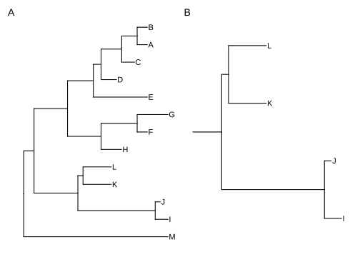

>  **图 6.1：查看指定进化枝。**  (A) 示例树； (B) 可视化指定进化枝。可通过内部节点编号，或选定末端分类群的最近共同祖先（MRCA）来确定进化枝。

部分函数（如 `viewClade()`）专门操作进化枝，接受内部节点编号参数。可用 `MRCA()` 通过两个分类群名称获取内部节点编号（图 6.1）。该函数适用于树对象和图形对象（ `ggtree()` 输出）。`tidytree` 包也提供了 `MRCA()` 方法，用于从 MRCA 节点提取信息（见 2.1.3 节）。

## 6.2 缩放指定进化枝

`ggtree` 可用 `scaleClade()` 缩小（压缩）指定进化枝，同时保留被压缩进化枝的拓扑结构和分支长度，从而节省绘图空间，突出显示主要关注的进化枝。

```r
tree2 <- groupClade(tree, c(17, 21))
p <- ggtree(tree2, aes(color=group)) + theme(legend.position='none') +
  scale_color_manual(values=c("black", "firebrick", "steelblue"))
scaleClade(p, node=17, scale=.1) 
```

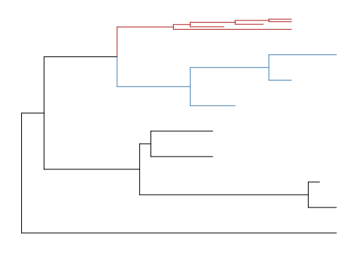

>  **图 6.2：缩放指定进化枝。** 当 `scale>1` 时放大进化枝以突出显示；小于 1 时缩小进化枝以节省空间。

若想强调重要进化枝，可将 `scaleClade()` 的 `scale` 参数设为大于 1 来放大进化枝。也可用 `groupClade()` 为指定进化枝分配不同 ID，从而按不同颜色着色（图 6.2）。

## 6.3 折叠与展开进化枝

折叠进化枝以突出特定部分是常见做法。`ggtree` 用 `collapse()` 折叠指定进化枝（图 6.3A）。

```r
p2 <- p %>% collapse(node=21) + 
  geom_point2(aes(subset=(node==21)), shape=21, size=5, fill='green')
p2 <- collapse(p2, node=23) + 
  geom_point2(aes(subset=(node==23)), shape=23, size=5, fill='red')
print(p2)
expand(p2, node=23) %>% expand(node=21)
```

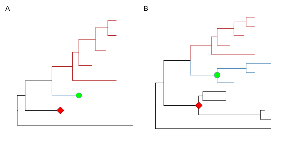

>  **图 6.3：折叠与展开进化枝。**  (A) 折叠指定进化枝； (B) 用 `expand()` 恢复折叠的进化枝，绿色和红色符号标记折叠的进化枝。

折叠适用处理过大或非重点的进化枝；`expand()` 可展开折叠的进化枝（图 6.3B）。

三角形表示折叠的进化枝。`collapse()` 的 `mode` 参数默认为 `"none"`，表示将进化枝折叠为末端分支；可设置为 `"max"`（使用最远的末端分支，图 6.4A）、`"min"`（使用最近的末端分支，图 6.4B）或 `"mixed"`（同时使用两者，图 6.4C）。

```r
p2 <- p + geom_tiplab()
node <- 21
collapse(p2, node, 'max') %>% expand(node)
collapse(p2, node, 'min') %>% expand(node)
collapse(p2, node, 'mixed') %>% expand(node)
```

可以设置三角形的颜色和透明度（图 6.4D）。

```r
collapse(p, 21, 'mixed', fill='steelblue', alpha=.4) %>% 
  collapse(23, 'mixed', fill='firebrick', color='blue')
```

结合 `scaleClade()` 可以缩放三角形（图 6.4E）。

```r
scaleClade(p, 23, .2) %>% collapse(23, 'min', fill="darkgreen")  
```

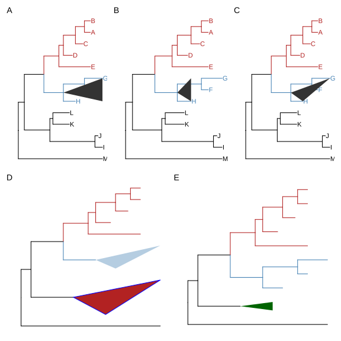

>  **图 6.4：将进化枝折叠为三角形。**  (A) `'max'` 取最远末端分支的位置； (B) `'min'` 取最近末端分支的位置； (C) `'mixed'` 同时取最近和最远末端分支的位置，这种形状更贴近进化枝的真实形态； (D) 设置三角形的颜色（color）、填充色（fill）和透明度（alpha）； (E) 结合 `scaleClade()` 缩小三角形以节省空间。

## 6.4 对分类群进行分组

`groupClade()` 将一个或多个内部节点下的分支和节点分配到不同的组，以对进化枝进行聚类。

`groupOTU()` 按指定操作分类单元（OTU）组，将分支和节点分配到不同的组中。这些 OTU 组可以是单系群（clade）、多系群（polyphyletic）或并系群（paraphyletic）。该函数接受 OTU 向量（分类群名称）或列表，并从这些 OTU 回溯到它们的最近共同祖先（MRCA），然后将它们聚类在一起（图 6.5）。

分组后，可通过映射不同线型、粗细、颜色或形状进行注释。

```r
data(iris)
rn <- paste0(iris[,5], "_", 1:150)
rownames(iris) <- rn
d_iris <- dist(iris[,-5], method="man")

tree_iris <- ape::bionj(d_iris)
grp <- list(setosa     = rn[1:50],
            versicolor = rn[51:100],
            virginica  = rn[101:150])

p_iris <- ggtree(tree_iris, layout = 'circular', branch.length='none')
groupOTU(p_iris, grp, 'Species') + aes(color=Species) +
  theme(legend.position="right")
```

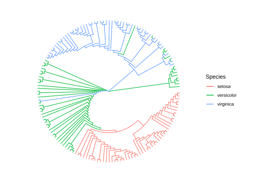

>  **图 6.5：对 OTU 分组。** 基于 OTU 关系进行聚类，选定的 OTU 及其回溯至最近共同祖先（MRCA）的祖先节点被聚类在一起。

也可以在树级别进行分组，以下代码生成与图 6.5 相同的图形（详见 2.2.3 节）。

```r
tree_iris <- groupOTU(tree_iris, grp, "Species")
ggtree(tree_iris, aes(color=Species), layout = 'circular', 
        branch.length = 'none') + 
  theme(legend.position="right")
```

## 6.5 探索树结构

为方便探索树的结构，`ggtree` 支持使用 `rotate()` 将指定进化枝旋转 180 度（图 6.6B）。过 `flip()` 交换内部节点的直接子代进化枝的位置（图 6.6C）。

```r
p1 <- p + geom_point2(aes(subset=node==16), color='darkgreen', size=5)
p2 <- rotate(p1, 16)
flip(p2, 17, 21)
```

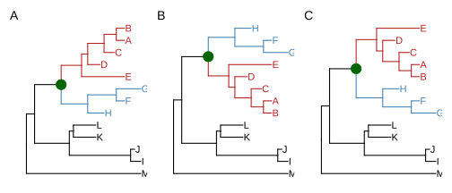

>  **图 6.6：探索树结构。** (A) 树中一个进化枝（深绿色圆圈）； (B) 该进化枝旋转 180°； (C) 其直接子代进化枝（蓝色和红色）的位置互换。

多数树操作函数是针对进化枝，`ggtree` 也提供整树操作函数。例如，`open_tree()` 可将矩形或环形布局的树转换为扇形；`rotate_tree()` 可以按指定角度旋转环形或扇形树（图 6.7、6.8 ）。

```r
p3 <- open_tree(p, 180) + geom_tiplab()
print(p3)
```

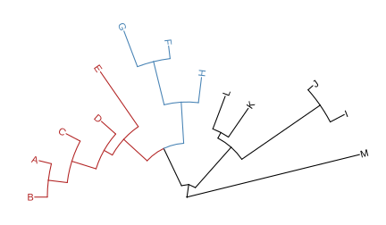

> **图 6.7：将树转换为扇形。** 用 `open_tree()` 函数并指定角度即可。

```r
rotate_tree(p3, 180)
```

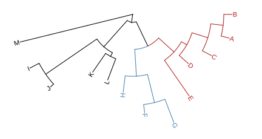

>  **图 6.8：旋转树。** 环形或扇形树可以按任意角度旋转。

以下示例展示了旋转四个指定进化枝（图 6.9）。遍历并旋转所有内部节点也很容易。

```r
set.seed(2016-05-29)
x <- rtree(50)
p <- ggtree(x) + geom_tiplab()

## nn <- unique(reorder(x, 'postorder')$edge[,1]) 
## 遍历所有内部节点

nn <- sample(unique(reorder(x, 'postorder')$edge[,1]), 4)

pp <- lapply(nn, function(n) {
    p <- rotate(p, n)
    p + geom_point2(aes(subset=(node == n)), color='red', size=3)
})

plot_list(gglist=pp, tag_levels='A', nrow=1)
```

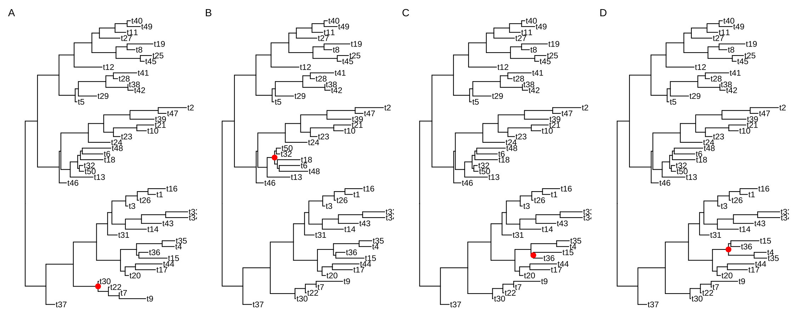

>  **图 6.9：旋转指定进化枝。** 随机选择四个进化枝并旋转（红色符号指示）。

图 6.10 演示使用不同张角（open angles）调用 `open_tree()`。

```r
set.seed(123)
tr <- rtree(50)
p <- ggtree(tr, layout='circular') 
angles <- seq(0, 270, length.out=6)

pp <- lapply(angles, function(angle) {
  open_tree(p, angle=angle) + ggtitle(paste("open angle:", angle))
})

plot_list(gglist=pp, tag_levels='A', nrow=2)
set.seed(123)
tr <- rtree(50)
p <- ggtree(tr, layout='circular') 
angles <- seq(0, 270, length.out=6)

pp <- lapply(angles, function(angle) {
  open_tree(p, angle=angle) + ggtitle(paste("open angle:", angle))
})

g <- plot_list(gglist=pp, tag_levels='A', nrow=2)
ggplotify::as.ggplot(g, vjust=-.1,scale=1.1)
```

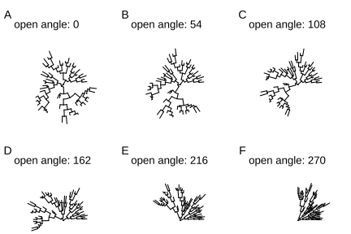

>  **图 6.10：以不同角度打开树。**

图 6.11 展示了以不同角度旋转树。

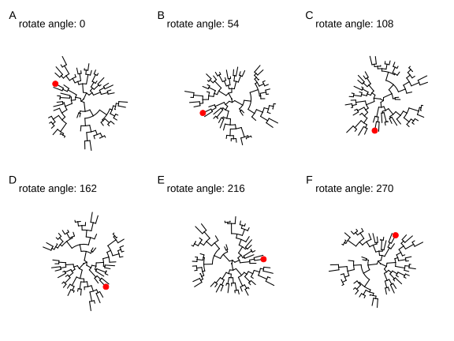

>  **图 6.11：以不同角度旋转树。**

此外，还可以使用 `identify()` 实现交互式树操作（详见第 12 章）。

## 6.6 总结

一个优秀的可视化工具不仅展示数据，还能够辅助用户探索数据，帮助用户更深入地理解数据，从而有助于发现隐藏模式。`ggtree` 提供一系列函数，可对系统发育树进行可视化操作，并结合相关数据探索树的结构。在进化背景下探索数据，有助于发现新的系统学规律，并生成新的科学假说。