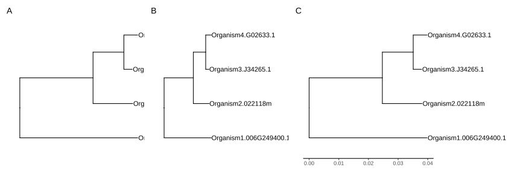

# FAQ


## A.4 Text and Label

### A.4.1 叶标签被截断

出现此问题是因为 ggplot2 无法根据添加的文本自动调整 `xlim` 的范围。

```r
library(ggtree)
## 示例树来自 https://support.bioconductor.org/p/72398/
tree <- read.tree(text = paste("(Organism1.006G249400.1:0.03977,", 
    "(Organism2.022118m:0.01337,(Organism3.J34265.1:0.00284,",
    "Organism4.G02633.1:0.00468)0.51:0.0104):0.02469);"))
p <- ggtree(tree) + geom_tiplab()  
```

在本例中，图 A.1A 显示的叶标签被截断了。这是因为数据的单位分属两个不同的空间（数据空间与像素空间）。可以通过 `xlim` 为叶标签分配更多空间（图 A.1B）。

```r
p + xlim(0, 0.08)
```

另一种解决方案是设置 `clip = "off"`，以允许在绘图面板外部进行绘制。可能还需要设置 `plot.margin` 来为边距分配更多空间（图 A.1C）。

```r
p + coord_cartesian(clip = 'off') + 
  theme_tree2(plot.margin = margin(6, 120, 6, 6))
```



>  **图 A.1：** 为被截断的叶标签分配更多空间。叶标签过长时可能被截断（A）。一种解决方案是为绘图面板分配更多空间（B），另一种解决方案是允许在绘图面板外部绘制标签（C）。

第三种解决方案是使用 `hexpand()`，如第 12.4 节中所演示的。

对于矩形/系统发育树布局的树，用户可以将叶标签显示为 y 轴标签。在这种情况下，无论标签有多长，都不会被截断（见图 4.8C）。

