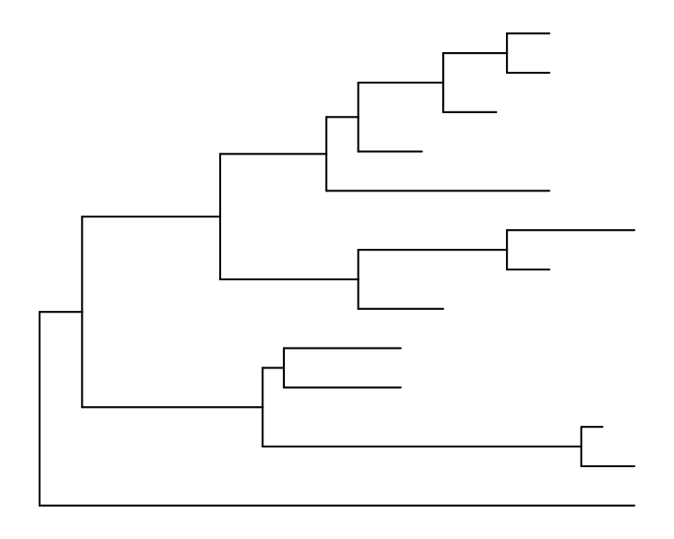
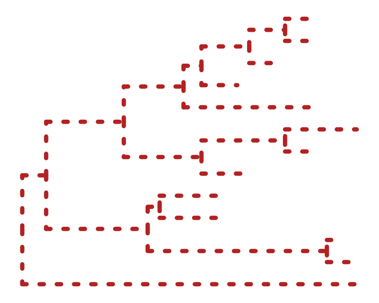
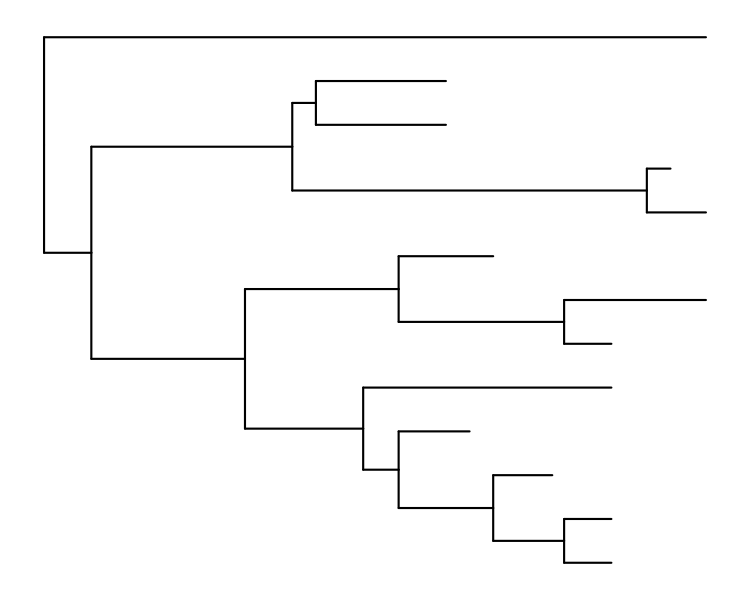
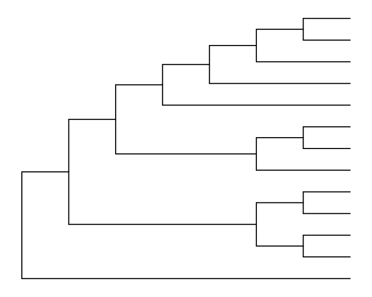
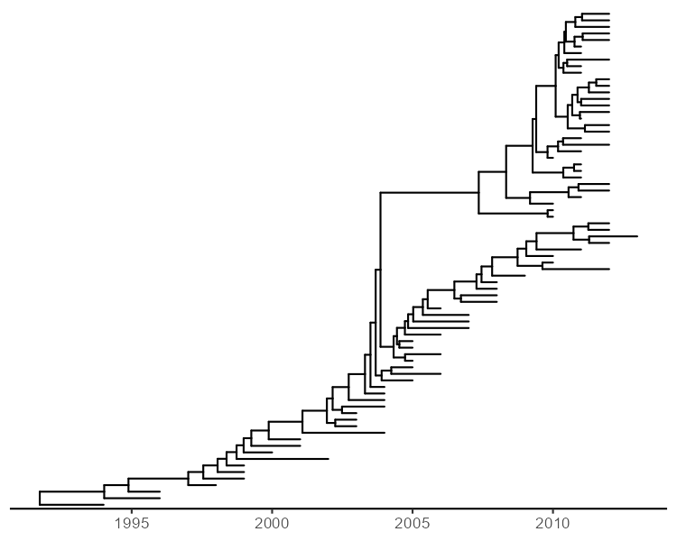

# Phylogenetic tree 可视化

@since 2026-09-15
@author Jiawei Mao
***

## 1. 简介

`ggtree` 通过几何图层 `geom_tree()` 实现 tree 的可视化。查看 tree 非常简单：

```R
ggplot(tree_object) + geom_tree() + theme_tree()
```

或者简写为：

```R
ggtree(tree_object)
```

`ggtree` 提供的许多几何图层：

| 图层 (Layer)     | 描述 (Description)                                    |
| ---------------- | ----------------------------------------------------- |
| `geom_balance`   | 高亮显示内部节点的两个直接后代进化支                  |
| `geom_cladelab`  | 使用横条和文字标签（或图像）对进化支进行注释          |
| `geom_facet`     | 在特定面板（facet）中绘制关联数据，并使该图与树对齐   |
| `geom_hilight`   | 使用矩形或圆形高亮显示选定的进化支                    |
| `geom_inset`     | 在树的节点上添加插图（子图）                          |
| `geom_label2`    | `geom_label` 的修改版本，支持子集（subset）美学映射   |
| `geom_nodepoint` | 使用符号点标注内部节点                                |
| `geom_point2`    | `geom_point` 的修改版本，支持子集（subset）美学映射   |
| `geom_range`     | 柱状图层，用于展示演化推断的不确定性                  |
| `geom_rootpoint` | 使用符号点标注根节点                                  |
| `geom_rootedge`  | 为树添加根边（root-edge）                             |
| `geom_segment2`  | `geom_segment` 的修改版本，支持子集（subset）美学映射 |
| `geom_strip`     | 使用横条和（可选的）文字标签对关联的类群进行注释      |
| `geom_taxalink`  | 连接相关的类群                                        |
| `geom_text2`     | `geom_text` 的修改版本，支持子集（subset）美学映射    |
| `geom_tiplab`    | 叶节点标签图层                                        |
| `geom_tippoint`  | 使用符号点标注外部节点（叶节点）                      |
| `geom_tree`      | 树结构图层，支持多种布局                              |
| `geom_treescale` | 树枝比例尺图例                                        |

## 2. tree 可视化

### 2.1 基础 tree 可视化

```R
library("treeio")
library("ggtree")

# 获取 treeio 包中附带的示例文件的完整路径：extdata 目录下的 sample.nwk
nwk <- system.file("extdata", "sample.nwk", package="treeio")
# 读取文件，返回 treedata 对象
tree <- read.tree(nwk)

# ggplot(tree, aes(x,y)) 初始化 ggplot 对象，x 表示分支方向，y 表示节点的垂直位置
# geom_tree() 添加 tree 的分支图层，绘出 tree 的线条
# theme_tree() 应用为 tree 设计的简洁主题，会移除坐标轴、网格线、背景等
ggplot(tree, aes(x, y)) + geom_tree() + theme_tree()
```



`ggtree()` 函数为上述调用的简洁缩写，功能完全相同。即 `ggtree()` 等价于：

```R
ggplot(tree, aes(x, y)) + geom_tree() + theme_tree()
```

- 更改线条颜色、大小和类型：

```R
# color = "firebrick" 设置数值颜色为砖红色
# size = 2 设置线条宽度为 2
# linetype = "dotted" 设置线条为虚线
ggtree(tree, color = "firebrick", size = 2, linetype = "dotted")
```



- 系统发育树默认以阶梯状排列（ladderize）的形式显示。设置参数 `ladderize = FALSE` 来关闭此功能：

`ggtree` 默认根据每个内部节点包含的叶节点数量，自动对子分支进行排序，使树的分支排列更规律、更“阶梯化”，便于阅读。**设置 `ladderize = FALSE`**：`ggtree` 不会重新排序，而是按照树对象中分支的原始顺序来绘制。

```R
ggtree(tree, ladderize = FALSE)
```



- `branch.length` 参数用于缩放树枝。`branch.length = "none"` 表示仅查看树的拓扑结构（即 clodogram），不设置分支长度

```R
ggtree(tree, branch.length = "none")
```



### 2.2 layout

`ggtree` 支持多种 layout，包括：

| 布局            | 说明         |
| --------------- | ------------ |
| rectangular     | 矩形，默认   |
| roundrect       | 圆角矩形     |
| ellipse         | 椭圆形       |
| slanted         | 倾斜         |
| circular        | 圆形         |
| fan             | 扇形         |
| equal_angle     | 等角（无根） |
| daylight        | 日光（无根） |
| time-scaled     |              |
| two-dimensional |              |

```R
library(ggtree)
set.seed(2017-02-16)
tree <- rtree(50)
ggtree(tree)
ggtree(tree, layout="roundrect")
ggtree(tree, layout="slanted")
ggtree(tree, layout="ellipse")
ggtree(tree, layout="circular")
ggtree(tree, layout="fan", open.angle=120)
ggtree(tree, layout="equal_angle")
ggtree(tree, layout="daylight")
ggtree(tree, branch.length='none')
ggtree(tree, layout="ellipse", branch.length="none")
ggtree(tree, branch.length='none', layout='circular')
ggtree(tree, layout="daylight", branch.length = 'none')
```


> A. 矩形（默认）
>
> B. 圆角矩形
>
> C. slanted (倾斜)
>
> D. ellipse（椭圆）
>
> E. circular（圆形）
>
> F. fan (扇形)
>
> G. equal_angle （等角）
>
> H. daylight （日光）
>
> I. 矩形（branch.length='none'）
>
> J. ellipse (branch.length='none')
>
> K. circular (branch.length='none')
>
> L. daylight (branch.length='none')

通过修改比例尺或坐标系（scales/coordination），还可以绘制出其他布局。

```R
# 1. 翻转 x 轴，在矩形 tree 中，x 轴从 root 到 leaf，反转后，root 在右，leaf 在左
ggtree(tree) + scale_x_reverse() 

# 2. 翻转坐标轴，交换 x 轴和 y 轴，原本水平的矩形变成垂直方向
ggtree(tree) + coord_flip()

# 3. 层次聚类，分支为直角，叶子在底部，像一个树冠
ggtree(tree) + layout_dendrogram()

# 4. ggplotify::as.ggplot() 将 ggtree 生成的对象转换为一个标准 ggplot 图形对象
# angle = -30：将整棵树旋转 -30 度。
# scale = .9：整体缩放为原来的 90%。
# 常用于导出 PDF/SVG 时微调
ggplotify::as.ggplot(ggtree(tree), angle=-30, scale=.9)

# 5. layout = 'slanted'：分支呈斜线连接，而不是直角折线。视觉效果更流畅，常用于发表图。
# + coord_flip()：再交换 x、y 轴，使倾斜树变为垂直方向。
ggtree(tree, layout='slanted') + coord_flip()

# 6. layout = 'slanted'：斜线分支。
# branch.length = 'none'：忽略枝长，所有叶子到根的距离等长。
# 树变成纯拓扑结构，适合展示分支关系而非进化距离。
# + layout_dendrogram()：再套用树状图布局。
ggtree(tree, layout='slanted', branch.length='none') + layout_dendrogram()

# 7. layout = 'circular'：树呈圆形（辐射状） 布局。
# + xlim(-10, NA)：设置 x 轴范围为 -10 到自动值。
# 在圆形布局中，x 代表半径。
# 设置负的下限可以在圆心留出更多空间，避免中心节点过于拥挤。
# NA 表示上限由数据自动决定。
ggtree(tree, layout='circular') + xlim(-10, NA)

# 8. layout_inward_circular()：将树绘制为向内辐射的圆形，即根在外围，叶在圆心
ggtree(tree) + layout_inward_circular()

# 9. xlim = 15：设置 x 轴（半径）范围为 0 到 15。
ggtree(tree) + layout_inward_circular(xlim=15)
```


- **系统发育树（Phylogram）**

支持矩形、圆角矩形、倾斜、椭圆、圆形和扇形布局，用于可视化系统发育图（默认情况下，树枝长度按比例缩放）。

- **无根布局（unrooted layout）**

支持通过**等角算法**和**日光算法**绘制无根（也称为“辐射状”）布局。

**等角法**从树的根节点开始，根据每个子树中包含的叶节点数量，按比例为其分配角度弧段。该算法从根节点向叶节点迭代，并将分配给某子树的角度进一步细分为其依赖子树的角度。该方法速度快，已被许多软件包实现。等角法的一个缺点是叶节点往往会聚集在一起，从而留下大量未利用的空间。

**日光法**则是从等角法构建的初始树开始，通过依次遍历每个内部节点并摆动子树，使“日光”弧段趋于相等，从而迭代地优化树形。

- **分支图（Cladogram）**

仅显示树拓扑结构的分支图，不对树枝长度缩放，可将 `branch.length` 参数设置为 `"none"`，该设置适用于所有类型的布局。

- **时间尺度布局（Timescaled layout）**

对于时间尺度树，必须通过 `mrsd` 参数指定最近的采样日期。`ggtree()` 将根据采样时间（叶节点）和分歧时间（内部节点）对树进行缩放，并默认在树的下方显示时间尺度轴。此外，还可以使用 `deeptime` 包向 `ggtree()` 绘制的图中添加地质时间尺度（例如纪和代）。

```R
# 获取 ggtree 包中 examples 目录下的 MCC_FluA_H3.tree 文件路径
beast_file <- system.file("examples/MCC_FluA_H3.tree",
  package = "ggtree"
)
beast_tree <- read.beast(beast_file)

# mrsd 是 most recent sampling date（最近采样日期）的缩写
# mrsd = "2013-01-01" 表示最新样本的采样日期是 2013 年 1 月 1 日
# theme_tree2() 是 ggtree 提供的一个主题，与 theme_tree() 类似，但会显示 x 轴
ggtree(beast_tree, mrsd = "2013-01-01") + theme_tree2()
```



- **二维树布局（Two-dimensional tree layout）**

二维树是将系统发育树投射到一个由关联**表型**和树分支尺度（如进化距离、分歧时间，位于 x 轴）所定义的空间中的图形。表型（数值型或分类型性状，位于 y 轴）可以是衡量树中类群及假想祖先某些生物学特征的指标。这种布局非常适合追踪病毒表型或其他行为（y 轴）随病毒进化（x 轴）而发生的变化。

对进化时间跨度内的表型或基因型进行分析，已被广泛应用于流感病毒进化的研究。不过，此类分析图通常并非树状图，即数据点之间没有连线；而我们的二维树布局则通过相应的树枝将数据点连接了起来。因此，我们提供的这种新布局将使此类数据分析变得更加便捷，且更易于扩展应用于大规模序列数据集。

**示例**：使用前文提到的人类和猪 H3 流感病毒的时间尺度树，并根据血凝素蛋白每个类群及祖先序列预测的 N-连接糖基化位点（NLG）对 y 轴进行了缩放。NLG 位点是通过 NetNGlyc 1.0 服务器进行预测的。

要对 y 轴进行缩放，需要将 `ggtree()` 函数中的 `yscale` 参数设置为数值型或分类型变量。如果 `yscale` 为分类型变量（本例），用户需要通过 `yscale_mapping` 变量来指定类别到数值的映射方式。

```R
# 获取 ggtree 包中示例文件 NAG_inHA1.txt 的路径
NAG_file <- system.file("examples/NAG_inHA1.txt", package = "ggtree")
# 以制表符为分隔符读取文件，无表头
NAG.df <- read.table(NAG_file,
  sep = "\t", header = FALSE,
  stringsAsFactors = FALSE
)
# 取出第二列（数值列，代表每个病毒株预测的 N-连接糖基化位点数量）
NAG <- NAG.df[, 2]
# 将第一列（病毒株名称）设为 NAG 向量的名称
names(NAG) <- NAG.df[, 1]

# 将 treedata 对象转换为普通 phylo 对象，以便访问 tip.label
# tip：所有叶节点的名称（病毒株名）
tip <- as.phylo(beast_tree)$tip.label
beast_tree <- groupOTU(beast_tree, tip[grep("Swine", tip)],
  group_name = "host"
)

p <- ggtree(beast_tree, aes(color = host),
  mrsd = "2013-01-01",
  yscale = "label", yscale_mapping = NAG
) +
  theme_classic() + theme(legend.position = "none") +
  scale_color_manual(
    values = c("blue", "red"),
    labels = c("human", "swine")
  ) +
  ylab("Number of predicted N-linked glycosylation sites")

## (optional) add more annotations to help interpretation
p + geom_nodepoint(color = "grey", size = 3, alpha = .8) +
  geom_rootpoint(color = "black", size = 3) +
  geom_tippoint(size = 3, alpha = .5) +
  annotate("point", 1992, 5.6, size = 3, color = "black") +
  annotate("point", 1992, 5.4, size = 3, color = "grey") +
  annotate("point", 1991.6, 5.2, size = 3, color = "blue") +
  annotate("point", 1992, 5.2, size = 3, color = "red") +
  annotate("text", 1992.3, 5.6, hjust = 0, size = 4, label = "Root node") +
  annotate("text", 1992.3, 5.4,
    hjust = 0, size = 4,
    label = "Internal nodes"
  ) +
  annotate("text", 1992.3, 5.2,
    hjust = 0, size = 4,
    label = "Tip nodes (blue: human; red: swine)"
  )
```

## 3. 显示 Tree 的组件

### 3.1 显示树比例尺（进化距离）

可以使用 `geom_treescale()` 图层显示树的比例尺。

```R
ggtree(tree) + geom_treescale()
```

`geom_treescale()` 支持以下参数：

- `x` 和 `y`：比例尺的位置
- `width`：比例尺的长度
- `fontsize`：文字大小
- `linesize`：线条粗细
- `offset`：线条与文字的相对位置
- `color`：比例尺的颜色

### 3.3 显示标签

可以使用 `geom_text()` 或 `geom_label()` 同时显示节点（如果存在）和叶端标签，或者使用 `geom_tiplab()` 仅显示叶端标签。

```R
p + geom_tiplab(size=3, color="purple")
```

`geom_tiplab()` 图层不仅支持使用 `text` 或 `label` geom 来显示标签，还支持使用 `image` geom 通过图像文件为叶端添加标签。此外，还提供了 `geom_nodelab()` geom 用于显示节点标签。