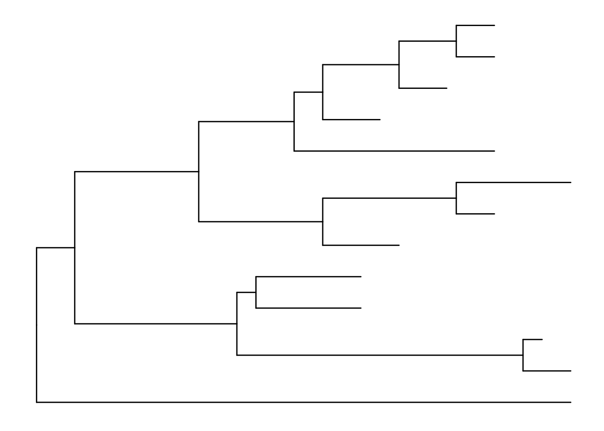
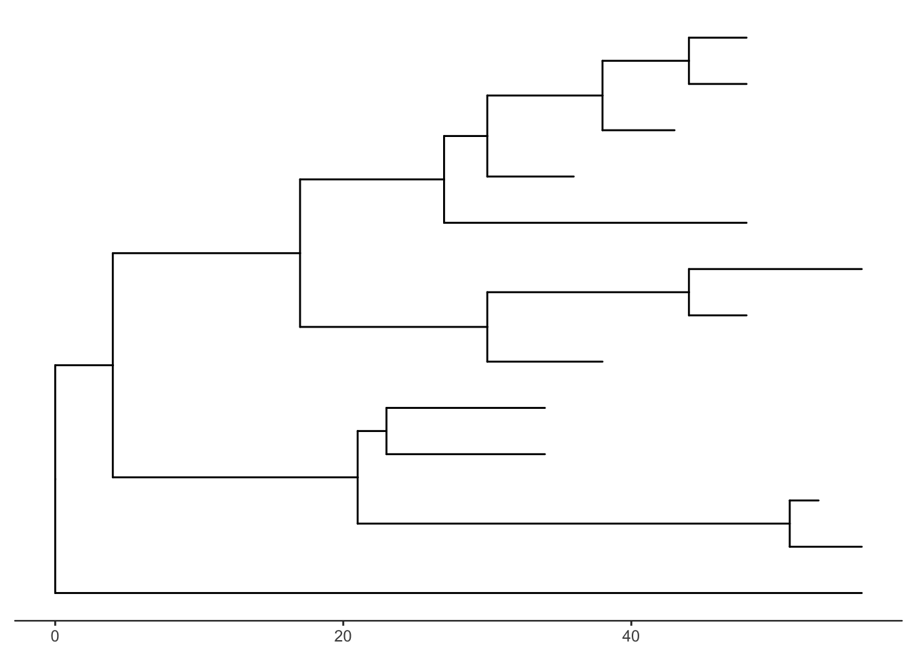
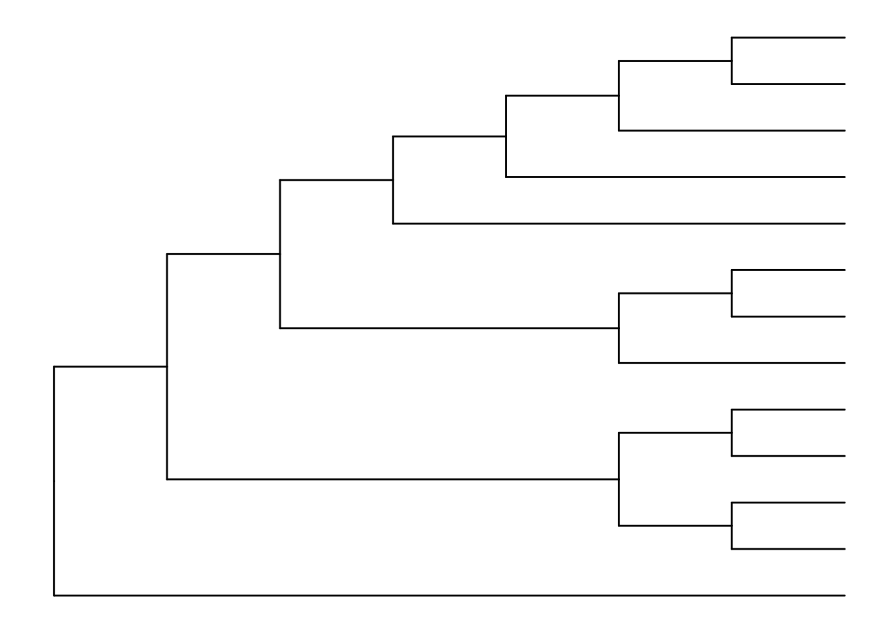
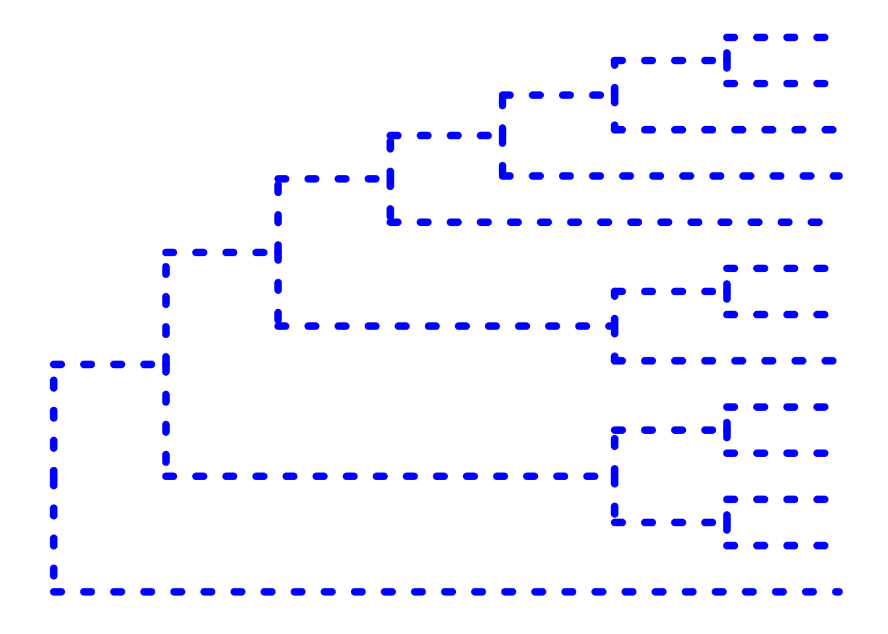
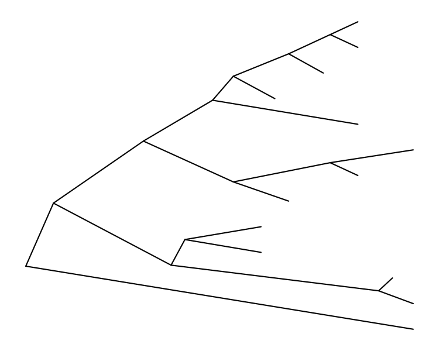
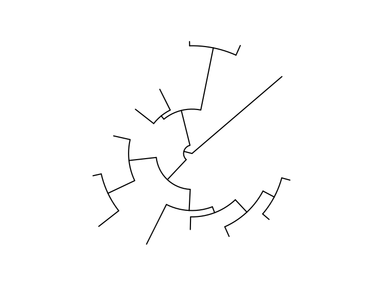
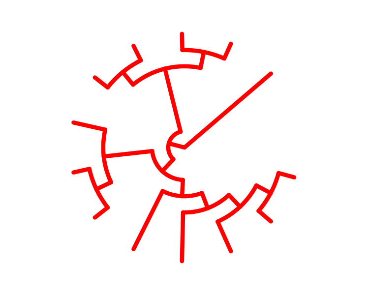
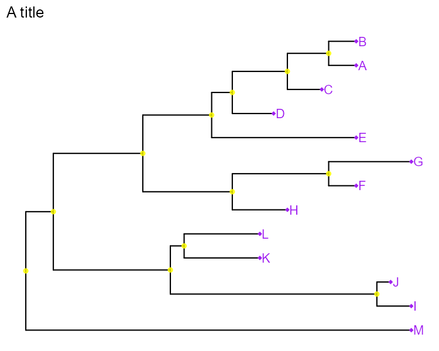
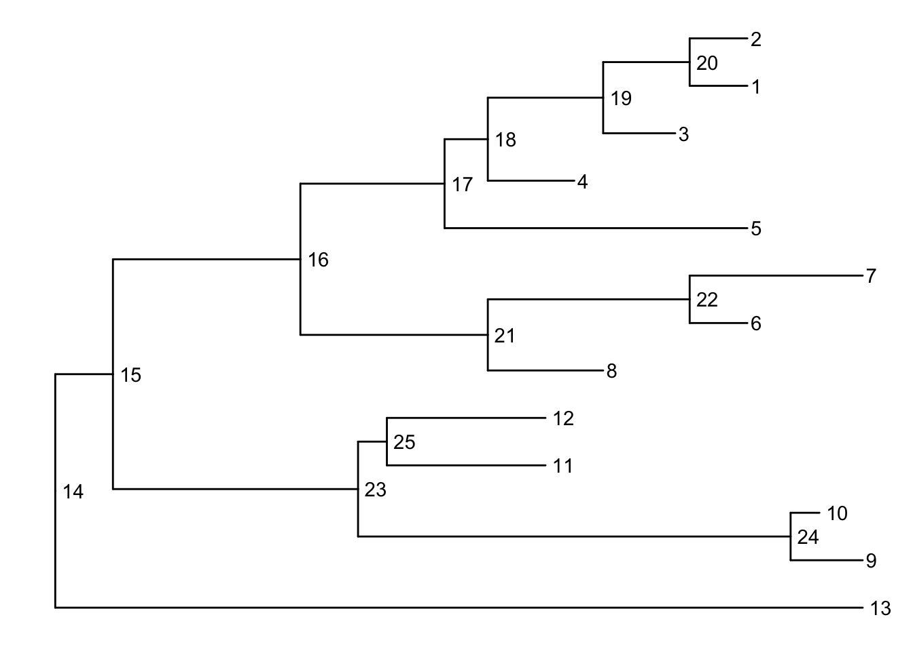
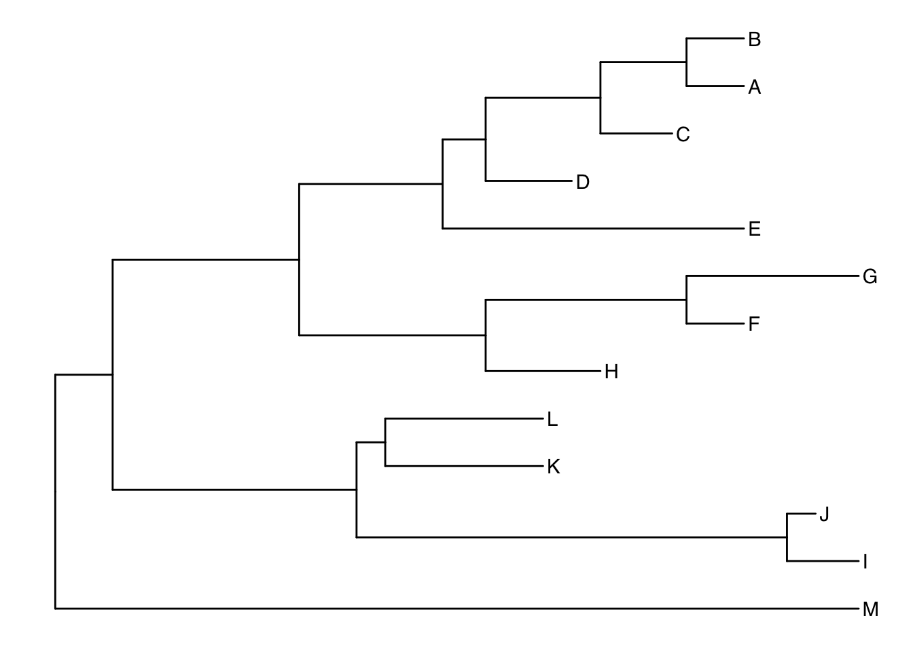

# 使用 ggtree 对系统发育树进行可视化与注释

下面演示使用 `ggtree`（`ggplot2` 包的扩展包）来可视化和注释系统发育树（phylogenetic trees）。`ggtree` 是 `ggplot2` 的一个扩展插件。本文的许多示例均改编自 `ggtree` 的官方使用指南（vignettes）。

阅读本文需要你具备 R 语言的基础知识，熟悉数据框（data frames），掌握使用 `dplyr` 和 `%>%`（管道操作符）进行数据操作，最重要的是，熟悉使用 `ggplot2` 进行数据可视化。

这里**不涉及**生成系统发育树的方法和软件，也不解读系统发育树。全基因组测序使得对整个基因组进行检测成为可能；基于此，目前已有许多方法和软件工具，能够利用未组装的测序序列（reads）、草图组装/重叠群（contigs）或完整的基因组序列，通过基于 SNP 或基于基因的系统发育分析来进行比较基因组学研究。

## ggtree 软件包

`ggtree` 是一个 R 语言软件包，它扩展了 `ggplot2` 的功能，用于可视化系统发育树，并利用协变量及其他相关数据对其进行注释。该软件包可从 Bioconductor 获取：

- **ggtree Bioconductor 页面**：bioconductor.org/packages/ggtree
- **ggtree 主页**：guangchuangyu.github.io/ggtree （包含许多关于该软件包的信息、更多文档、精美图片集以及相关资源的链接）
- **ggtree 相关论文**：Yu, Guangchuang, et al. “ggtree: an r package for visualization and annotation of phylogenetic trees with their covariates and other associated data.” *Methods in Ecology and Evolution* (2016) DOI:10.1111/2041-210X.12628

Bioconductor 软件包通常都配有非常详尽的文档，形式为 vignettes（指南文档）。您可以查看 ggtree 的操作教程，其中包含了许多可运行的示例和解释。

就像来自 CRAN 的 R 软件包一样，Bioconductor 软件包也只需安装一次（安装说明在此），然后在每次启动新的 R 会话时加载即可。请先加载 `tidyverse` 软件包。

```r
library(tidyverse)
library(ggtree)
```

> [!NOTE]
>
> 在加载 `tidyverse` 之后再加载 `ggtree` 时，请花点时间查看一下输出信息。初次安装 `ggtree` 时可能会花费一些时间，因为它依赖于许多其他的 R 软件包。而这些软件包反过来又可能依赖于其他软件包。当加载 `ggtree` 时，它们都会被加载到您的工作环境中。同时请注意那些以 `The following objects are masked from 'package:....` 开头的行。其中一个例子是来自 `dplyr` 的 `collapse()` 函数。当 `ggtree` 被加载时，它也加载了自己名为 `collapse()` 的函数。现在，如果您想使用 `dplyr` 的 `collapse` 函数，您将不得不使用类似 `dplyr::collapse()` 这样的语法来显式调用它。

## 树的导入

在 `ggtree` 的首页上，你可以查看“树数据导入（Tree Data Import）”指南文档。目前有许多不同的软件包可以从各类数据中构建系统发育树，而这些软件生成的树文件也对应着多种存储格式。

大多数树形查看软件（包括 R 语言包）主要支持 **Newick** 和 **Nexus** 文件格式。此外，其他进化分析软件生成的文件中，可能还包含可用于注释系统发育树的支持性证据。`ggtree` 支持多种文件格式，包括：

- Newick
- Nexus
- Phylip
- Jplace
- New Hampshire eXtended 格式 (NHX)

以及以下软件的输出文件：

- BEAST
- EPA
- HYPHY
- PAML
- PHYLDOG
- pplacer
- r8s
- RAxML
- RevBayes

`ggtree` 软件包实现了多种解析函数，具体包括：

- **`read.tree`**：用于读取 Newick 文件。
- **`read.phylip`**：用于读取 Phylip 文件。
- **`read.jplace`**：用于读取 Jplace 文件。
- **`read.nhx`**：用于读取 NHX 文件。
- **`read.beast`**：用于解析 BEAST 的输出文件。
- **`read.codeml`**：用于解析 CODEML 的输出文件（包括 rst 和 mlc 文件）。
- **`read.codeml_mlc`**：专门用于解析 mlc 文件（CODEML 的输出）。
- **`read.hyphy`**：用于解析 HYPHY 的输出文件。
- **`read.jplace`**：用于解析 jplace 文件，包括 EPA 和 pplacer 的输出。
- **`read.nhx`**：用于解析 NHX 文件，包括 PHYLODOG 和 RevBayes 的输出。
- **`read.paml_rst`**：用于解析 rst 文件（BASEML 和 CODEML 的输出）。
- **`read.r8s`**：用于解析 r8s 的输出文件。
- **`read.raxml`**：用于解析 RAxML 的输出文件。

## 基础进化树

首先，我们来导入树数据。我们将使用一个包含 13 个样本（即“叶节点 / tips”）的虚拟系统发育树。你可以点击[这里](https://4va.github.io/biodatasci/data/tree_newick.nwk)下载 `tree_newick.nwk` 数据文件。如果你还没有加载所需的 R 包，请先加载它们，然后使用 `read.tree()` 函数导入树文件。直接打印该对象本身并没有太大用处，它的输出只是提供了一些关于这棵树的基本信息。

```r
library(tidyverse)
library(ggtree)

tree <- read.tree("data/tree_newick.nwk")
tree
```

```
Phylogenetic tree with 13 tips and 12 internal nodes.

Tip labels:
  A, B, C, D, E, F, ...

Rooted; includes branch length(s).
```

就像在 `ggplot2` 中通过 `ggplot(...)` 创建基础画布，并使用 `+ geom_???()` 添加图层一样，在 `ggtree` 中也可以这样做。`ggtree` 软件包提供了一个 `geom_tree()` 函数。由于 `ggtree` 是基于 `ggplot2` 构建的，因此它会默认应用 `ggplot2` 带有白色线条的灰色主题。你可以使用 `ggtree` 包自带的主题来覆盖这一默认设置。

在实际应用中，几乎总需要添加一个树的几何图层（tree geom）并移除默认的背景和坐标轴，所以 `ggtree()` 函数本质上就是 `ggplot(...) + geom_tree() + theme_tree()` 的一个快捷方式。

```r
# 使用 geom_tree 构建 ggplot 对象
ggplot(tree) + geom_tree() + theme_tree()

# 这是一个方便的简写形式
ggtree(tree)
```



添加比例尺：

- `treescale` 几何图层（geom），它可以添加比例尺；
- 或者将默认的 `ggtree()` 主题更改为 `theme_tree2()`，它会在 x 轴上添加刻度

在这个图中，水平维度表示遗传变化的程度，而分支则代表了随时间演化的进化谱系。水平方向上的分支越长，表示遗传变化量越大，比例尺正是用来指示这一点的。分支长度的单位通常是“每个位点的核苷酸替换数（nucleotide substitutions per site）”——即变化或替换的次数除以序列的长度（另外，它也可以代表变化百分比，即每 100 个碱基中的变化数）。更多详情请参阅这篇文章。

```r
# 添加比例尺
ggtree(tree) + geom_treescale()

# 或者使用 theme_tree2() 在 x 轴上添加完整的刻度
ggtree(tree) + theme_tree2()
```



默认情况下，绘制的是系统发育树（phylogram），其 x 轴显示遗传变化 / 进化距离。如果你想禁用比例缩放，转而生成一个分支图（cladogram），可以在调用 `ggtree()` 时设置 `branch.length="none"` 选项。更多详情请查阅 `?ggtree`。

```r
ggtree(tree, branch.length="none")
```



帮助文档 `?ggtree` 中的 `...` 参数表示可以进一步传递给 `ggplot()` 的额外选项。你可以利用它来修改图形的视觉美学（aesthetics）。下面绘制一个分支图（不进行分支缩放），并使用粗蓝色的虚线（请注意，这里我没有使用 `aes()` 将这些美学属性映射到数据的特征上——我们稍后会讲到这一点）。

```r
ggtree(tree, branch.length="none", color="blue", size=2, linetype=3)
```



### 练习 1

再次查看 `?ggtree` 的帮助文档，特别是 `layout=` 选项。默认情况下，它会生成矩形布局（rectangular layout）。

```R
ggtree(
  tr,
  mapping = NULL,
  layout = "rectangular",
  open.angle = 0,
  mrsd = NULL,
  as.Date = FALSE,
  yscale = "none",
  yscale_mapping = NULL,
  ladderize = TRUE,
  right = FALSE,
  branch.length = "branch.length",
  root.position = 0,
  xlim = NULL,
  layout.params = list(as.graph = TRUE),
  hang = 0.1,
  ...
)
```

| 参数             | 类型/说明   | 详细描述                                                     |
| ---------------- | ----------- | ------------------------------------------------------------ |
| `tr`             | phylo 对象  | 输入的系统发育树对象                                         |
| `mapping`        | 美学映射    | 用于将数据中的变量映射到图形的视觉属性（如颜色、大小等）     |
| `layout`         | 字符型      | 树的布局方式。可选值包括：'rectangular'（矩形）、'dendrogram'（树状图）、'slanted'（倾斜）、'ellipse'（椭圆）、'roundrect'（圆角矩形）、'fan'（扇形）、'circular'（圆形）、'inward_circular'（向内圆形）、'radial'（辐射状）、'equal_angle'（等角）、'daylight'（日光法）、'tree_and_leaf'（树与叶）或 'ape' |
| `open.angle`     | 数值型      | 展开角度，仅在 `layout = 'fan'`（扇形布局）时有效            |
| `mrsd`           | 日期/字符   | 最近采样日期（most recent sampling date），通常用于绘制时间尺度树 |
| `as.Date`        | 逻辑值      | 是否在时间树中使用 `Date` 类                                 |
| `yscale`         | 数值型      | Y 轴缩放比例                                                 |
| `yscale_mapping` | 映射        | 针对分类变量的 Y 轴缩放映射                                  |
| `ladderize`      | 逻辑值      | 默认为 `TRUE`。是否重新组织树的结构，使其呈现出“阶梯状（ladder）”的外观 |
| `right`          | 逻辑值      | 如果 `ladderize = TRUE`，是否将最小的进化支（clade）放在右侧。更多信息请参阅 `ape::ladderize()` |
| `branch.length`  | 字符/变量   | 用于缩放树枝长度的变量。如果设置为 `'none'`，则绘制分支图（cladogram，即仅展示拓扑结构，不反映进化距离） |
| `root.position`  | 数值型      | 根节点的位置（默认值为 0）                                   |
| `xlim`           | 数值向量    | X 轴的限制范围，仅在 `layout = 'inward_circular'`（向内圆形布局）时生效 |
| `layout.params`  | 列表 (list) | 当 `layout` 是一个函数时，用于传递该布局函数的参数。若 `as.graph=TRUE`，坐标将作为 `igraph` 对象重新计算；若 `as.graph=FALSE`，坐标重新计算但保留原始的 `phylo` 或 `treedata` 对象 |
| `hang`           | 数值型      | 标签悬挂在绘图区域下方的比例（占整个树图高度的比例）。如果为负值，标签将从 0 的位置向下悬挂。此参数仅对类似 `hclust` 类的 `'dendrogram'`（树状图）布局有效，默认值为 0.1。 |
| `...`            | 附加参数    | 其他附加参数。例如：`nsplit`（整数）：当 `'continuous'` 不为 `"none"` 时，树枝被划分的块数，默认值为 200 |

请尝试完成以下操作：

1. 创建一棵倾斜的系统发育树（slanted phylogenetic tree）。

```R
ggtree(tree, layout = "slanted")
```



2. 创建一棵圆形的系统发育树（circular phylogenetic tree）。

```R
ggtree(tree, layout = "circular")
```



3. 创建一棵未缩放、带有粗红线的圆形分支图（circular unscaled cladogram with thick red lines）。

```R
ggtree(tree, layout = "circular", branch.length = "none", color="red", size=2)
```



### 其他树的几何图层（Tree geoms）

接下来我们添加额外的图层。与 `ggplot2` 一样，我们可以创建一个绘图对象（例如 `p`）来存储 `ggplot` 的基础布局，然后根据需要使用 `+` 号继续添加更多图层。下面我们来添加节点（node）和叶节点（tip）的点，最后为叶节点添加标签。

```r
# 创建基础绘图对象
p <- ggtree(tree)

# 添加内部节点点
p + geom_nodepoint()

# 添加叶节点点
p + geom_tippoint()

# 为叶节点添加标签
p + geom_tiplab()
```

### 练习 2

就像我们在 `ggtree()` 调用中修改树的美学属性一样，我们也可以在 `geom_nodepoint()` 或 `geom_tippoint()` 函数中传入图形参数，来修改点本身的美学属性。请尝试创建一棵具有以下视觉特征的进化树：

- **叶节点标签**：显示为紫色。
- **叶节点**：紫色的菱形
- **内部节点**：较大的半透明黄色（提示：可以使用 `alpha=` 参数来设置透明度）。
- **标题**：使用 `+ ggtitle(...)` 添加一个图表标题。

```R
p <- ggtree(tree)
p1 <- p +
  geom_nodepoint(color="yellow", alpha=0.8)+
  geom_tippoint(color="purple", shape=18)+
  geom_tiplab(color="purple")+ # 叶节点标签
  ggtitle("A title")
```



## 树的注释（Tree annotation）

`geom_tiplab()` 函数只能提供一些非常基础的注释功能。让我们把注释功能再深入一步。更多详细信息请参阅[树注释（Tree Annotation）](https://yulab-smu.top/treedata-book/chapter5.html) 和高级树注释（Advanced Tree Annotation）指南文档。

### 内部节点编号

在进行更深入的注释之前，我们需要了解 `ggtree` 是如何在内部处理树结构的。`ggtree` 中用于注释进化支（clade）的一些函数，需要指定一个内部节点编号作为参数。要获取内部节点编号，用户可以使用 `geom_text` 将其显示出来，其中标签（label）通过美学映射（aes）绑定到树对象内部存储的“node 变量”上。我们还提供了 `hjust` 选项，以防止标签直接覆盖在节点上。有关此过程的更多信息，请阅读 `ggtree` 树操作（manipulation）指南文档。

```r
ggtree(tree) + geom_text(aes(label=node), hjust=-.3)
```



获取内部节点编号的另一种方法是使用 `MRCA()` 函数，只需提供一个分类单元名称的向量（使用 `c("taxon1", "taxon2")` 创建）。该函数会返回输入分类单元的最近共同祖先（MRCA）的节点编号。首先，重新绘制带有叶节点标签的图，以便你选择要获取 MRCA 的分类单元。

```r
ggtree(tree) + geom_tiplab()
```



让我们获取分类单元 C+E 以及 G+H 的最晚近共同祖先。我们可以使用 `MRCA()` 来获取内部节点编号。你可以回到之前带有节点编号的图中进行确认。

```r
MRCA(tree, tip=c("C", "E"))
## [1] 17
MRCA(tree, tip=c("G", "H"))
## [1] 21
```

### 为进化支添加标签

我们可以使用 `geom_cladelabel()` 添加一个新的几何图层，通过条形标记和相应的文本来注释选定的进化支。你需要使用该进化支中所有分类单元的连接节点（即内部节点编号）来选择进化支。更多详情请参阅“树注释”指南文档。

让我们为分类单元 C 和 E 的最晚近共同祖先（内部节点 17）所在的进化支添加注释，并将其设为红色。更多信息请参阅 `?geom_cladelabel` 帮助文档。

```r
ggtree(tree) + 
  geom_cladelabel(node=17, label="Some random clade", color="red")
```

现在让我们把叶节点标签加回来。注意看，此时进化支标签离叶节点标签太近了。我们可以添加一个 `offset`（偏移量）来调整位置。你可能需要微调这个数值，直到看起来合适为止。

```r
ggtree(tree) + 
  geom_tiplab() + 
  geom_cladelabel(node=17, label="Some random clade", 
                  color="red2", offset=.8)
```

接下来，我们为连接分类单元 G 和 H 的进化支（内部节点 21）添加另一个标签。

```r
ggtree(tree) + 
  geom_tiplab() + 
  geom_cladelabel(node=17, label="Some random clade", 
                  color="red2", offset=.8) + 
  geom_cladelabel(node=21, label="A different clade", 
                  color="blue", offset=.8)
```

糟糕，现在我们遇到了两个问题。首先，如果标签能够对齐，看起来会更好。这很简单，只需向 `geom_cladelabel()` 传入 `align=TRUE` 参数即可（详见帮助文档）。但是，现在标签超出了绘图的边缘。这是因为 `geom_cladelabel()` 只是将这个新图层添加到了 `ggtree` 调用时创建的原始画布末端。默认的布局会尝试优化空间，把整棵树铺满整个绘图区域。以下是我们的修复方法：

1. 首先使用 `ggtree(tree)` 创建基础绘图布局。
2. 添加叶节点标签。
3. 添加每个进化支标签。
4. 还记得 `theme_tree2()` 吗？我们很早就用它来添加显示遗传距离的 X 轴刻度。这就是 X 轴的单位。我们需要设置 X 轴的限制范围。你可以去搜索类似“ggplot2 x axis limits”的内容，最终会找到一个 StackOverflow 页面，它告诉你确切的解决方法——只需添加一个 `+ xlim(..., ...)` 图层。在这里，我们将 X 轴向右延伸一些。
5. 最后，如果我们愿意，可以注释掉代码中的 `theme_tree2()` 部分，或者直接在图的最顶层再添加一个主题图层来覆盖之前的设置。`theme_tree()` 是不带 X 轴刻度的。

```r
ggtree(tree) + 
  geom_tiplab() + 
  geom_cladelabel(node=17, label="Some random clade", 
                  color="red2", offset=.8, align=TRUE) + 
  geom_cladelabel(node=21, label="A different clade", 
                  color="blue", offset=.8, align=TRUE) + 
  theme_tree2() + 
  xlim(0, 70) + 
  theme_tree()
```

作为替代方案，我们也可以使用 `geom_hilight()` 来高亮显示整个进化支。请参阅帮助文档了解调整选项。

```r
ggtree(tree) + 
  geom_tiplab() + 
  geom_hilight(node=17, fill="gold") + 
  geom_hilight(node=21, fill="purple")
```

#### 连接分类单元

某些进化事件（例如：基因重配、水平基因转移）可以通过在树上添加简单的注释来进行可视化。`geom_taxalink()` 图层可以在树的任意两个节点之间绘制直线或曲线，从而通过连接分类单元来展示这些进化事件。更多信息请查看“树注释”指南文档和 `?geom_taxalink`。

```r
ggtree(tree) + 
  geom_tiplab() + 
  geom_taxalink("E", "H", color="blue3") +
  geom_taxalink("C", "G", color="orange2", curvature=-.9)
```


## 参考

- https://4va.github.io/biodatasci/r-ggtree.html