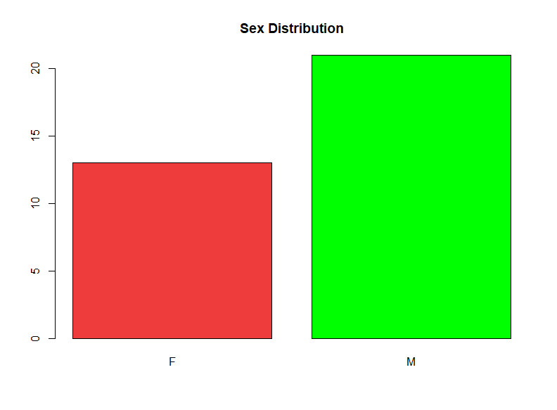

# 条形图

## 简介

`d.cancer` 数据框包含肺癌病人放疗的一些数据。导入数据：

```r
> library(readr)
> d.cancer <- readr::read_csv("src/data/cancer.csv", locale=locale(encoding="GBK"))
Parsed with column specification:
cols(
  id = col_double(),
  age = col_double(),
  sex = col_character(),
  type = col_character(),
  v0 = col_double(),
  v1 = col_double()
)
```

统计男女个数，并用条形图表示：

```r
> res <- table(d.cancer[,'sex'])
> print(res)

 F  M
13 21
```

```r
> barplot(res)
```


然后添加颜色、标题：

```r
barplot(res1,
  main = "Sex Distribution",
  col = c("brown2", "green")
)
```



`colors()` 函数返回 R 中定义的六百多种颜色名称，如前 10 种颜色：

```r
> head(colors(), 10)
 [1] "white"         "aliceblue"     "antiquewhite"  "antiquewhite1" "antiquewhite2" "antiquewhite3" "antiquewhite4"
 [8] "aquamarine"    "aquamarine1"   "aquamarine2"
```

`width` 与 `xlim` 配合可以调整条形宽度，例如：
