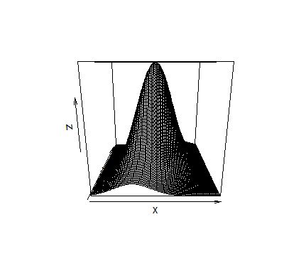

# 三维图

- [三维图](#三维图)
  - [简介](#简介)
  - [contour](#contour)

2020-08-12, 13:14
***

## 简介

用 `persp` 函数作三维曲面图, `contour` 作等值线图， `image` 作色块图。 坐标x和y构成一张平面网格， 数据z是包含z坐标的矩阵，每行对应一个横坐标， 每列对应一个纵坐标。

下面是二元正态分布密度曲面数据：

```r
x <- seq(-3,3, length=100)
y <- x
f <- function(x,y,ssq1=1, ssq2=2, rho=0.5){
  det1 <- ssq1*ssq2*(1 - rho^2)
  s1 <- sqrt(ssq1)
  s2 <- sqrt(ssq2)
  1/(2*pi*sqrt(det1)) * exp(-0.5 / det1 * (
    ssq2*x^2 + ssq1*y^2 - 2*rho*s1*s2*x*y))
}
z <- outer(x, y, f)
```

三维曲面图：

```r
persp(x, y, z)
```



## contour

```r
contour(x = seq(0, 1, length.out = nrow(z)),
        y = seq(0, 1, length.out = ncol(z)),
        z,
        nlevels = 10, levels = pretty(zlim, nlevels),
        labels = NULL,
        xlim = range(x, finite = TRUE),
        ylim = range(y, finite = TRUE),
        zlim = range(z, finite = TRUE),
        labcex = 0.6, drawlabels = TRUE, method = "flattest",
        vfont, axes = TRUE, frame.plot = axes,
        col = par("fg"), lty = par("lty"), lwd = par("lwd"),
        add = FALSE, ...)
```

|参数|说明|
|---|---|
|x|x 坐标|
|y|y 坐标|
|z|包含和 (x,y) 对应的 z 值矩阵|

