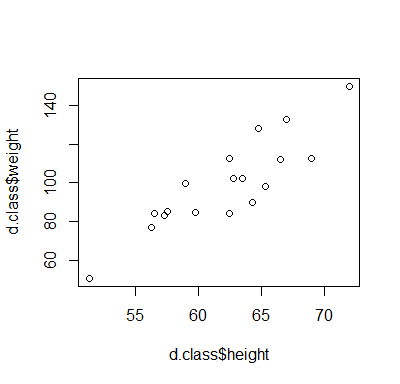
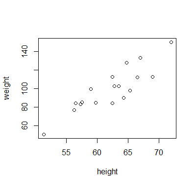
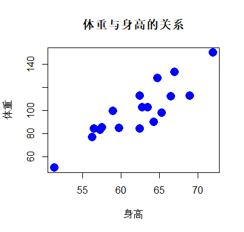
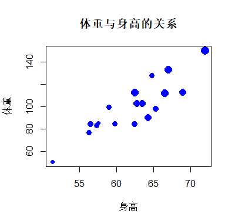
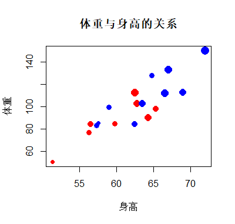
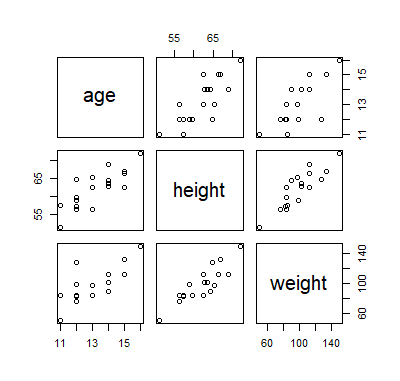

# 散点图

- [散点图](#散点图)
  - [简介](#简介)
  - [标题](#标题)
  - [样式](#样式)
  - [散点图矩阵](#散点图矩阵)

## 简介

使用 `plot()` 函数绘制散点图。

```r
plot(x, y = NULL, type = "p",  xlim = NULL, ylim = NULL,
     log = "", main = NULL, sub = NULL, xlab = NULL, ylab = NULL,
     ann = par("ann"), axes = TRUE, frame.plot = axes,
     panel.first = NULL, panel.last = NULL, asp = NA,
     xgap.axis = NA, ygap.axis = NA,
     ...)
```

|参数|说明|
|---|---|
|x|x 坐标值|
|y|y 坐标值|
|xlab|x 轴标题|
|ylab|y 轴标题|

以 d.class 数据为例，从 class.csv 读入数据：

```r
> library(readr)
> d.class <- read_csv("src/data/class.csv")
Parsed with column specification:
cols(
  name = col_character(),
  sex = col_character(),
  age = col_double(),
  height = col_double(),
  weight = col_double()
)
```

体重对身高作图：

```r
plot(d.class$height, d.class$height)
```



使用 `with()` 函数可以简化数据框变量访问格式：

```r
with(d.class,
     plot(height, weight))
```

坐标轴标题也随着更新，更为简介。



## 标题

使用 `main` 参数增加标题，用 `xlab` 指定横轴标题，`ylab` 指定纵轴标题。例如：

```r
with(d.class,
     plot(height, weight,
          main="体重与身高的关系",
          xlab = "身高",ylab = "体重"))
```


## 样式

`pch` 指定散点形状，`col` 参数指定颜色，`cex` 指定大小。例如：

```r
with(d.class,
     plot(height, weight,
          main="体重与身高的关系",
          xlab = "身高",ylab = "体重",
          pch=16, col='blue', cex=2))
```



`cex` 表示数据点大小，可以将其和其它数据绑定，例如年龄，从而数据点的大小和年龄大小对应：

```r
with(d.class,
     plot(height, weight,
          main="体重与身高的关系",
          xlab = "身高",ylab = "体重",
          pch=16, col='blue',
          cex=1+(age-min(age))/(max(age)-min(age))))
```



还可以继续用颜色来表示性别：

```r
with(d.class,
     plot(height, weight,
          main="体重与身高的关系",
          xlab = "身高",ylab = "体重",
          pch=16, 
          col=ifelse(sex=='M', "blue", "red"), 
          cex=1+(age-min(age))/(max(age)-min(age))))
```



## 散点图矩阵

用 `pairs()` 函数可以做散点图矩阵：

```r
library(readr)

d.class <- read_csv("src/data/class.csv")

pairs(d.class[, c('age', 'height', 'weight')])
```


