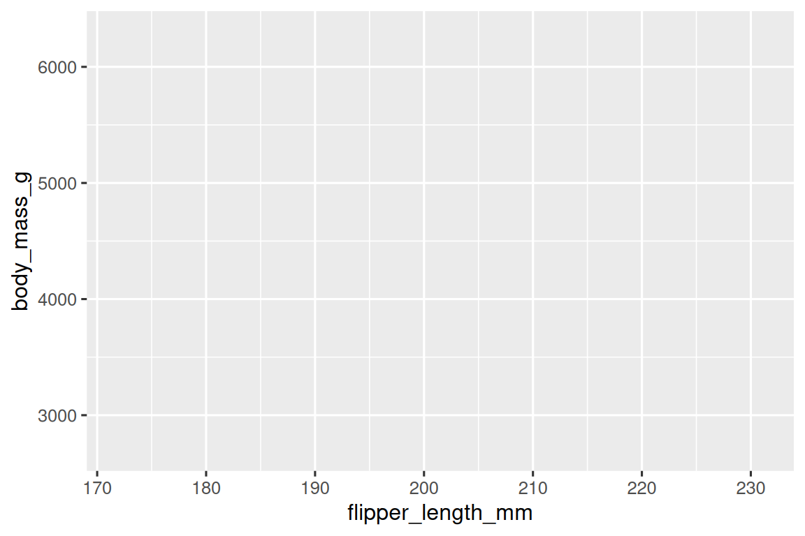
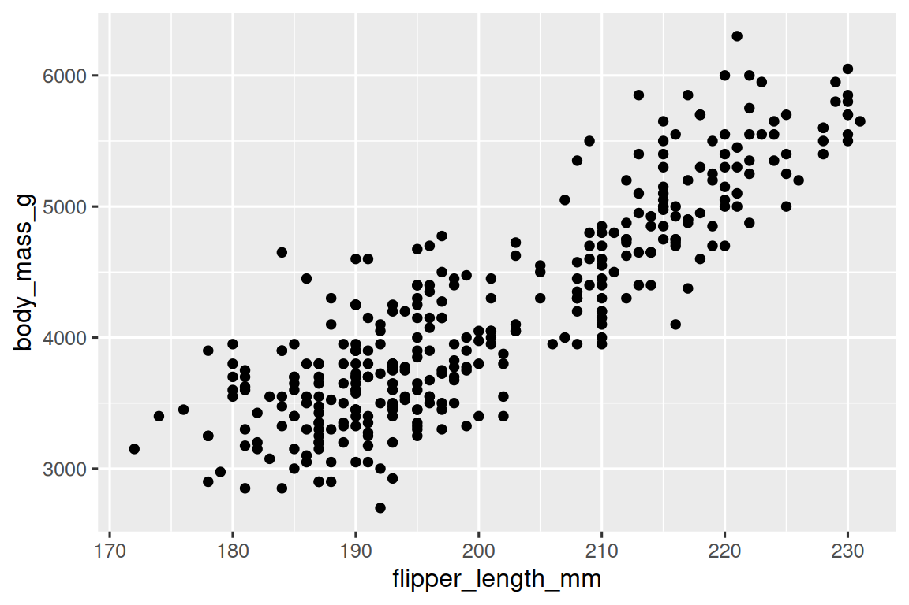
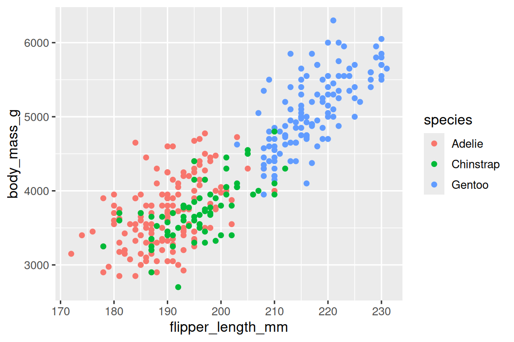
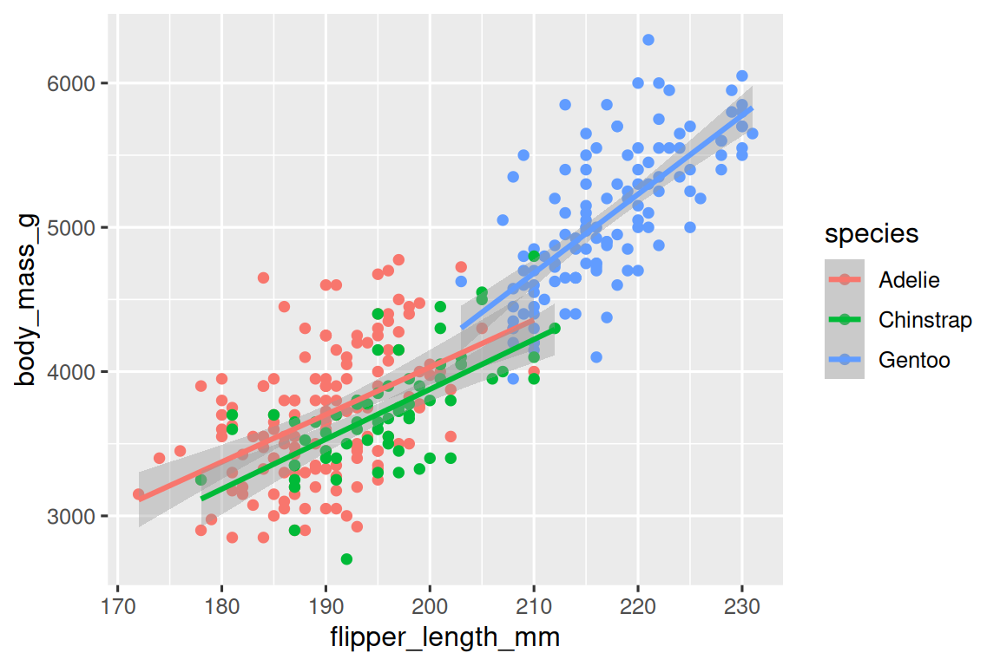
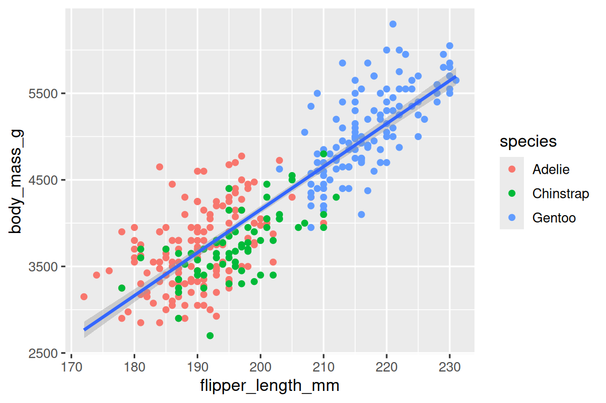
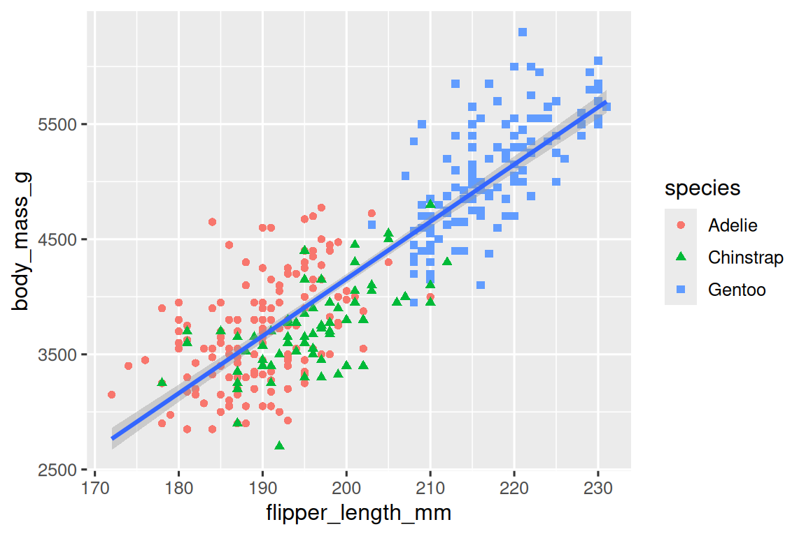

# 1. 数据可视化

## 1.1 简介

R 有多种绘图系统，但 **ggplot2** 是其中最优雅、最通用的系统之一。ggplot2 实现了**图形语法（the grammar of graphics）**，这是一套用于描述和构建图形的统一体系。借助 ggplot2，你只需学习一套系统，就能在多种场景下更快、更高效地绘图。

本章将教你如何使用 **ggplot2** 实现数据可视化。我们将从绘制一张简单的散点图开始，以此介绍**美学映射**与**几何对象**—— 它们是 ggplot2 的基础构建模块。随后我们会带你学习**单个变量的分布可视化**，以及**两个或多个变量之间关系的可视化**。最后我们会讲解如何保存图表，并提供一些**问题排查技巧**。

### 1.1.1 准备环境

本章重点讲解 **ggplot2**，它是 tidyverse 中的核心包之一。为了使用本章所需的数据集、帮助页面和函数，请运行以下代码加载 tidyverse：

```R
library(tidyverse)
#> ── Attaching core tidyverse packages ───────────────────── tidyverse 2.0.0 ──
#> ✔ dplyr     1.2.0     ✔ readr     2.2.0
#> ✔ forcats   1.0.1     ✔ stringr   1.6.0
#> ✔ ggplot2   4.0.2     ✔ tibble    3.3.1
#> ✔ lubridate 1.9.5     ✔ tidyr     1.3.2
#> ✔ purrr     1.2.1     
#> ── Conflicts ─────────────────────────────────────── tidyverse_conflicts() ──
#> ✖ dplyr::filter() masks stats::filter()
#> ✖ dplyr::lag()    masks stats::lag()
#> ℹ Use the conflicted package (<http://conflicted.r-lib.org/>) to force all conflicts to become errors
```

这一行代码会加载 **tidyverse 核心包**—— 几乎所有数据分析中都会用到的包。它同时也会告诉你，tidyverse 中的哪些函数与 **R 基础包**（或你可能已加载的其他包）中的函数存在**冲突**。

如果你运行这段代码后，出现报错信息 **there is no package called 'tidyverse'**（找不到名为 'tidyverse' 的包），你需要先安装这个包，然后再次运行 `library()` 函数。

```R
install.packages("tidyverse")
library(tidyverse)
```

只需要安装一次，但**每次启动新的 R 会话**时都需要重新加载它。

除了 tidyverse，我们还会使用 **palmerpenguins** 包，它包含了**企鹅数据集**，记录了帕尔默群岛三个岛屿上企鹅的身体测量数据；以及 **ggthemes** 包，它提供了**适合色盲人士使用的安全配色方案**。

```R
> library(palmerpenguins)

载入程序包：‘palmerpenguins’

The following objects are masked from ‘package:datasets’:

    penguins, penguins_raw
> library(ggthemes)
```

## 1.2 初步探索

鳍足较长的企鹅，体重会比鳍足较短的企鹅更重还是更轻？你心里或许已经有了答案，但不妨试着给出更精确的判断。鳍足长度与体重之间呈现怎样的关系？是正相关、负相关、线性相关还是非线性相关？这种关系是否会因企鹅的种类而变化？是否会因企鹅栖息的岛屿而不同？让我们通过可视化来解答这些问题。

### 1.2.1 `penguins` data-frame

你可以使用 palmerpenguins 包中的 `penguins` 数据框（即 `palmerpenguins::penguins`）来验证你对这些问题的回答。 数据框（data frame）是由变量（列）和观测值（行） 组成的矩形数据表。`penguins` 数据集包含 344 条观测数据，由 Kristen Gorman 博士与南极帕尔默站长期生态研究站（LTER）收集并提供。

为了方便讨论，我们先定义一些术语：

- **变量（variable）**：指能够测量的数量、性质或属性。
- **值（value）**：指测量时变量所呈现的状态。同一变量在不同测量中，其值可能会发生变化。
- **观测（observation）**：指在相似条件下完成的一组测量（通常是在同一时间、对同一对象完成所有测量）。一个观测会包含多个值，每个值对应不同的变量。观测又称为数据点（data point）。
- **表格数据（tabular data）**：是一组值的集合，每个值都对应一个变量和一次观测。如果表格数据中，每个值都放在独立的 “单元格” 中，每个变量独占一列，每个观测独占一行，这样的数据就是整洁数据（tidy data）。

在这个语境下，**变量**指的是所有企鹅都具有的一项属性，而**观测**指的是单只企鹅的全部属性。

在控制台中输入数据框的名称，R 就会打印出其内容的预览信息。预览内容顶部标注了 “tibble”（ tibble 是 tidyverse 中对数据框的特殊实现，也译作 “轻量级数据框”）。在 tidyverse 体系中，我们使用名为 **tibble** 的特殊数据框。

```R
> penguins
# A tibble: 344 × 8
   species island    bill_length_mm bill_depth_mm flipper_length_mm body_mass_g sex     year
   <fct>   <fct>              <dbl>         <dbl>             <int>       <int> <fct>  <int>
 1 Adelie  Torgersen           39.1          18.7               181        3750 male    2007
 2 Adelie  Torgersen           39.5          17.4               186        3800 female  2007
 3 Adelie  Torgersen           40.3          18                 195        3250 female  2007
 4 Adelie  Torgersen           NA            NA                  NA          NA NA      2007
 5 Adelie  Torgersen           36.7          19.3               193        3450 female  2007
 6 Adelie  Torgersen           39.3          20.6               190        3650 male    2007
 7 Adelie  Torgersen           38.9          17.8               181        3625 female  2007
 8 Adelie  Torgersen           39.2          19.6               195        4675 male    2007
 9 Adelie  Torgersen           34.1          18.1               193        3475 NA      2007
10 Adelie  Torgersen           42            20.2               190        4250 NA      2007
# ℹ 334 more rows
# ℹ Use `print(n = ...)` to see more rows
```

该数据框包含 8 列。还可以使用 `glimpse()` 函数查看每个变量的前几个值。此外，如果使用的是 RStudio，运行 `View(penguins)` 即可打开交互式数据查看器。

```R
> glimpse(penguins)
Rows: 344
Columns: 8
$ species           <fct> Adelie, Adelie, Adelie, Adelie, Adelie, Adelie, Adelie, Adelie, Adelie, Adelie, Ad…
$ island            <fct> Torgersen, Torgersen, Torgersen, Torgersen, Torgersen, Torgersen, Torgersen, Torge…
$ bill_length_mm    <dbl> 39.1, 39.5, 40.3, NA, 36.7, 39.3, 38.9, 39.2, 34.1, 42.0, 37.8, 37.8, 41.1, 38.6, …
$ bill_depth_mm     <dbl> 18.7, 17.4, 18.0, NA, 19.3, 20.6, 17.8, 19.6, 18.1, 20.2, 17.1, 17.3, 17.6, 21.2, …
$ flipper_length_mm <int> 181, 186, 195, NA, 193, 190, 181, 195, 193, 190, 186, 180, 182, 191, 198, 185, 195…
$ body_mass_g       <int> 3750, 3800, 3250, NA, 3450, 3650, 3625, 4675, 3475, 4250, 3300, 3700, 3200, 3800, …
$ sex               <fct> male, female, female, NA, female, male, female, male, NA, NA, NA, NA, female, male…
$ year              <int> 2007, 2007, 2007, 2007, 2007, 2007, 2007, 2007, 2007, 2007, 2007, 2007, 2007, 2007…
```

`penguins` 数据集中的变量包括：

- **species**：企鹅的种类（阿德利、帽带、巴布亚）。
- **flipper_length_mm**：企鹅的鳍足长度，单位为毫米。
- **body_mass_g**：企鹅的体重，单位为克。

如需了解更多关于 `penguins` 数据集的信息，可运行 `?penguins` 打开帮助页面。

### 1.2.2 最终目标

本章的最终目标是重现下面这张可视化图表，它在**考虑企鹅种类的前提下**，展示企鹅鳍足长度与体重之间的关系。


### 1.2.3 创建 ggplot 图表

让我们一步步来重现这张图表。

使用 ggplot2 绘图时，首先要通过 `ggplot()` 创建一个**绘图对象**，之后再为它添加图层。`ggplot()` 的第一个参数是绘图所用的数据集，因此 `ggplot(data = penguins)` 会创建一幅**空白图表**，它已准备好展示企鹅数据，但由于我们还没有指定可视化方式，所以目前是空的。这张图暂时没什么内容，你可以把它想象成一块**空白画布**，后续再把图表的其他图层 “画” 上去。

```R
ggplot(data = penguins)
```


接下来，我们需要告诉 `ggplot()` 如何将数据中的信息**以视觉形式呈现**。`ggplot()` 函数中的 `mapping` 参数用于定义数据集中的变量如何**映射**到图表的**视觉属性（美学特性）**。`mapping` 参数始终在 `aes()` 函数中定义，而 `aes()` 中的 `x` 和 `y` 参数则指定将哪些变量映射到 x 轴和 y 轴。目前，我们只将**鳍足长度**映射到 x 轴，将**体重**映射到 y 轴。`ggplot2` 会在 `data` 参数指定的数据中寻找被映射的变量，在本例中也就是 `penguins` 数据集。

下图展示了添加这些映射后的结果：

```R
ggplot(
  data = penguins,
  mapping = aes(x = flipper_length_mm, y = body_mass_g)
)
```



这块画布现在有了更清晰的结构：可以清楚看到鳍足长度会显示在 **x 轴**，体重会显示在 **y 轴**。但企鹅的数据本身还没有出现在图上。这是因为我们还没有在代码中明确，要如何把数据框里的观测值呈现在图表中。

要实现这一点，我们需要定义一个**几何对象（geom）**：即用来表示数据的几何图形。ggplot2 中所有几何对象都通过以 `geom_` 开头的函数来实现。人们通常根据图表使用的几何对象类型来描述图表。例如：条形图使用条形几何对象（`geom_bar()`），折线图使用线条几何对象（`geom_line()`），箱线图使用箱形几何对象（`geom_boxplot()`），散点图使用点几何对象（`geom_point()`），依此类推。

`geom_point()` 函数会为你的图表添加一个**点图层**，从而创建一张**散点图**。ggplot2 提供了许多 geom 函数，每个函数都会为图表添加不同类型的图层。在整本书中，你会学到大量的 geom 函数，尤其是在**第 9 章**。

```R
> ggplot(
+   data = penguins,
+   mapping = aes(x = flipper_length_mm, y = body_mass_g)
+ ) + geom_point()
警告信息:
Removed 2 rows containing missing values or values outside the scale range
(`geom_point()`). 
```



现在我们得到了一张**散点图**。虽然它还没有达到我们的 “最终目标” 图，但借助这张图，我们已经可以开始回答驱动本次探索的问题了：**“鳍足长度与体重之间呈现怎样的关系？”**这种关系看起来是正相关的（鳍足越长，体重越大），且呈较为明显的线性关系（点聚集在一条直线周围，而非曲线周围），相关性中等偏强（直线周围的散点分布不算太分散）。总体而言，鳍足更长的企鹅，体重通常更大。

在我们为这张图表添加更多图层之前，先暂停一下，回顾一下我们得到的警告信息：

> Removed 2 rows containing missing values or values outside the scale range
> (`geom_point()`). 

我们会看到这条提示，是因为数据集中有**两只企鹅**的**体重**和 / 或**鳍足长度**存在**缺失值**，而如果缺少这两个变量中的任意一个，ggplot2 就无法在图上展示它们。和 R 语言一样，ggplot2 遵循的原则是：**缺失值绝不应该被无声忽略**。这类警告可能是你在处理真实数据时最常见的警告之一 ——**缺失值是非常普遍的问题**，在本书中你会学到更多相关内容，尤其是在**第 18 章**。在本章后续的绘图中，我们会**屏蔽这条警告**，以免它在每张图下方都重复出现。

### 1.2.4 添加美学属性与图层

散点图常用于展示两个数值变量之间的关系，但对变量间呈现出的任何明显关系都保持怀疑态度是个好习惯，我们应该思考：是否存在其他变量，可以解释或改变这种表面关系的本质。例如，鳍足长度与体重的关系是否会因**企鹅种类**不同而有所差异？我们将企鹅种类加入图表中，看看这能否为这些变量间的直观关系带来更多新发现。我们通过**不同颜色来区分不同企鹅种类**来实现这一点。

要实现这一点，我们需要修改美学映射（aesthetic）：

```R
ggplot(
  data = penguins,
  mapping = aes(x = flipper_length_mm, y = body_mass_g, color = species)
) +
  geom_point()
```



当把一个**分类变量**映射到某个美学属性时，ggplot2 会自动为该变量的每个不同取值（这里是三种企鹅）分配一个唯一的美学属性值（此处为不同颜色），这个过程称为**缩放（scaling）**。ggplot2 还会自动添加一个**图例**，说明每个美学属性值对应哪个变量类别。

现在我们再添加一个图层：一条展示体重与鳍足长度之间关系的平滑曲线。在继续之前，请回顾上面的代码，思考一下我们该如何把它添加到现有的图表中。

因为这是用来表示数据的**新几何对象**，我们将在散点图层之上**添加一个新的 geom 图层**：`geom_smooth()`。并且通过 `method = "lm"` 表示希望基于**线性模型**绘制**最佳拟合直线**。

```R
ggplot(
  data = penguins,
  mapping = aes(x = flipper_length_mm, y = body_mass_g, color = species)
) +
  geom_point() +
  geom_smooth(method = "lm")
```



我们成功添加了直线，但这张图和 **1.2.2 节** 里的效果图不一样 —— 原图只对**整个数据集**绘制**一条直线**，而不是按企鹅种类分别绘制多条直线。

当在 `ggplot()` 中定义的美学映射属于**全局级别**，会被传递给图表中后续的每一个几何图层。不过，ggplot2 中的每个几何函数也可以接收 `mapping` 参数，从而实现**局部**的美学映射，该映射会附加到从全局继承的映射之上。由于我们希望点按企鹅种类区分颜色，但不希望线条也按种类分开，因此应该**只在 `geom_point()` 中**指定 `color = species`。

```R
ggplot(
  data = penguins,
  mapping = aes(x = flipper_length_mm, y = body_mass_g)
) +
  geom_point(mapping = aes(color = species)) +
  geom_smooth(method = "lm")
```



好啦！现在的图表已经和**最终目标**非常接近了。我们还需要为不同种类的企鹅设置**不同形状**，并完善图表的**标签**。

通常来说，在图表中只依靠颜色来展示信息并不好，因为有些人会因为色盲或其他色觉差异而对颜色有不同的感知。因此，除了颜色，还可以把企鹅种类（species）映射到形状（shape）这个美学属性上。

```R
ggplot(
  data = penguins,
  mapping = aes(x = flipper_length_mm, y = body_mass_g)
) +
  geom_point(mapping = aes(color = species, shape = species)) +
  geom_smooth(method = "lm")
```



请注意，图例也会**自动更新**，以显示点的不同形状。

最后，我们可以在新图层中使用 `labs()` 函数来完善图表的标签。`labs()` 的部分参数的含义：`title` 为图表添加**标题**，`subtitle` 添加**副标题**。其他参数与美学映射相对应：`x` 是 x 轴标签，`y` 是 y 轴标签，`color` 和 `shape` 用于设置**图例的名称**。此外，我们还可以使用 `ggthemes` 包中的 `scale_color_colorblind()` 函数，将调色板修改为**色盲友好配色**。

```R
ggplot(
  data = penguins,
  mapping = aes(x = flipper_length_mm, y = body_mass_g)
) +
  geom_point(aes(color = species, shape = species)) +
  geom_smooth(method = "lm") +
  labs(
    title = "Body mass and flipper length",
    subtitle = "Dimensions for Adelie, Chinstrap, and Gentoo Penguins",
    x = "Flipper length (mm)", y = "Body mass (g)",
    color = "Species", shape = "Species"
  ) +
  scale_color_colorblind()
```


最终得到一张与我们 “目标”**完美匹配**的图表！

### 1.2.5 练习

1. `penguins` 数据集中有多少行、多少列？

```R
> penguins
# A tibble: 344 × 8
   species island    bill_length_mm bill_depth_mm flipper_length_mm body_mass_g sex   
   <fct>   <fct>              <dbl>         <dbl>             <int>       <int> <fct> 
 1 Adelie  Torgersen           39.1          18.7               181        3750 male  
 2 Adelie  Torgersen           39.5          17.4               186        3800 female
 3 Adelie  Torgersen           40.3          18                 195        3250 female
 4 Adelie  Torgersen           NA            NA                  NA          NA NA    
 5 Adelie  Torgersen           36.7          19.3               193        3450 female
 6 Adelie  Torgersen           39.3          20.6               190        3650 male  
 7 Adelie  Torgersen           38.9          17.8               181        3625 female
 8 Adelie  Torgersen           39.2          19.6               195        4675 male  
 9 Adelie  Torgersen           34.1          18.1               193        3475 NA    
10 Adelie  Torgersen           42            20.2               190        4250 NA    
# ℹ 334 more rows
# ℹ 1 more variable: year <int>
# ℹ Use `print(n = ...)` to see more rows
```

344 行，8 列。

2. penguins 数据框中的 `bill_depth_mm` 变量描述的是什么？使用 `?penguins` 查看帮助文档来找答案。

```
bill_length_mm
a number denoting bill length (millimeters)
```

3. 绘制 `bill_depth_mm` 与 `bill_length_mm` 的散点图。也就是将 `bill_depth_mm` 放在 y 轴，`bill_length_mm` 放在 x 轴绘制散点图，并描述这两个变量之间的关系。

```R
ggplot(
  data = penguins,
  mapping = aes(x = bill_length_mm, y=bill_depth_mm)
) +
  geom_point(aes(color=species))
```

## 1.3 ggplot2 调用

在结束这些入门章节后，我们将使用**更简洁**的方式来书写 ggplot2 代码。到目前为止，我们的代码都写得非常详尽清晰，这在学习阶段是很有帮助的：

```R
ggplot(
  data = penguins,
  mapping = aes(x = flipper_length_mm, y = body_mass_g)
) +
  geom_point()
```

通常情况下，一个函数的前两个参数非常重要，你应该熟记。`ggplot()` 的前两个参数是 **data**（数据）和 **mapping**（映射）。在本书的剩余部分，我们将**不再写出这些参数名**。这样可以节省输入时间，并且通过减少多余文字，能更容易看出不同图表之间的区别。这是一个非常重要的编程技巧，我们将在**第 25 章**再次讲到。

把上一张图的代码改写成更简洁的形式：

```R
ggplot(penguins, aes(x = flipper_length_mm, y = body_mass_g)) + 
  geom_point()
```

