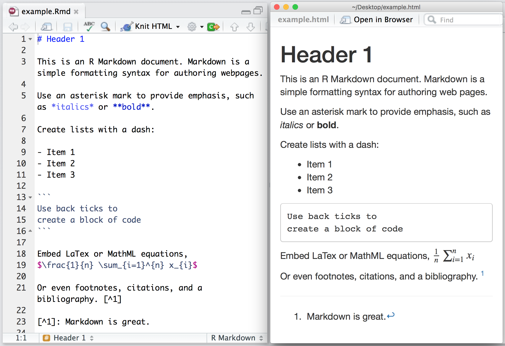
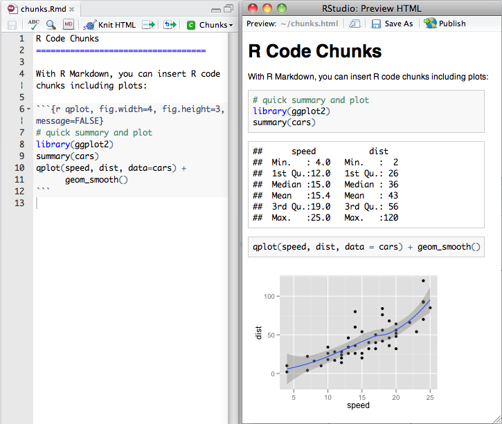
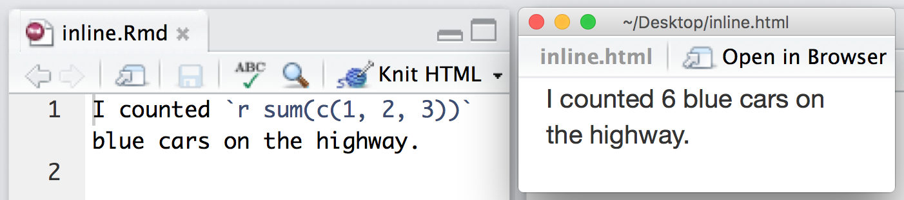
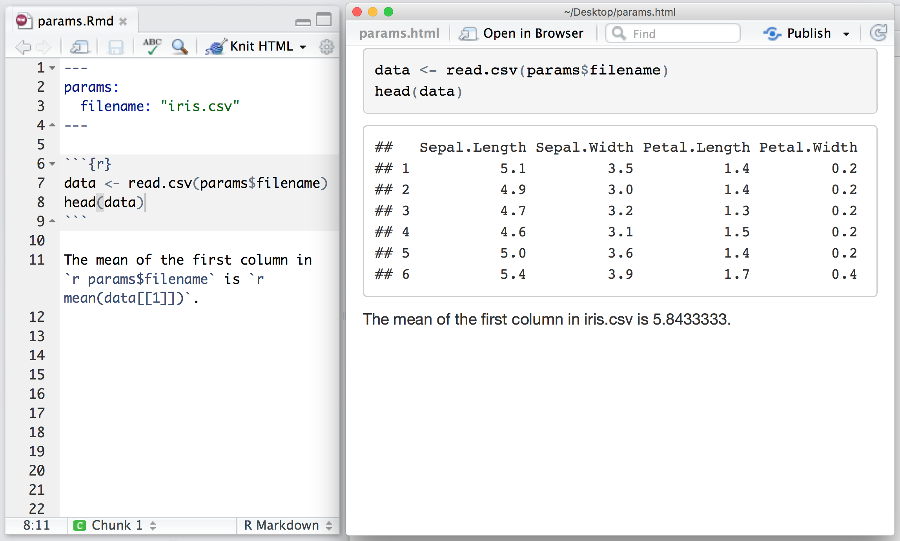
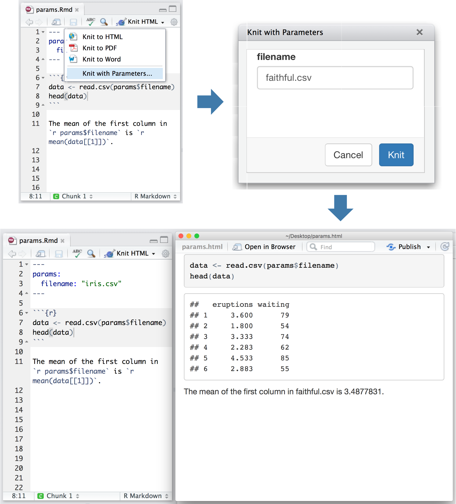
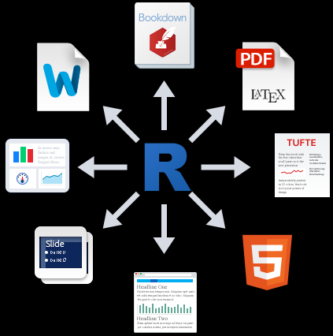

# Introduction

- [Introduction](#introduction)
  - [简介](#简介)
  - [安装](#安装)
  - [Markdown 基础](#markdown-基础)
    - [R 代码块](#r-代码块)
    - [内嵌 R 代码](#内嵌-r-代码)
    - [公式](#公式)
    - [插入图片](#插入图片)
    - [表格](#表格)
  - [RMarkdown 文件结构](#rmarkdown-文件结构)
  - [参数](#参数)
    - [参数引用](#参数引用)
  - [渲染输出](#渲染输出)
    - [输出格式](#输出格式)
    - [输出目录](#输出目录)
    - [生成 PDF](#生成-pdf)

2020-05-15, 15:42
*** *

## 简介

R Markdown 文件后缀为 `.Rmd`，该文件可以包含 markdown 以及 R 代码段。如下图所示：


`knitr` 执行 `.Rmd` 文件中的所有代码段，并创建一个新的 markdown （`.md`）文件，在其中包含 `.Rmd` 内容和代码输出。

`knitr` 生成的 markdown 文件由 `pandoc` 处理，生成发布的网页、PDF、MS Word 文件、slide show 等等支持的格式。

虽然上面的内容看着复杂，但是 R Markdown 将所有功能包装，集成为一个命令。R Studio 中的 "Knit" 按钮可以直接将 `.Rmd` 文件渲染为最终样式。

## 安装

从 CRAN 安装：

```r
install.packages("rmarkdown")
```

## Markdown 基础

Markdown 是一种简单的标记语言。如下所示，左侧为 Markdown 语法，右侧为输出效果：



### R 代码块

在 R Markdown 文件中，可以插入 R 代码段。例如，下面计算并绘图：



### 内嵌 R 代码

单行表达式，以 `r` 识别，例如：



### 公式

例如 $\frac{\sum (\bar{x} - x_i)^2}{n-1}$

### 插入图片

```{r, out.width='35%', fig.align='left', fig.cap='this is caption'}
knitr::include_graphics("images/R_logo.png")
```

### 表格

参考 [kableExtra](https://haozhu233.github.io/kableExtra/)

## RMarkdown 文件结构


基本构成：

- metadata
- text
- code

点击 `Knit`，可以输出为需要的文件格式。

## 参数

R Markdown 可以包含一个 metadata 部分，用于设置标题、作者、日期以及输出格式等。

例如，下面的 metadata 在 `.Rmd` 顶部添加 TOC，并且输出 HTML 格式：

```rmd
---
title: "Sample Document"
output:
  html_document:
    toc: true
    theme: united
---
```

### 参数引用

metadata 中可以包含 `params:` 字段，在其中列入一些值，然后在后面文件内容中可以引用这些值。例如：



通过参数，可以快速应用新的数据集、模型和参数，通过 `rmarkdown::render()` 可以设置新的参数值：

```r
rmarkdown::render("input.Rmd", params = list())
```

也可以通过 “Knit” 按钮设置：



## 渲染输出

将 `.Rmd` 渲染输出的方式有两种，如果使用 RStudio，可以使用 "Knit" 按钮渲染并预览文件。

如果没有使用 RStudio，则可以使用 `rmarkdown::render` 函数，例如：

```r
rmarkdown::render("input.Rmd")
```

两个方式本质相同。

### 输出格式



R Markdown 内置支持 HTML, PDF, MS_WORD, ODT, RTF, Markdown等。可以在 metadata 中指定格式：

```rmd
---
title: "Sample Document"
output: pdf_document
---
```

而且，针对格式还能自定义设置：

```rmd
---
title: "Sample Document"
output:
  pdf_document:
    toc: true
    highlight: zenburn
---
```

还能一次指定多种格式：

```rmd
---
title: "Sample Document"
output:
  html_document:
    toc: true
    theme: united
  pdf_document:
    toc: true
    highlight: zenburn
---
```

如果使用 `rmarkdown::render` 渲染，则可以通过参数设置格式：

```r
render("input.Rmd", "pdf_document")
```

也可以直接渲染文件中定义的所有格式：

```r
render("input.Rmd", "all")
```

### 输出目录

在格式下面指定 `toc: true`

例如：

```rmd
title: "Sample Document"
output:
  html_document:
    toc: true
    theme: united
```

### 生成 PDF

pdf 文档可以插入矢量图和数学公式，备受大家喜欢。但是如果包含中午呢，往往编译不成功，可以参考 [R Markdown: The Definitive Guide](https://bookdown.org/yihui/rmarkdown/)。
