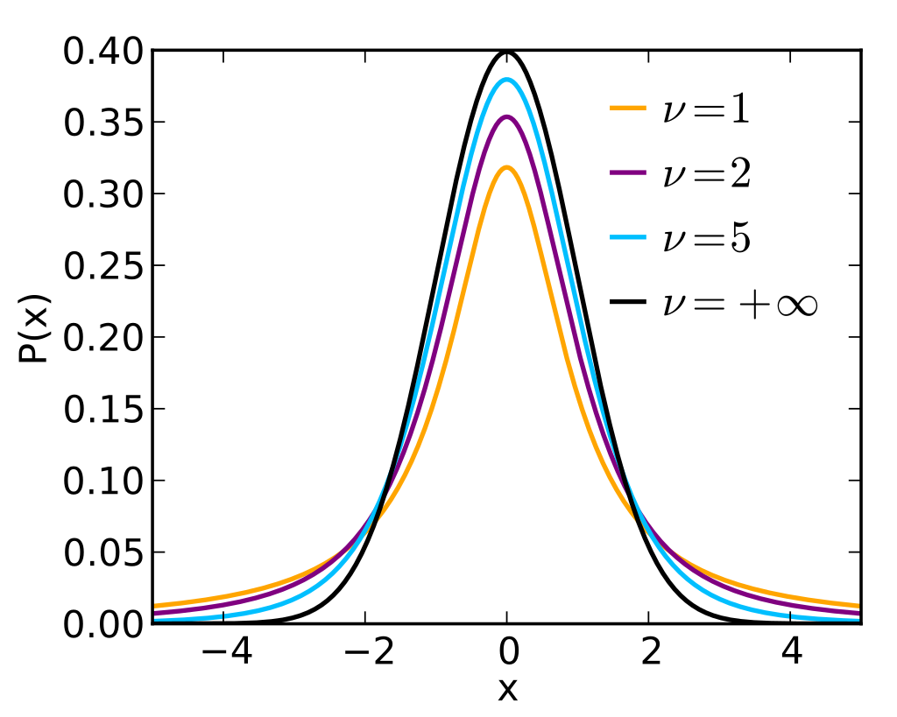

# t 分布

- [t 分布](#t-分布)
  - [简介](#简介)
  - [性质](#性质)
  - [参考](#参考)

2023-03-23, 15:50
****

## 简介

Student's t-distribution，即 t 分布，当**样本较少**或**总体方差未知**时，用于估计总体参数的概率分布。

假定已知正态分布的 $\mu$ 和 $\sigma^2$ 的估计量 $S^2$，则可以用样本标准差 $S$ 代替总体标准差 $\sigma$，得到一个新的变量 $t$：

$$t=\frac{\overline{x}-\mu
}{S/\sqrt{n}}$$

则称 t 服从自由度为 $n-1$ 的 t 分布。

> NOTE
> 在均值和方差已知的情况下，知道 n-1 个变量后，最后一个变量就能计算出来，所以自由度为 $n-1$

样本方差定义：

$$S^2=\frac{1}{N-1}\sum_{i=1}^N (x_i-\overline{x})^2$$

**总结**

从正态分布总体中随机抽样，若总体均值为 $\mu$，方差用估计量 $S^2$ 代替，则**样本均值**服从 t 分布。

t 分布通常用 $t_k$ 表示，其中 k 表示自由度。

当自由度 $\nu \rightarrow +\infty$，对应正态分布。

## 性质

t 分布的性质：

- t 分布与正态分布类似，具有对称性；
- t 分布的均值与标准正态分布均值相同，为 0，但方差为 $k/(k-2)$，因此，计算 t 分布的方差时自由度必须大于 2；
- 标准正态分布的方差为 1，而 t 分布方差 $k/(k-2)$ 总大于 1，所以 t 分布比正态分布略胖。

当 k 增大时，t 分布的方差接近 $N(0,1)$ 的方差 1。例如：

- 当 $k=10$，t 分布的方差为 10/8=1.25；
- 当 $k=30$，t 分布的方差为 30/28=1.07；
- 当 $k=100$，t 分布的方差为 100/98=1.02；

> **NOTE**
> 对 t 分布，不要求样本量很大，k=30 时，t 分布与正态分布已经很接近。

## 参考

- https://en.wikipedia.org/wiki/Student%27s_t-distribution
- https://mathworld.wolfram.com/Studentst-Distribution.html