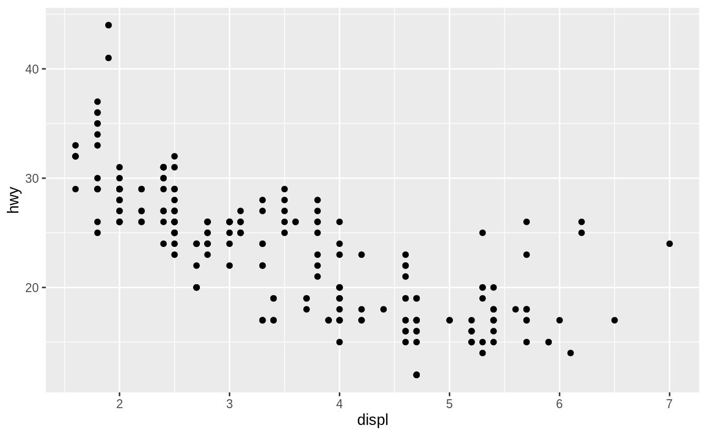
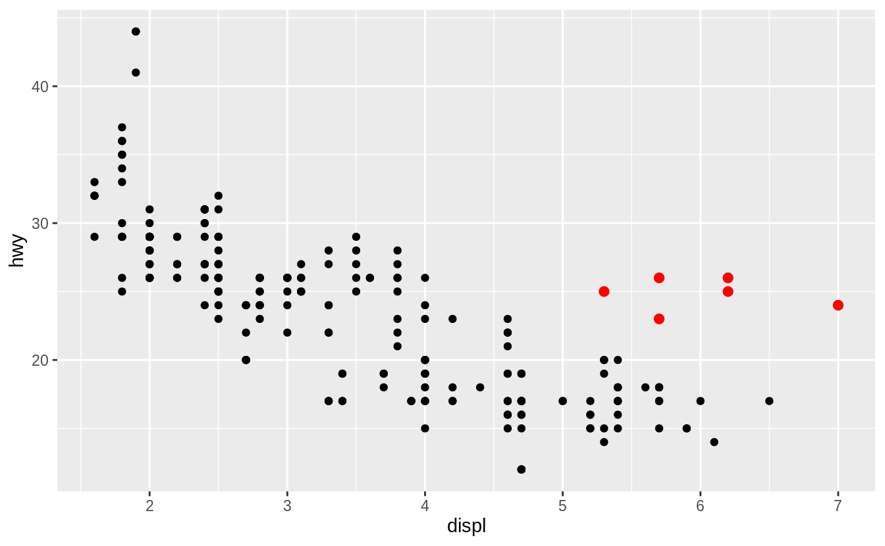
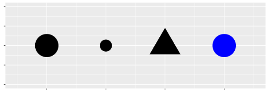
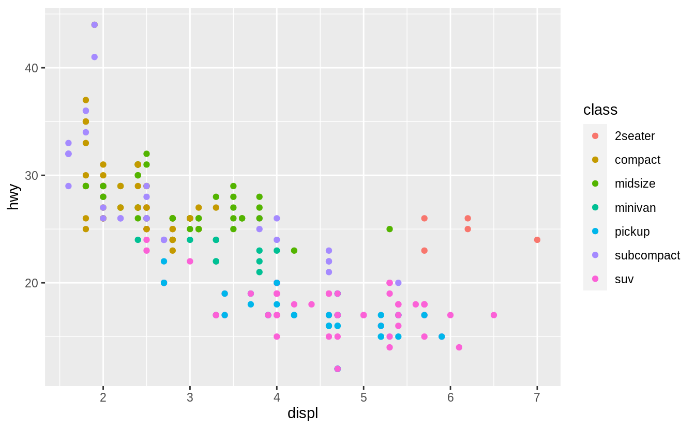
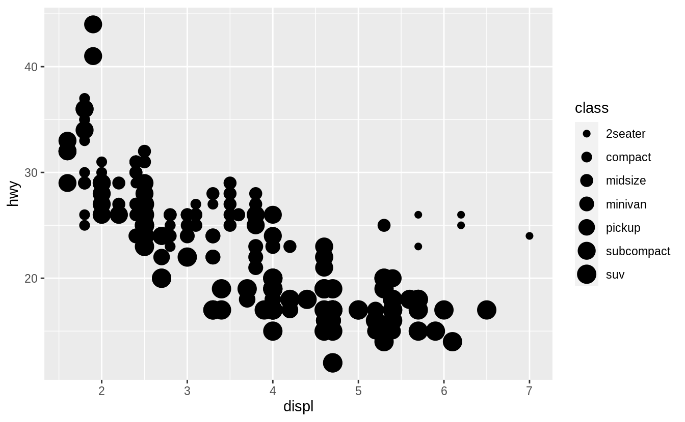
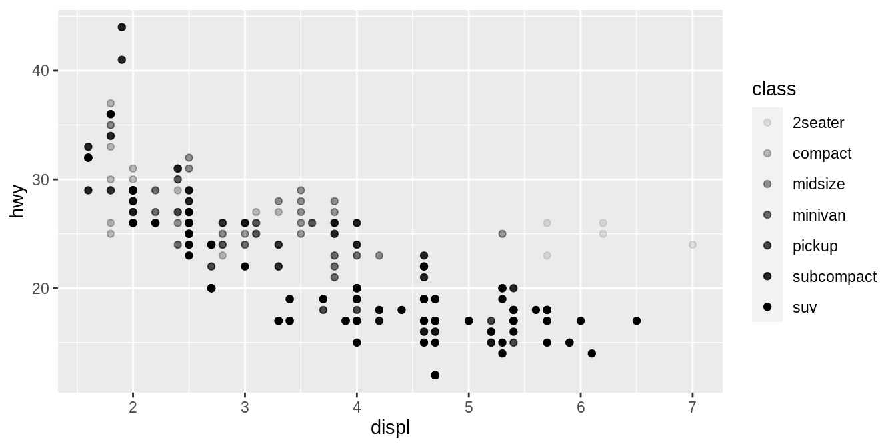
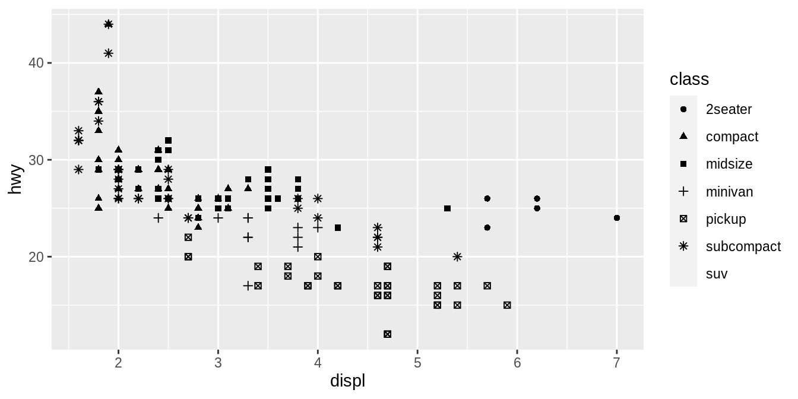
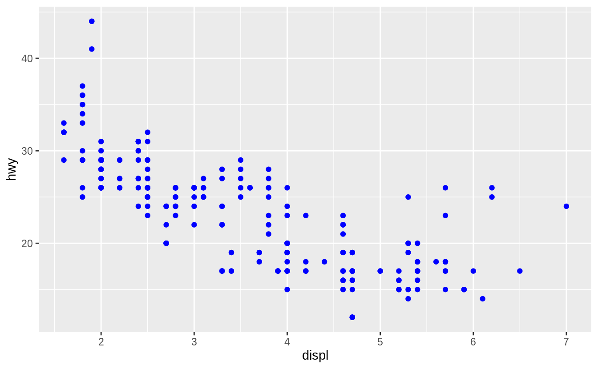

# 数据可视化

- [数据可视化](#%e6%95%b0%e6%8d%ae%e5%8f%af%e8%a7%86%e5%8c%96)
  - [简介](#%e7%ae%80%e4%bb%8b)
  - [准备](#%e5%87%86%e5%a4%87)
  - [第一步](#%e7%ac%ac%e4%b8%80%e6%ad%a5)
    - [创建 ggplot](#%e5%88%9b%e5%bb%ba-ggplot)
  - [自定义](#%e8%87%aa%e5%ae%9a%e4%b9%89)
    - [颜色映射](#%e9%a2%9c%e8%89%b2%e6%98%a0%e5%b0%84)
    - [大小映射](#%e5%a4%a7%e5%b0%8f%e6%98%a0%e5%b0%84)
    - [透明度和形状映射](#%e9%80%8f%e6%98%8e%e5%ba%a6%e5%92%8c%e5%bd%a2%e7%8a%b6%e6%98%a0%e5%b0%84)
    - [手动设置颜色](#%e6%89%8b%e5%8a%a8%e8%ae%be%e7%bd%ae%e9%a2%9c%e8%89%b2)
  - [Facets](#facets)

2020-05-15, 16:20
***

## 简介

下面学习如何使用 ggplot2 可视化数据。R 中有许多绘图工具，ggplot2 是使用最广，也是最为强大的绘图工具之一。

在 [http://vita.had.co.nz/papers/layered-grammar.pdf](http://vita.had.co.nz/papers/layered-grammar.pdf) 有 ggplot2 的理论基础。

## 准备

安装 tidyverse:

```r
install.packages("tidyverse")
```

载入包：

```r
library(tidyverse)
#> ── Attaching packages ─────────────────────────────────────── tidyverse 1.3.0 ──
#> ✔ ggplot2 3.3.0     ✔ purrr   0.3.4
#> ✔ tibble  3.0.1     ✔ dplyr   0.8.5
#> ✔ tidyr   1.0.3     ✔ stringr 1.4.0
#> ✔ readr   1.3.1     ✔ forcats 0.5.0
#> ── Conflicts ────────────────────────────────────────── tidyverse_conflicts() ──
#> ✖ dplyr::filter() masks stats::filter()
#> ✖ dplyr::lag()    masks stats::lag()
```

## 第一步

使用 ggplot2 中自带的数据 mpg，查看大型发动机的汽车是否比小型发动机的汽车更耗油，以及发动机的尺寸和燃油效率是否有关系。

```r
> library(tidyverse)
> df <- ggplot2::mpg
> df
# A tibble: 234 x 11
   manufacturer model     displ  year   cyl trans     drv     cty   hwy fl    class
   <chr>        <chr>     <dbl> <int> <int> <chr>     <chr> <int> <int> <chr> <chr>
 1 audi         a4          1.8  1999     4 auto(l5)  f        18    29 p     compa~
 2 audi         a4          1.8  1999     4 manual(m~ f        21    29 p     compa~
 3 audi         a4          2    2008     4 manual(m~ f        20    31 p     compa~
 4 audi         a4          2    2008     4 auto(av)  f        21    30 p     compa~
 5 audi         a4          2.8  1999     6 auto(l5)  f        16    26 p     compa~
 6 audi         a4          2.8  1999     6 manual(m~ f        18    26 p     compa~
 7 audi         a4          3.1  2008     6 auto(av)  f        18    27 p     compa~
 8 audi         a4 quatt~   1.8  1999     4 manual(m~ 4        18    26 p     compa~
 9 audi         a4 quatt~   1.8  1999     4 auto(l5)  4        16    25 p     compa~
10 audi         a4 quatt~   2    2008     4 manual(m~ 4        20    28 p     compa~
# ... with 224 more rows
```

数据中：

- `displ` 为引擎尺寸，单位为升
- `hwy` 是汽车在告诉上的燃油效率，单位为 miles per gallon (mpg)。

### 创建 ggplot

例如：

```r
library(tidyverse)

df <- ggplot2::mpg
ggplot(data = df)+geom_point(mapping = aes(x=displ, y=hwy))
```



从该图可以看出，发动机尺寸和燃油效率大体成负相关。

对 ggplot2，`ggplot()` 创建了一个坐标系，第一个参数 `data=` 指定了绘图所用数据集。

`geom_point()` 在 `ggplot()` 上添加了一层散点图。每个绘图函数都有一个 `mapping` 参数，用于指定数据到图形的映射，一般和 `aes()` 结合使用，`aes()` 的 `x` 和 `y` 分别指定坐标轴的 x 和 y 坐标值。ggplot2 在 `data` 参数找查找对应的参数。

所以绘图的基本格式为：

```r
ggplot(data = <DATA>) +
  <GEOM_FUNCTION>(mapping = aes(<MAPPINGS>))
```

`<DATA>` 为绘图数据，`GEOM_FUNCTION` 为绘图函数，`<MAPPING>` 用于指定数据映射。

## 自定义

在下图中，有部分点（红色）不再线性趋势内，这些车的形势里程比预期高啊。



我们可以查看 `mpg` 数据集的 `class` 变量，看这些车是不是混合动力车。

现在我们将 `class` 属性 映射到散点图的美学（aesthetic）属性。美学属性是指图形的一个可视化特征，如点的大小、形状和颜色等。如下图所示：



### 颜色映射

下面将数据点的颜色映射到  `class` 变量值：

```r
library(tidyverse)

mpg <- ggplot2::mpg
ggplot(data = mpg) +
  geom_point(mapping = aes(x = displ, y = hwy, color = class))
```



通过将变量名称赋值给 `aes()` 中的变量，即可将美学特征映射到变量。ggplot2 会自动对变量的每一个 unique 值分配合适特征，并在 legend 中添加对应的信息。

从图中可以看出，异常点大多是两座汽车，这些汽车并不是混合动力车，而是跑车。跑车发动机大，但是车身小，所以里程提高。

### 大小映射

下面把 `class` 映射到点的大小：

```r
library(tidyverse)

mpg <- ggplot2::mpg
ggplot(data = mpg) +
  geom_point(mapping = aes(x = displ, y = hwy, size = class))
```



> 不得不说，这个默认样式有点丑

### 透明度和形状映射

```r
# Left
ggplot(data = mpg) +
  geom_point(mapping = aes(x = displ, y = hwy, alpha = class))

# Right
ggplot(data = mpg) +
  geom_point(mapping = aes(x = displ, y = hwy, shape = class))
```





> ggplot2 默认一次只使用 6 个形状，额外的分组不绘制。

### 手动设置颜色

```r
ggplot(data = mpg) +
  geom_point(mapping = aes(x = displ, y = hwy), color = "blue")
```

这里的 `color` 不在 `aes` 中，不传递任何信息，只是单纯设置数据点的颜色。



美学特征设置包括：

- 颜色，通过颜色名称
- 大小，单位 mm
- 形状，根据形状编号，如下


> R 有 25 个内置的形状，根据编号识别。0-14 空心形状，边框颜色通过 `color` 设置；实心形状 15-18 填充颜色 `color`；实心形状 21-24 通过 `color` 设置边框有暗色，通过 `fill` 设置填充颜色。

## Facets

根据单个变量拆分子图，使用 `facet_wrap()`，
