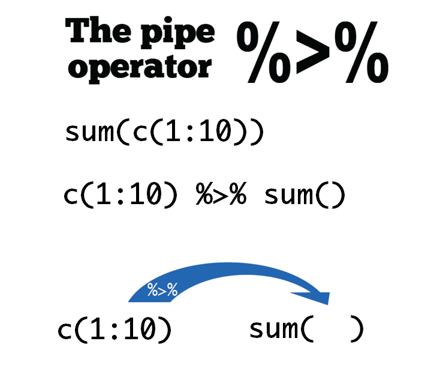

# 数据处理

- [数据处理](#数据处理)
  - [简介](#简介)
  - [mutate](#mutate)
  - [管道 %>%](#管道-)
  - [select](#select)
    - [范围选择](#范围选择)
    - [去除列](#去除列)
    - [通过变量指定列](#通过变量指定列)
    - [模式选择](#模式选择)
  - [filter](#filter)
  - [summarise 统计](#summarise-统计)
  - [group_by 分组](#group_by-分组)
  - [arrange 排序](#arrange-排序)
  - [left_join](#left_join)
  - [拆分列](#拆分列)
    - [扁平化](#扁平化)
    - [extract](#extract)
  - [合并列](#合并列)
  - [合并行](#合并行)
  - [宽表转换为长表](#宽表转换为长表)
    - [列名中提取数值](#列名中提取数值)
  - [dplyr 新版功能](#dplyr-新版功能)
    - [summarise 升级](#summarise-升级)
      - [range](#range)
      - [quantile](#quantile)
      - [数据框](#数据框)
  - [选择列](#选择列)
    - [通过索引](#通过索引)
    - [列名称](#列名称)
    - [通过函数](#通过函数)
    - [通过类型](#通过类型)
    - [条件组合](#条件组合)
  - [重命名列](#重命名列)
  - [调整列的位置](#调整列的位置)
  - [across 函数](#across-函数)
  - [group or variable](#group-or-variable)
  - [行操作](#行操作)

2020-05-29, 12:55
*** *

## 简介

数据的基本结构如下所示：


tidy 的基本思想：

- 数据结构：数据框
- 数据框的列表示一个变量，行表示一个样本
- 函数处理时，输入和数据均为数据库结构

下面介绍 tidy 中的数据处理神器 `dplyr` 包。其中主要包含以下 7 个函数：

- `mutate()`, `select()`, `filter()`
- `summarise()`, `group_by()`, `arrange()`
- `left_join()`, `right_join()`, `full_join()`

## mutate

例如：

```r
> df <- data.frame(
+     name = c("Alice", "Alice", "Bob", "Bob", "Carol", "Carol"),
+     type = c("english", "math", "english", "math", "english", "math")
+ )
> df
   name    type
1 Alice english
2 Alice    math
3   Bob english
4   Bob    math
5 Carol english
6 Carol    math
```

现在有他们的考试成绩需要添加进去：

```r
> score2020 <- c(80.2, 90.5, 92.2, 90.8, 82.5, 84.6)
> score2020
[1] 80.2 90.5 92.2 90.8 82.5 84.6
```

可以使用数据框语法：

```r
> df$score <- score2020
> df
   name    type score
1 Alice english  80.2
2 Alice    math  90.5
3   Bob english  92.2
4   Bob    math  90.8
5 Carol english  82.5
6 Carol    math  84.6
```

也可以使用 `mutate` 方法：

```r
> library(dplyr)
> mutate(.data = df, score4=score2020)
   name    type score score4
1 Alice english  80.2   80.2
2 Alice    math  90.5   90.5
3   Bob english  92.2   92.2
4   Bob    math  90.8   90.8
5 Carol english  82.5   82.5
6 Carol    math  84.6   84.6
```

`mutate` 的第一个参数是待处理的数据框。

第二个参数 `score4=score2020`，等号左边是待创建的新列，对应新列的名称；右边是赋值向量，该向量长度需要和数据库的行数相等。

## 管道 %>%

`%>%` 称为管道操作符，由 `dplyr` 包提供。

例如：

```r
> v <- c(1:10)
> v
 [1]  1  2  3  4  5  6  7  8  9 10
> sum(v)
[1] 55
> v %>% sum()
[1] 55
```

`sum(v)` 和 `v %>% sum()` 是等价的。这里管道操作符的含义是：向量 v 通过 `%>%` 作为第一个参数传递给函数 `sum()`。如下所示：



当执行多个函数操作时，使用 `%>%` 格外方便，代码可读性更强。例如：

```r
> sqrt(sum(abs(c(-10:10))))
[1] 10.48809
> c(-10:10) %>% abs() %>% sum() %>% sqrt()
[1] 10.48809
```

> RStudio 插入管道运算符快捷键 `Ctrl+Shift+M`

前面增加成绩栏的操作也可以使用管道：

```r
> df %>% mutate(score=score2020)
   name    type score
1 Alice english  80.2
2 Alice    math  90.5
3   Bob english  92.2
4   Bob    math  90.8
5 Carol english  82.5
6 Carol    math  84.6
```

可读性确实要强很多。

如果函数调用需要多个参数，后面的参数依次列出，例如，下面两个等价：

```r
filter(morley, Expt == 1)

morley %>% filter(Expt == 1)
```

## select

`select()` 用于选择数据框的列。

```r
> d.class <- read_csv("src/data/class.csv")
Parsed with column specification:
cols(
  name = col_character(),
  sex = col_character(),
  age = col_double(),
  height = col_double(),
  weight = col_double()
)
> knitr::kable(d.class)

|name    |sex | age| height| weight|
|:-------|:---|---:|------:|------:|
|Alice   |F   |  13|   56.5|   84.0|
|Becka   |F   |  13|   65.3|   98.0|
|Gail    |F   |  14|   64.3|   90.0|
|Karen   |F   |  12|   56.3|   77.0|
|Kathy   |F   |  12|   59.8|   84.5|
|Mary    |F   |  15|   66.5|  112.0|
|Sandy   |F   |  11|   51.3|   50.5|
|Sharon  |F   |  15|   62.5|  112.5|
|Tammy   |F   |  14|   62.8|  102.5|
|Alfred  |M   |  14|   69.0|  112.5|
|Duke    |M   |  14|   63.5|  102.5|
|Guido   |M   |  15|   67.0|  133.0|
|James   |M   |  12|   57.3|   83.0|
|Jeffrey |M   |  13|   62.5|   84.0|
|John    |M   |  12|   59.0|   99.5|
|Philip  |M   |  16|   72.0|  150.0|
|Robert  |M   |  12|   64.8|  128.0|
|Thomas  |M   |  11|   57.5|   85.0|
|William |M   |  15|   66.5|  112.0|
> d.class %>%
+   select(name, age) %>%
+   head(n=3) %>%
+   knitr::kable()

|name  | age|
|:-----|---:|
|Alice |  13|
|Becka |  13|
|Gail  |  14|
```

### 范围选择

使用冒号可以按范围选择，例如选择 "age" 到 "weight" 的所有列：

```r
> d.class %>%
+   select(age:weight) %>%
+   head(n=3) %>%
+   knitr::kable()

| age| height| weight|
|---:|------:|------:|
|  13|   56.5|     84|
|  13|   65.3|     98|
|  14|   64.3|     90|
```

### 去除列

参数说，前面写符号表示去除该列，保留余下的列

```r
> d.class %>%
+   select(-name, -age) %>%
+   head(n=3) %>%
+   knitr::kable()

|sex | height| weight|
|:---|------:|------:|
|F   |   56.5|     84|
|F   |   65.3|     98|
|F   |   64.3|     90|
```

### 通过变量指定列

如果要选择的变量名已经保存为一个字符型向量，可以用 `one_of()` 函数引入，例如：

```r
> vars <- c("name", "sex")
> d.class %>%
+   select(one_of(vars)) %>%
+   head(n=3) %>%
+   knitr::kable()

|name  |sex |
|:-----|:---|
|Alice |F   |
|Becka |F   |
|Gail  |F   |
```

### 模式选择

`select()` 函数有若干个配套函数可以按名字的模式选择列。例如：

- `starts_with("se")`，选择名字以 `se` 开头的变量列；
- `ends_with("ght")`，选择以 "ght" 结尾的变量列；
- `contains("no")`，选择名字中含有子串 "no" 变量列；
- `matches("^[[:alpha:]]+[[:digit:]]+$")`，选择列名匹配某个正则表达式模式的变量列，这里匹配前一部分是字母，后一部分是数字的变量名。
- `num_range("x", 1:3)`，选择 x1, x2, x3
- `everything()`，指代所有选择的变量，这可以用来指定的变量次序提前，其它变量排在后面。

## filter

数据框的任何子集仍为数据框，即使只有一行而且都是数值也是如此。行子集可以用行下标选取，例如 `d.class[8:12,]`。函数 `head()` 取出数据框的前面若干行，`tail()` 取出数据框的最后若干行。

dplyr 的 `filter()` 函数可以按条件选出符合条件的行组成的子集。比如，把成绩高于 90 分的同学筛出来：

```r
> df %>% filter(score >= 90)
   name    type score
1 Alice    math  90.5
2   Bob english  92.2
3   Bob    math  90.8
```

也可以同时限定多个条件，如英语成绩高于 90 分：

```r
> df %>% filter(type=="english", score >= 90)
  name    type score
1  Bob english  92.2
```

这些操作都是返回一个新数据框，不影响原数据框。

筛选 class 数据集中不大于 13 岁的女生：

```r
> d.class %>% filter(sex=='F', age<=13) %>% knitr::kable()

|name  |sex | age| height| weight|
|:-----|:---|---:|------:|------:|
|Alice |F   |  13|   56.5|   84.0|
|Becka |F   |  13|   65.3|   98.0|
|Karen |F   |  12|   56.3|   77.0|
|Kathy |F   |  12|   59.8|   84.5|
|Sandy |F   |  11|   51.3|   50.5|
```

## summarise 统计

`summarise()` 用于统计，往往与其它函数配合使用，比如，计算所有同学考试成绩的均值：

```r
> df %>% summarise(mean_socre=mean(score))
  mean_socre
1       86.8
```

还可以一次完成多个统计：

```r
> df %>% summarise(
+     mean_score=mean(score),
+     median_score=median(score),
+     n=n(),
+     sum=sum(score)
+ )
  mean_score median_score n   sum
1       86.8        87.55 6 520.8
```

## group_by 分组

`summarise()` 配合 `group_by()` 使用，口感更好。比如，统计每个学生的平均成绩，首先需要按学生 `name` 进行分组，然后求均值：

```r
> df %>% group_by(name) %>% summarise(
+     mean_score=mean(score),
+     sd_score=sd(score)
+ )
# A tibble: 3 x 3
  name  mean_score sd_score
  <chr>      <dbl>    <dbl>
1 Alice       85.4    7.28
2 Bob         91.5    0.990
3 Carol       83.6    1.48
```

## arrange 排序

例如，按照成绩进行排序：

```r
> df %>% arrange(score)
   name    type score
1 Alice english  80.2
2 Carol english  82.5
3 Carol    math  84.6
4 Alice    math  90.5
5   Bob    math  90.8
6   Bob english  92.2
```

降序排列，在前面加减号 `-`：

```r
> df %>% arrange(-score)
   name    type score
1   Bob english  92.2
2   Bob    math  90.8
3 Alice    math  90.5
4 Carol    math  84.6
5 Carol english  82.5
6 Alice english  80.2
```

或者使用 `desc` 降序：

```r
> df %>% arrange(desc(score))
   name    type score
1   Bob english  92.2
2   Bob    math  90.8
3 Alice    math  90.5
4 Carol    math  84.6
5 Carol english  82.5
6 Alice english  80.2
```

也可以对多个变量先后排序。例如，先按学科排序，然后按照成绩从高到低：

```r
> df %>% arrange(type, desc(score))
   name    type score
1   Bob english  92.2
2 Carol english  82.5
3 Alice english  80.2
4   Bob    math  90.8
5 Alice    math  90.5
6 Carol    math  84.6
```

## left_join

`left_join` 用于数据库合并。

例如，我们统计每个学生的平均成绩，保存在 `df1`:

```r
> df1 <- df %>% group_by(name) %>% summarise(mean_score=mean(score))
> df1
# A tibble: 3 x 2
  name  mean_score
  <chr>      <dbl>
1 Alice       85.4
2 Bob         91.5
3 Carol       83.6
```

然后我们有一个新的数据框 `df2`，包含学生的年龄信息：

```r
> df2 <- tibble(
+     name=c("Alice", "Bob"),
+     age=c(12, 13)
+ )
> df2
# A tibble: 2 x 2
  name    age
  <chr> <dbl>
1 Alice    12
2 Bob      13
```

下面使用 `left_join` 将 `df1` 和 `df2` 合并起来，通过姓名 `name` 进行连接。如下：

```r
> left_join(df1, df2, by='name')
# A tibble: 3 x 3
  name  mean_score   age
  <chr>      <dbl> <dbl>
1 Alice       85.4    12
2 Bob         91.5    13
3 Carol       83.6    NA
```

或者使用管道操作：

```r
> df1 %>% left_join(df2, by='name')
# A tibble: 3 x 3
  name  mean_score   age
  <chr>      <dbl> <dbl>
1 Alice       85.4    12
2 Bob         91.5    13
3 Carol       83.6    NA
```

`left_join` 以左侧的数据框为主，由于 `df2` 没有 `Carol`，对缺失值为 `NA`。

下面再看 `right_join`:

```r
> df1 %>% right_join(df2, by='name')
# A tibble: 2 x 3
  name  mean_score   age
  <chr>      <dbl> <dbl>
1 Alice       85.4    12
2 Bob         91.5    13
```

`right_join` 以右侧的数据框为参考，右侧没有 `Carol`，所以左侧数据框的 `Carol` 也丢掉。

## 拆分列

有时应该放在不同列的数据用分隔符分隔后放在同一列中了。 比如，下面数据集中“succ/total”列存放了用“/”分隔开的成功数与试验数：

```r
> d.sep <- read_csv(
+   "testid, succ/total
+ 1, 1/10
+ 2, 3/5
+ 3, 2/8
+ ")
> knitr::kable(d.sep)

| testid|succ/total |
|------:|:----------|
|      1|1/10       |
|      2|3/5        |
|      3|2/8        |
```

用 tidyr::separate() 可以将这样的列拆分为各自的变量列。例如：

```r
> d.sep %>%
+   separate("succ/total", into = c("succ", "total"),
+            sep = "/", convert = TRUE) %>% knitr::kable()


| testid| succ| total|
|------:|----:|-----:|
|      1|    1|    10|
|      2|    3|     5|
|      3|    2|     8|
```

参数说明：

- `into` 指定拆分后新的变量名
- `sep` 指定分隔符，还可以指定取子串的字符位置，按位置拆分各个子串
- `convert=TRUE` 要求自动将分隔后的值转换为适当的类型
- `extra` 指定拆分后有多余内容的处理方法
- `fill` 指定有不足内容时的处理方法

### 扁平化

再来个更复杂的例子：

```r
> library(tidyverse)
> dbpa <- read_csv(
+   "var,avg
+   male:systolicbp,118
+   male:diastolicbp,85
+   female:systolicbp,115
+   female:diastolicbp,83"
+ )
> knitr::kable(dbpa)

|var                | avg|
|:------------------|---:|
|male:systolicbp    | 118|
|male:diastolicbp   |  85|
|female:systolicbp  | 115|
|female:diastolicbp |  83|
```

用 `separate()` 函数将变量名和性别分开：

```r
> dbpa2 <- dbpa %>%
+   separate(var, into = c("sex", "var"), sep = ":")
> knitr::kable(dbpa2)


|sex    |var         | avg|
|:------|:-----------|---:|
|male   |systolicbp  | 118|
|male   |diastolicbp |  85|
|female |systolicbp  | 115|
|female |diastolicbp |  83|
```

实际上，可能还需要将收缩压（systolicbp）和舒张压（diastolicbp）分为两列。此时需要用 `pivot_wider()` 函数：

```r
> dbpa3 <- dbpa2 %>%
+   pivot_wider(names_from = "var", values_from="avg")
> knitr::kable(dbpa3)

|sex    | systolicbp| diastolicbp|
|:------|----------:|-----------:|
|male   |        118|          85|
|female |        115|          83|
```

### extract

`extract()` 可以按照正则表达式从指定列中拆分出和正则表达式捕获组对应的一列或多列。例如，下面数据中的 design 的 factor 水平 AA, AB, BA, BB 实际上是两个因子的组合，可以将其拆分出来：

```r
> dexp <- tibble(
+   design = c("AA", "AB", "BA", "BB"),
+   response = c(120, 110, 105, 95)
+ )
> knitr::kable(dexp)

|design | response|
|:------|--------:|
|AA     |      120|
|AB     |      110|
|BA     |      105|
|BB     |       95|
```

使用 `extract()` 拆分：

```r
> dexp %>%
+   extract(design,
+           into = c("fac1", "fac2"),
+           regex = "(.)(.)") %>%
+   knitr::kable()

|fac1 |fac2 | response|
|:----|:----|--------:|
|A    |A    |      120|
|A    |B    |      110|
|B    |A    |      105|
|B    |B    |       95|
```

## 合并列

`tidyr::unite()` 可以将同一行的两列或多列的内容合并成一列。 这是`separate()` 的反向操作， 如：

```r
> d.sep <- read_csv(
+   "testid, succ/total
+ 1, 1/10
+ 2, 3/5
+ 3, 2/8
+ ")
> d.sep %>%
+   separate("succ/total", into = c("succ", "total"),
+            sep="/", convert = TRUE) %>%
+   unite(ratio, succ, total, sep = ":") %>%
+   knitr::kable()

| testid|ratio |
|------:|:-----|
|      1|1:10  |
|      2|3:5   |
|      3|2:8   |
```

`unite` 参数说明：

- 第一个参数是要修改的数据框，这里用管道符传递进来
- 第二个参数是合并后的变量名（ratio 变量）
- 其它参数是要合并的变量名
- `sep` 指定分隔符

## 合并行

矩阵或数据框可以使用 `rbind` 纵向合并列。dplyr 包的 `bind_rows()` 函数可以纵向合并两个或多个数据框。要求具有相同的变量集合，变量次序可以不同。

比如，有如下两个分开男生、女生的数据框：

```r
> d.class <- read_csv("src/data/class.csv")
Parsed with column specification:
cols(
  name = col_character(),
  sex = col_character(),
  age = col_double(),
  height = col_double(),
  weight = col_double()
)
> knitr::kable(d.class)

|name    |sex | age| height| weight|
|:-------|:---|---:|------:|------:|
|Alice   |F   |  13|   56.5|   84.0|
|Becka   |F   |  13|   65.3|   98.0|
|Gail    |F   |  14|   64.3|   90.0|
|Karen   |F   |  12|   56.3|   77.0|
|Kathy   |F   |  12|   59.8|   84.5|
|Mary    |F   |  15|   66.5|  112.0|
|Sandy   |F   |  11|   51.3|   50.5|
|Sharon  |F   |  15|   62.5|  112.5|
|Tammy   |F   |  14|   62.8|  102.5|
|Alfred  |M   |  14|   69.0|  112.5|
|Duke    |M   |  14|   63.5|  102.5|
|Guido   |M   |  15|   67.0|  133.0|
|James   |M   |  12|   57.3|   83.0|
|Jeffrey |M   |  13|   62.5|   84.0|
|John    |M   |  12|   59.0|   99.5|
|Philip  |M   |  16|   72.0|  150.0|
|Robert  |M   |  12|   64.8|  128.0|
|Thomas  |M   |  11|   57.5|   85.0|
|William |M   |  15|   66.5|  112.0|

> d3.class <- d.class %>%
+   select(name, sex, age) %>%
+   filter(sex=="M")
> d4.class <- d.class %>%
+   select(name, sex, age) %>%
+   filter(sex=="F")
> # 合并
> d3.class %>%
+   bind_rows(d4.class) %>%
+   knitr::kable()

|name    |sex | age|
|:-------|:---|---:|
|Alfred  |M   |  14|
|Duke    |M   |  14|
|Guido   |M   |  15|
|James   |M   |  12|
|Jeffrey |M   |  13|
|John    |M   |  12|
|Philip  |M   |  16|
|Robert  |M   |  12|
|Thomas  |M   |  11|
|William |M   |  15|
|Alice   |F   |  13|
|Becka   |F   |  13|
|Gail    |F   |  14|
|Karen   |F   |  12|
|Kathy   |F   |  12|
|Mary    |F   |  15|
|Sandy   |F   |  11|
|Sharon  |F   |  15|
|Tammy   |F   |  14|
```

## 宽表转换为长表

`pivot_longer()` 可以将横向的多次观测堆叠在一列中。例如，对如下数据：

```r
> dwide <- read_csv(
+   "subject,1,2,3,4
+ 1,1,NA,NA,NA
+ 2,NA,7,NA,4
+ 3,5,10,NA,NA
+ 4,NA,NA,9,NA"
+ )
> knitr::kable(dwide)


| subject|  1|  2|  3|  4|
|-------:|--:|--:|--:|--:|
|       1|  1| NA| NA| NA|
|       2| NA|  7| NA|  4|
|       3|  5| 10| NA| NA|
|       4| NA| NA|  9| NA|
```

subject 是受试者编号，每次受试者有4次随访，NA表示缺失。数据分析和绘图用的函数一般不能直接使用这样的数据，一般需要将测试值作为变量名，将4次测量合并在一列中，将随访序号单独放在一列中。用 `pivot_longer()` 函数实现：

```r
> dwide %>%
+   pivot_longer(`1`:`4`,
+                names_to="time",
+                values_to="response") %>%
+   knitr::kable()

| subject|time | response|
|-------:|:----|--------:|
|       1|1    |        1|
|       1|2    |       NA|
|       1|3    |       NA|
|       1|4    |       NA|
|       2|1    |       NA|
|       2|2    |        7|
|       2|3    |       NA|
|       2|4    |        4|
|       3|1    |        5|
|       3|2    |       10|
|       3|3    |       NA|
|       3|4    |       NA|
|       4|1    |       NA|
|       4|2    |       NA|
|       4|3    |        9|
|       4|4    |       NA|
```

参数说明：

- `names_to` 指定一个新变量名，将原来的列标题转换为该变量的值
- `values_to` 指定一个新变量名，将原来的各个列对应的测量值保存在该变量名的列中。

由于原来的变量名不是合法 R 变量名，所以在 `pivot_longer()` 中用反单撇号保护，并用冒号表示变量范围，也可以仿照 `select()` 函数中指定变量名的方法将 `1`:`4` 写成：

- `c("1", "2", "3", "4")`
- `-subject`
- `cols=one_of(vars)`, 其中 `vars` 是保存了 1 到 4 的字符串的字符型向量。

如果转换结果中不希望保留 NA 值，可以添加 `values_drop_na=TRUE`:

```r
> dwide %>%
+   pivot_longer(`1`:`4`,
+                names_to="time",
+                values_to="response",
+                values_drop_na=TRUE) %>%
+   knitr::kable()

| subject|time | response|
|-------:|:----|--------:|
|       1|1    |        1|
|       2|2    |        7|
|       2|4    |        4|
|       3|1    |        5|
|       3|2    |       10|
|       4|3    |        9|
```

### 列名中提取数值

有时要合并的列明中带有数值，需要将这些数值部分提取处理，

## dplyr 新版功能

安装最新版：

```r
devtools::install_github("tidyverse/dplyr")
```

导入包：

```r
library(dplyr, warn.conflicts = FALSE)
library(tidyr)
```

### summarise 升级

之前 `summarise()` 返回的统计结果是一个值，现在可以有多种形式：

- 长度为 1 的向量，如 `min(x)`, `n()` 或 `sum(is.na(y))`
- 长度为 n 的向量，比如 `quantile()`
- 数据库

例如，对数据：

```r
> library(dplyr, warn.conflicts = FALSE)
> library(tidyr)
> df <- tibble(
+     grp = rep(c("a", "b"), each=5),
+     x = c(rnorm(5, -0.25, 1), rnorm(5, 0, 1.5)),
+     y = c(rnorm(5, 0.25, 1), rnorm(5, 0, 0.5)),
+ )
> df
# A tibble: 10 x 3
   grp         x       y
   <chr>   <dbl>   <dbl>
 1 a     -0.0944 -0.578
 2 a      0.0344  1.91  
 3 a     -0.769   0.918
 4 a     -0.454  -0.0762
 5 a     -2.23    1.62  
 6 b      0.383  -0.0193
 7 b      1.53    0.355
 8 b      0.380   0.114
 9 b      0.808  -0.494
10 b      1.01    0.284
```

上面使用过的，分组后计算均值，`summarise` 返回单个值：

```r
> df %>% group_by(grp) %>% summarise(rng=mean(x))
# A tibble: 2 x 2
  grp      rng
  <chr>  <dbl>
1 a     -0.702
2 b      0.822
```

每个分组，返回一个均值。

#### range

下面我们看看新功能，`summarise` 返回多个值，比如使用 `range()` 返回最大值和最小值：

```r
> df %>% group_by(grp) %>% summarise(rng=range(x))
# A tibble: 4 x 2
# Groups:   grp [2]
  grp       rng
  <chr>   <dbl>
1 a     -2.23  
2 a      0.0344
3 b      0.380
4 b      1.53
```

#### quantile

`quantile()` 函数也返回多个值：

```r
> df %>% group_by(grp) %>% summarise(rng=quantile(x, probs = c(0.05, 0.5, 0.95)))
# A tibble: 6 x 2
# Groups:   grp [2]
  grp        rng
  <chr>    <dbl>
1 a     -1.94
2 a     -0.454  
3 a      0.00866
4 b      0.381  
5 b      0.808  
6 b      1.43  
```

#### 数据框

`summarise` 可以输出数据库，比如：

## 选择列

### 通过索引

指定索引：

```r
> df %>% select(1, 3)
# A tibble: 10 x 2
   grp         y
   <chr>   <dbl>
 1 a     -0.578
 2 a      1.91  
 3 a      0.918
 4 a     -0.0762
 5 a      1.62  
 6 b     -0.0193
 7 b      0.355
 8 b      0.114
 9 b     -0.494
10 b      0.284
```

返回索引：

```r
> df %>% select(2:3)
# A tibble: 10 x 2
         x       y
     <dbl>   <dbl>
 1 -0.0944 -0.578
 2  0.0344  1.91  
 3 -0.769   0.918
 4 -0.454  -0.0762
 5 -2.23    1.62  
 6  0.383  -0.0193
 7  1.53    0.355
 8  0.380   0.114
 9  0.808  -0.494
10  1.01    0.284
```

### 列名称

指定列：

```r
> df %>% select(grp, x, y)
# A tibble: 10 x 3
   grp         x       y
   <chr>   <dbl>   <dbl>
 1 a     -0.0944 -0.578
 2 a      0.0344  1.91  
 3 a     -0.769   0.918
 4 a     -0.454  -0.0762
 5 a     -2.23    1.62  
 6 b      0.383  -0.0193
 7 b      1.53    0.355
 8 b      0.380   0.114
 9 b      0.808  -0.494
10 b      1.01    0.284
```

范围列：

```r
> df %>% select(x:y)
# A tibble: 10 x 2
         x       y
     <dbl>   <dbl>
 1 -0.0944 -0.578
 2  0.0344  1.91  
 3 -0.769   0.918
 4 -0.454  -0.0762
 5 -2.23    1.62  
 6  0.383  -0.0193
 7  1.53    0.355
 8  0.380   0.114
 9  0.808  -0.494
10  1.01    0.284
```

### 通过函数

例如选择以 `x` 开头的列：

```r
> df %>% select(starts_with("x"))
# A tibble: 10 x 1
         x
     <dbl>
 1 -0.0944
 2  0.0344
 3 -0.769
 4 -0.454
 5 -2.23  
 6  0.383
 7  1.53  
 8  0.380
 9  0.808
10  1.01  
```

选择以 `p` 结尾的列：

```r
> df %>% select(ends_with("p"))
# A tibble: 10 x 1
   grp  
   <chr>
 1 a
 2 a
 3 a
 4 a
 5 a
 6 b
 7 b
 8 b
 9 b
10 b  
```

选择包含 `x` 的列：

```r
> df %>% select(contains("x"))
# A tibble: 10 x 1
         x
     <dbl>
 1 -0.0944
 2  0.0344
 3 -0.769
 4 -0.454
 5 -2.23  
 6  0.383
 7  1.53  
 8  0.380
 9  0.808
10  1.01  
```

```r
> df %>% select(matches("x"))
# A tibble: 10 x 1
         x
     <dbl>
 1 -0.0944
 2  0.0344
 3 -0.769
 4 -0.454
 5 -2.23  
 6  0.383
 7  1.53  
 8  0.380
 9  0.808
10  1.01
```

### 通过类型

```r
> df %>% select(where(is.character))
# A tibble: 10 x 1
   grp  
   <chr>
 1 a
 2 a
 3 a
 4 a
 5 a
 6 b
 7 b
 8 b
 9 b
10 b
```

```r
> df %>% select(where(is.numeric))
# A tibble: 10 x 2
         x       y
     <dbl>   <dbl>
 1 -0.0944 -0.578
 2  0.0344  1.91  
 3 -0.769   0.918
 4 -0.454  -0.0762
 5 -2.23    1.62  
 6  0.383  -0.0193
 7  1.53    0.355
 8  0.380   0.114
 9  0.808  -0.494
10  1.01    0.284
```

### 条件组合

如，选择非字符串列：

```r
> df %>% select(!is.character)
# A tibble: 10 x 2
         x       y
     <dbl>   <dbl>
 1 -0.0944 -0.578
 2  0.0344  1.91  
 3 -0.769   0.918
 4 -0.454  -0.0762
 5 -2.23    1.62  
 6  0.383  -0.0193
 7  1.53    0.355
 8  0.380   0.114
 9  0.808  -0.494
10  1.01    0.284
```

选择以 `x` 开头的数值列：

```r
> df %>% select(where(is.numeric) & starts_with("x"))
# A tibble: 10 x 1
         x
     <dbl>
 1 -0.0944
 2  0.0344
 3 -0.769
 4 -0.454
 5 -2.23  
 6  0.383
 7  1.53  
 8  0.380
 9  0.808
10  1.01  
```

选择以 `g` 开头或者以 `y` 结尾的列：

```r
> df %>% select(starts_with("g") | ends_with("y"))
# A tibble: 10 x 2
   grp         y
   <chr>   <dbl>
 1 a     -0.578
 2 a      1.91  
 3 a      0.918
 4 a     -0.0762
 5 a      1.62  
 6 b     -0.0193
 7 b      0.355
 8 b      0.114
 9 b     -0.494
10 b      0.284
```

## 重命名列

将 `grp` 重名为 `group`:

```r
> df %>% rename(group=grp)
# A tibble: 10 x 3
   group       x       y
   <chr>   <dbl>   <dbl>
 1 a     -0.0944 -0.578
 2 a      0.0344  1.91  
 3 a     -0.769   0.918
 4 a     -0.454  -0.0762
 5 a     -2.23    1.62  
 6 b      0.383  -0.0193
 7 b      1.53    0.355
 8 b      0.380   0.114
 9 b      0.808  -0.494
10 b      1.01    0.284
```

通过函数重命名：

```r
> df %>% rename_with(toupper)
# A tibble: 10 x 3
   GRP         X       Y
   <chr>   <dbl>   <dbl>
 1 a     -0.0944 -0.578
 2 a      0.0344  1.91  
 3 a     -0.769   0.918
 4 a     -0.454  -0.0762
 5 a     -2.23    1.62  
 6 b      0.383  -0.0193
 7 b      1.53    0.355
 8 b      0.380   0.114
 9 b      0.808  -0.494
10 b      1.01    0.284
```

重命名满足指定条件的列：

```r
> df %>% rename_with(toupper, where(is.numeric))
# A tibble: 10 x 3
   grp         X       Y
   <chr>   <dbl>   <dbl>
 1 a     -0.0944 -0.578
 2 a      0.0344  1.91  
 3 a     -0.769   0.918
 4 a     -0.454  -0.0762
 5 a     -2.23    1.62  
 6 b      0.383  -0.0193
 7 b      1.53    0.355
 8 b      0.380   0.114
 9 b      0.808  -0.494
10 b      1.01    0.284
```

```r
> df %>% rename_with(toupper, starts_with("x"))
# A tibble: 10 x 3
   grp         X       y
   <chr>   <dbl>   <dbl>
 1 a     -0.0944 -0.578
 2 a      0.0344  1.91  
 3 a     -0.769   0.918
 4 a     -0.454  -0.0762
 5 a     -2.23    1.62  
 6 b      0.383  -0.0193
 7 b      1.53    0.355
 8 b      0.380   0.114
 9 b      0.808  -0.494
10 b      1.01    0.284
```

## 调整列的位置

在上面讲了行排序函数 `arrange()`：

```r
> df %>% arrange(desc(abs(x)))
# A tibble: 10 x 3
   grp         x       y
   <chr>   <dbl>   <dbl>
 1 a     -2.23    1.62  
 2 b      1.53    0.355
 3 b      1.01    0.284
 4 b      0.808  -0.494
 5 a     -0.769   0.918
 6 a     -0.454  -0.0762
 7 b      0.383  -0.0193
 8 b      0.380   0.114
 9 a     -0.0944 -0.578
10 a      0.0344  1.91  
```

现在我们对列进行排序，可以通过 `select` 进行选择：

```r
> df %>% select(x, grp, y)
# A tibble: 10 x 3
         x grp         y
     <dbl> <chr>   <dbl>
 1 -0.0944 a     -0.578
 2  0.0344 a      1.91  
 3 -0.769  a      0.918
 4 -0.454  a     -0.0762
 5 -2.23   a      1.62  
 6  0.383  b     -0.0193
 7  1.53   b      0.355
 8  0.380  b      0.114
 9  0.808  b     -0.494
10  1.01   b      0.284
```

如果列特别多，`select` 就不好使了。推荐使用 `relocate()`，比如将 `grp` 放到 `y` 后面：

```r
> df %>% relocate(grp, .after=y)
# A tibble: 10 x 3
         x       y grp  
     <dbl>   <dbl> <chr>
 1 -0.0944 -0.578  a
 2  0.0344  1.91   a
 3 -0.769   0.918  a
 4 -0.454  -0.0762 a
 5 -2.23    1.62   a
 6  0.383  -0.0193 b
 7  1.53    0.355  b
 8  0.380   0.114  b
 9  0.808  -0.494  b
10  1.01    0.284  b
```

将 `x` 放到 `grp` 前面：

```r
> df %>% relocate(x, .before=grp)
# A tibble: 10 x 3
         x grp         y
     <dbl> <chr>   <dbl>
 1 -0.0944 a     -0.578
 2  0.0344 a      1.91  
 3 -0.769  a      0.918
 4 -0.454  a     -0.0762
 5 -2.23   a      1.62  
 6  0.383  b     -0.0193
 7  1.53   b      0.355
 8  0.380  b      0.114
 9  0.808  b     -0.494
10  1.01   b      0.284
```

将 `grp` 放到最后一列：

```r
> df %>% relocate(grp, .after=last_col())
# A tibble: 10 x 3
         x       y grp  
     <dbl>   <dbl> <chr>
 1 -0.0944 -0.578  a
 2  0.0344  1.91   a
 3 -0.769   0.918  a
 4 -0.454  -0.0762 a
 5 -2.23    1.62   a
 6  0.383  -0.0193 b
 7  1.53    0.355  b
 8  0.380   0.114  b
 9  0.808  -0.494  b
10  1.01    0.284  b
```

## across 函数

将入我们需要计算 iris 数据集每一列的均值：

```r
> iris %>% group_by(Species) %>% summarise(
+     mean_sepal_length=mean(Sepal.Length),
+     mean_sepal_width=mean(Sepal.Width),
+     mean_petal_length=mean(Petal.Length),
+     mean_petal_width=mean(Petal.Width)
+ )
# A tibble: 3 x 5
  Species mean_sepal_leng~ mean_sepal_width mean_petal_leng~
  <fct>              <dbl>            <dbl>            <dbl>
1 setosa              5.01             3.43             1.46
2 versic~             5.94             2.77             4.26
3 virgin~             6.59             2.97             5.55
# ... with 1 more variable: mean_petal_width <dbl>
```

而使用 `across` 函数，语法会简单许多：

```r
> iris %>% group_by(Species) %>% summarise(
+     across(everything(), mean)
+ )
# A tibble: 3 x 5
  Species    Sepal.Length Sepal.Width Petal.Length Petal.Width
  <fct>             <dbl>       <dbl>        <dbl>       <dbl>
1 setosa             5.01        3.43         1.46       0.246
2 versicolor         5.94        2.77         4.26       1.33
3 virginica          6.59        2.97         5.55       2.03
```

或者，更合理的，只对数值计算均值：

```r
> iris %>% group_by(Species) %>% summarise(
+     across(is.numeric,mean)
+ )
# A tibble: 3 x 5
  Species    Sepal.Length Sepal.Width Petal.Length Petal.Width
  <fct>             <dbl>       <dbl>        <dbl>       <dbl>
1 setosa             5.01        3.43         1.46       0.246
2 versicolor         5.94        2.77         4.26       1.33
3 virginica          6.59        2.97         5.55       2.03
```

`across()` 方便对多列进行操作，它主要有两个参数：

```r
across(.cols = , .fns = )
```

`.cols` 用于选取需要的若干列，选取语法和 `select()` 一致。

`.fns` 为我们要执行的函数（或多个函数），函数的语法有三种形式：

- 函数，如 `mean`
- lambda
- 函数或 lambda list

例如，使用函数：

```r
> std <- function(x) {
+   (x - mean(x)) / sd(x)
+ }
> iris %>% group_by(Species) %>%
+   summarise(
+     across(starts_with("Sepal"), std)
+   )
# A tibble: 150 x 3
# Groups:   Species [3]
   Species Sepal.Length Sepal.Width
   <fct>          <dbl>       <dbl>
 1 setosa        0.267       0.190
 2 setosa       -0.301      -1.13  
 3 setosa       -0.868      -0.601
 4 setosa       -1.15       -0.865
 5 setosa       -0.0170      0.454
 6 setosa        1.12        1.25  
 7 setosa       -1.15       -0.0739
 8 setosa       -0.0170     -0.0739
 9 setosa       -1.72       -1.39  
10 setosa       -0.301      -0.865
# ... with 140 more rows
```

使用 lambda:

```r
> iris %>% group_by(Species) %>% summarise(
+     across(starts_with("Sepal"), ~(.x - mean(.x))/sd(.x))
+ )
# A tibble: 150 x 3
# Groups:   Species [3]
   Species Sepal.Length Sepal.Width
   <fct>          <dbl>       <dbl>
 1 setosa        0.267       0.190
 2 setosa       -0.301      -1.13  
 3 setosa       -0.868      -0.601
 4 setosa       -1.15       -0.865
 5 setosa       -0.0170      0.454
 6 setosa        1.12        1.25  
 7 setosa       -1.15       -0.0739
 8 setosa       -0.0170     -0.0739
 9 setosa       -1.72       -1.39  
10 setosa       -0.301      -0.865
# ... with 140 more rows
```

多个函数，计算每一列的最小值和最大值：

```r
> iris %>% group_by(Species) %>% summarise(
+     across(starts_with("Petal"), list(min=min, max=max))
+ )
# A tibble: 3 x 5
  Species Petal.Length_min Petal.Length_max Petal.Width_min
  <fct>              <dbl>            <dbl>           <dbl>
1 setosa               1                1.9             0.1
2 versic~              3                5.1             1  
3 virgin~              4.5              6.9             1.4
# ... with 1 more variable: Petal.Width_max <dbl>
```

## group or variable

说明：

- `n()` 返回当前分组的行数
- `cur_data()` 返回当前分组的数据（不包含分组变量）
- `cur_group()` 返回当前分组的分组变量（单行单列的数据框）
- `across(cur_column())` 返回当前列的名称

这些函数返回当前分组的信息，只能在特定函数内部使用，如 `summarise()`, `mutate()` 等。

```r
> df <- tibble(
+     g=sample(rep(letters[1:3], 1:3)),
+     x=runif(6),
+     y=runif(6)
+ )
> df
# A tibble: 6 x 3
  g         x     y
  <chr> <dbl> <dbl>
1 a     0.294 0.100
2 b     0.517 0.485
3 c     0.387 0.806
4 b     0.814 0.589
5 c     0.869 0.584
6 c     0.428 0.135
```

## 行操作

