# R plugin

- [R plugin](#r-plugin)
  - [简介](#简介)
  - [配置](#配置)
  - [UI](#ui)
  - [R Console](#r-console)
  - [Plots](#plots)
  - [Tables](#tables)
  - [Viewer](#viewer)
  - [R packages](#r-packages)
  - [R files toolbar](#r-files-toolbar)
  - [Markdown toolbar](#markdown-toolbar)
  - [References](#references)

2020-08-28, 11:34
@jiaweiM
***

## 简介

PyCharm 的 R 插件支持 R 3.4及高版本。支持各种统计计算，编码辅助，可视化调试，预览等功能。

R 插件支持功能：

- 代码辅助
  - 语法高亮
  - 代码完成
  - 代码重构
  - 行注释
  - 快速修复
- 自动保存文件
- 图形和表格数据预览
- 运行和调试 R 脚本

## 配置

使用流程：

1. 安装 R
2. 安装 R 插件，对 PyCharm 或 Intellij IDEA 均可
3. 创建 R project
4. 配置 R interpreter
5. 检查并暗转所需包
6. 创建 `.R` 文件
7. 运行 R 脚本
8. 分析、导出以及保存结果

## UI

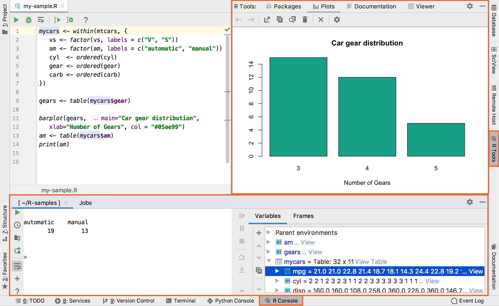

**R Tools** 窗口包含图、文档视图、R包以及 R Console。

## R Console

R Console 默认在底部栏。R Console 支持 `Ctrl+Space` 代码完成功能。

左侧栏命令功能：

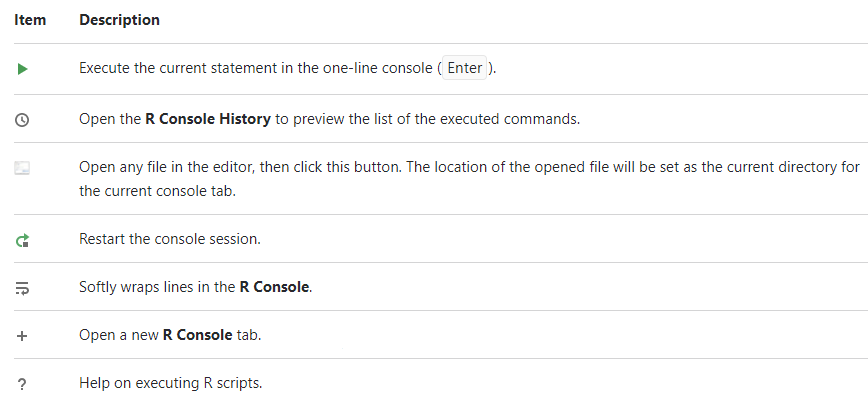

在 R console 中可以用 pipe 运算符 `%>%`，快捷键 `Ctrl+Shift+M`。

**Jobs** 显示运行的 R 脚本文件，可以查看运行情况。

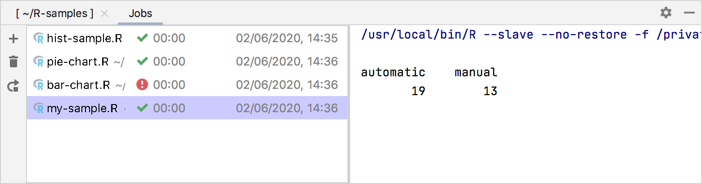

**Jobs** 工具栏如下：

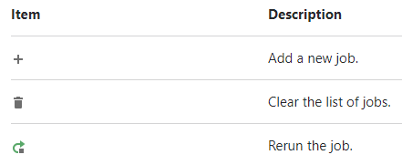

## Plots

R Tools 中的 **Plots** 栏用于预览图。

工具栏：

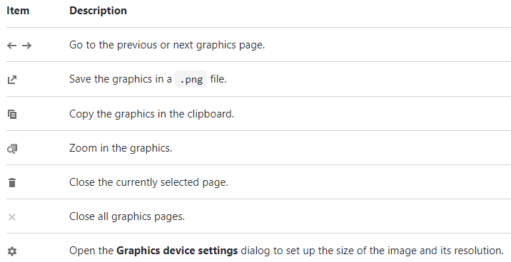

## Tables

对 **Variables** 视图中的表格数据，点击 **View Table** 可以在单独的窗口中预览数据。点击标题可以对数据排序：

工具栏：

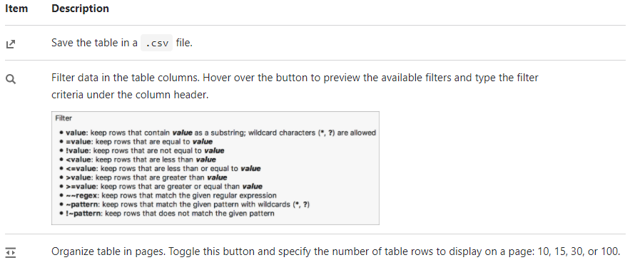

## Viewer

在 **Viewer** 栏中可以查看使用 JavaScript 可视化库创建的图。

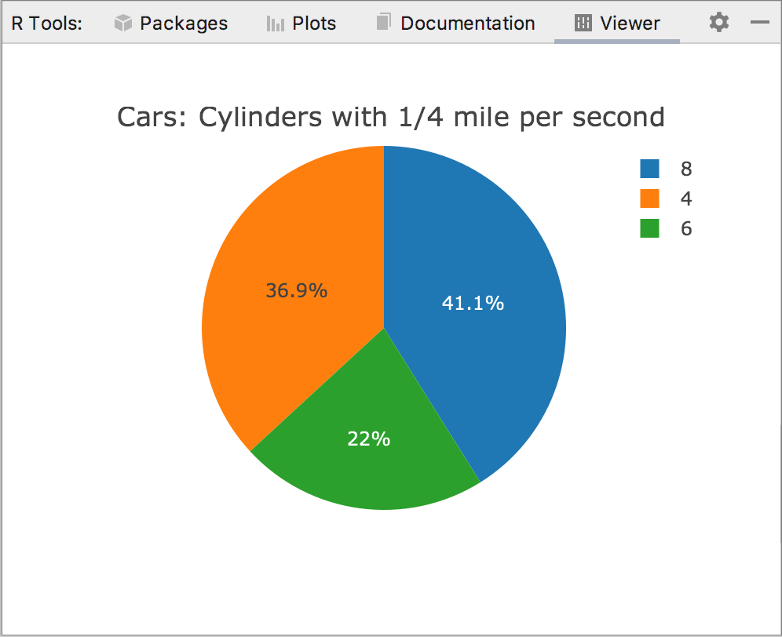

## R packages

用于安装、卸载以及更新 R 包。在其中列出已安装的所有 R 包：

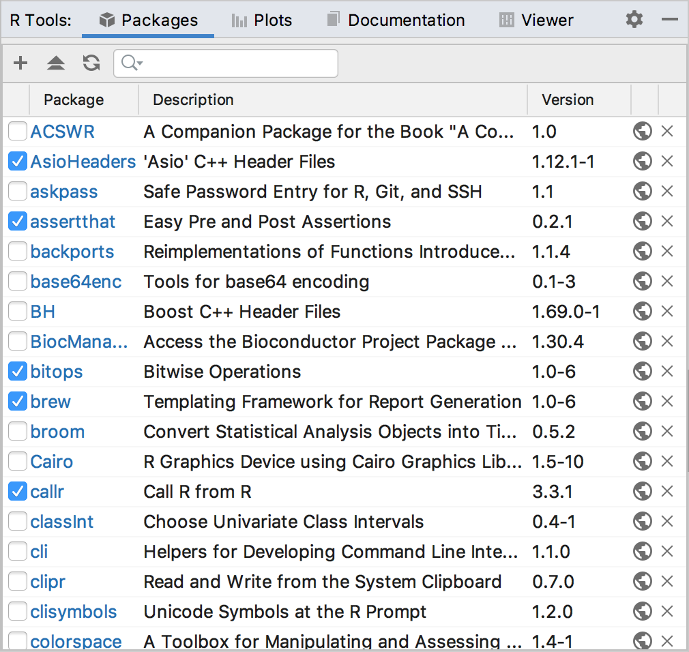

工具栏

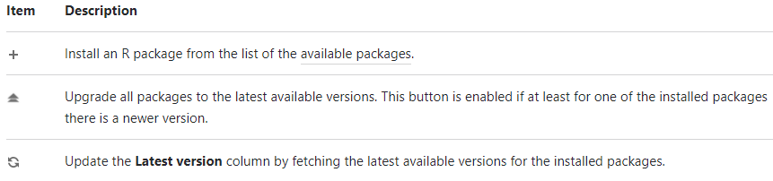

## R files toolbar

打开 R 文件后，在左上角会出现一个工具栏，用于运行和调试 R 代码。

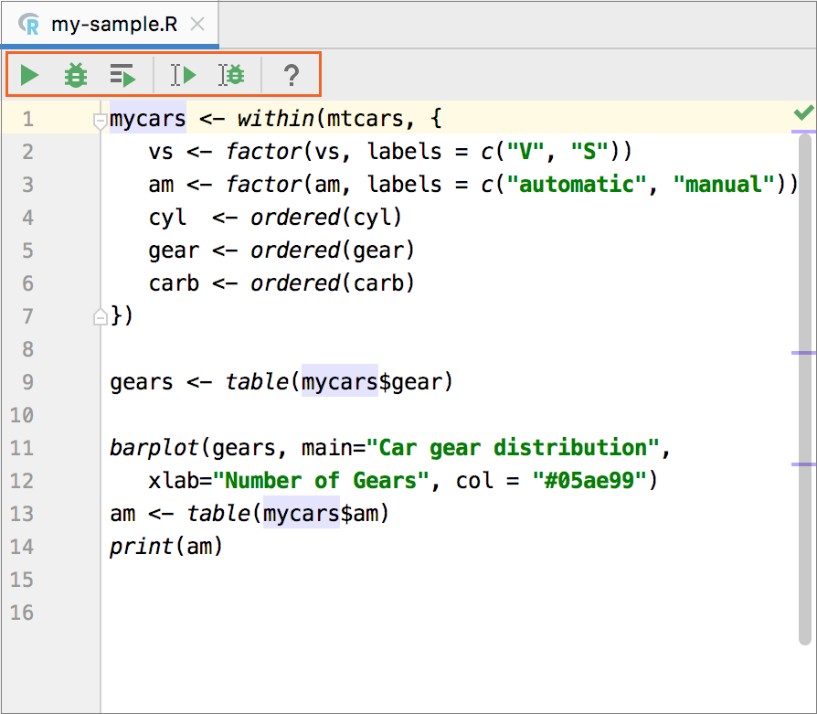

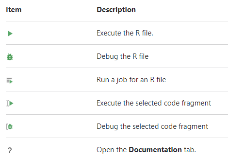

## Markdown toolbar

打开 `.rmd` 文件出现该工具栏。

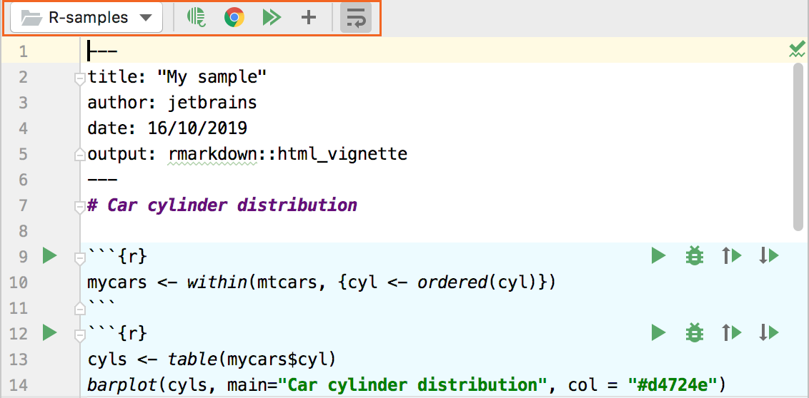

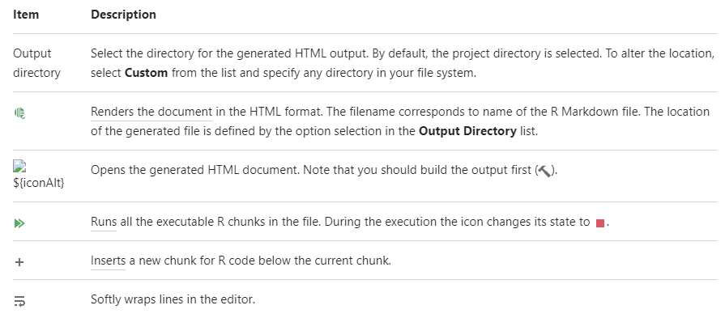

## References

- [https://www.jetbrains.com/help/pycharm/r-plugin-support.html#ui](https://www.jetbrains.com/help/pycharm/r-plugin-support.html#ui)
