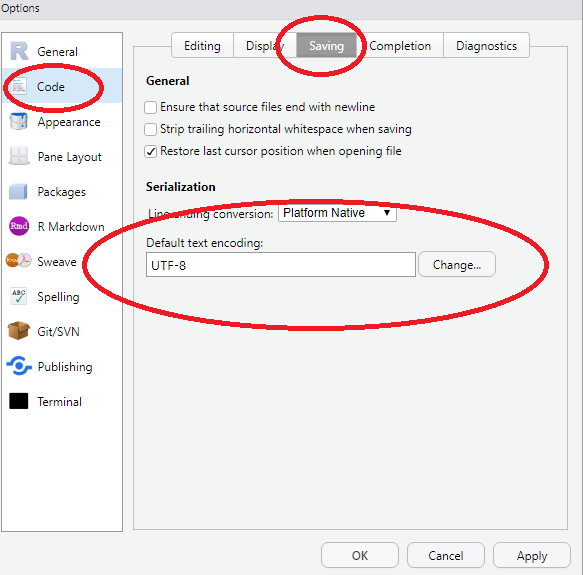

# RStudio

- [RStudio](#rstudio)
  - [使用技巧](#使用技巧)
    - [历史](#历史)
    - [放大某一个窗格](#放大某一个窗格)
    - [运行程序](#运行程序)
  - [快捷键](#快捷键)
    - [Console](#console)
    - [Source](#source)
    - [Editing (Console and Source)](#editing-console-and-source)
  - [设置编码](#设置编码)

2020-05-15, 18:45
*** *

## 使用技巧

### 历史

在控制台（命令行窗格）中， 除了可以用左右光标键移动光标位置， 用上下光标键调回以前运行过的命令， 还有一个重要的增强（以MS Windows操作系统为例）： 键入要运行的命令的前几个字母，如book， 按“Ctrl+向上光标键”， 就可以显示历史命令中以book开头的所有命令， 单击哪一个， 哪一个就自动复制到命令行。 这一技巧十分重要， 我们需要反复运行同一命令时， 这一方法让我们很容易从许多命令历史中找到所需的命令。

### 放大某一个窗格

当屏幕分辨率较低时， 将整个RStudio界面分为四个窗格会使得每个窗格都没有足够的显示精度。 为此， 可以将某个窗格放大到整个窗口区域， 需要使用其它窗格时再恢复到四个窗格的状态或者直接放大其它窗格到整个窗口区域。

使用菜单“View – Panes – Zoom Source”可以将编辑窗格放到最大， 在MS Windows下也可以使用快捷键`Ctrl+Shift+1`。 其它操作系统也有类似的快捷键可用。 使用菜单“View – Panes – Show All Panes”可以显示所有四个窗格。

`Ctrl+Alt+Shift+0` 显示所有窗格。

放大其它窗格也可以用“Ctrl + Shift + 数字”，数字与窗格的对应关系为：

1: 编辑窗格；
2: 控制台（Console）；
3: 帮助；
4: 历史；
5: 文件；
6: 图形；
7: 扩展包；
8: 已定义变量和函数；
9: 研究报告或网站结果显示。

### 运行程序

可以在命令行直接输入命令运行， 文字结果会显示在命令行窗口， 图形结果显示在“Plots”窗格中。

- 在命令行窗口（Console）中可以用左右光标键移动光标， 用上下光标键查找历史命令
- 输入命令的前几个字母后用“Ctrl+向上光标键”可以匹配地查找历史命令

一般情况下， 还是应该将R源程序保存在一个源程序文件中运行。 RStudio中“File – New File – R Script”可以打开一个新的无名的R源程序文件窗口供输入R源程序用。 输入一些程序后，保存文件， 然后点击“Source”快捷图标就可以运行整个文件中的所有源程序， 并会自动加上关于编码的选项。

编写R程序的正常做法是一边写一遍试验运行， 运行一般不是整体的运行而是写完一部分就运行一部分， 运行没有错误才继续编写下一部分。 在R源程序窗口中， 当光标在某一程序上的时候：

- 点击 “Run” 图标或者用快捷键 “Ctrl+Enter” 可以运行该行
- 选中若干程序行后， 点击 “Run” 图标或者用快捷键 “Ctrl+Enter” 可以运行这些行。

## 快捷键

### Console

| Description              | Windows & Linux | Mac           |
| ------------------------ | --------------- | ------------- |
| Move cursor to Console   | Ctrl+2          | Ctrl+2        |
| Clear console            | Ctrl+L          | Ctrl+L        |
| 光标到行首               | Home            | Command+Left  |
| 光标到行尾               | End             | Command+Right |
| Navigate command history | Up/Down         | Up/Down       |
| Popup command history    | Ctrl+Up         | Command+Up    |
| 中断执行的命令           | Esc             | Esc           |
| 修改工作目录             | Ctrl+Shift+H    | Ctrl+Shift+H  |

### Source

| Description                              | Windows             |
| ---------------------------------------- | ------------------- |
| Goto File/Function                       | Ctrl+.              |
| Move cursor to Source Editor             | Ctrl+1              |
| New document (except on Chrome/Windows)  | Ctrl+Shift+N        |
| New document (Chrome only)               | Ctrl+Alt+Shift+N    |
| Open document                            | Ctrl+O              |
| Save active document                     | Ctrl+S              |
| Close active document (except on Chrome) | Ctrl+W              |
| Close active document (Chrome only)      | Ctrl+Alt+W          |
| Close all open documents                 | Ctrl+Shift+W        |
| Preview HTML (Markdown and HTML)         | Ctrl+Shift+K        |
| Knit Document (knitr)                    | Ctrl+Shift+K        |
| Compile Notebook                         | Ctrl+Shift+K        |
| Compile PDF (TeX and Sweave)             | Ctrl+Shift+K        |
| Insert chunk (Sweave and Knitr)          | Ctrl+Alt+I          |
| Insert code section                      | Ctrl+Shift+R        |
| 运行-当前行/选择行                       | Ctrl+Enter          |
| 运行当前/选择行（光标位置不变）          | Alt+Enter           |
| Re-run previous region                   | Ctrl+Shift+P        |
| 运行-当前文件                            | Ctrl+Alt+R          |
| 从文件开头运行到当前行                   | Ctrl+Alt+B          |
| Run from current line to document end    | Ctrl+Alt+E          |
| Run the current function definition      | Ctrl+Alt+F          |
| Run the current code section             | Ctrl+Alt+T          |
| Run previous Sweave/Rmd code             | Ctrl+Alt+P          |
| Run the current Sweave/Rmd chunk         | Ctrl+Alt+C          |
| Run the next Sweave/Rmd chunk            | Ctrl+Alt+N          |
| Source a file                            | Ctrl+Shift+O        |
| Source the current document              | Ctrl+Shift+S        |
| Source the current document (with echo)  | Ctrl+Shift+Enter    |
| Fold Selected                            | Alt+L               |
| Unfold Selected                          | Shift+Alt+L         |
| Fold All                                 | Alt+O               |
| Unfold All                               | Shift+Alt+O         |
| Go to line                               | Shift+Alt+G         |
| Jump to                                  | Shift+Alt+J         |
| Switch to tab                            | Ctrl+Shift+.        |
| Previous tab                             | Ctrl+F11            |
| Next tab                                 | Ctrl+F12            |
| First tab                                | Ctrl+Shift+F11      |
| Last tab                                 | Ctrl+Shift+F12      |
| Navigate back                            | Ctrl+F9             |
| Navigate forward                         | Ctrl+F10            |
| Extract function from selection          | Ctrl+Alt+X          |
| Extract variable from selection          | Ctrl+Alt+V          |
| Reindent lines                           | Ctrl+I              |
| 注释/反注释当前/选择行                   | Ctrl+Shift+C        |
| Reflow Comment                           | Ctrl+Shift+/        |
| 格式化选择                               | Ctrl+Shift+A        |
| Show Diagnostics                         | Ctrl+Shift+Alt+P    |
| Transpose Letters                        | Ctrl+T              |
| 上下移动行                               | Alt+Up/Down         |
| 上下复制行                               | Shift+Alt+Up/Down   |
| Jump to Matching Brace/Paren             | Ctrl+P              |
| Expand to Matching Brace/Paren           | Ctrl+Shift+E        |
| Select to Matching Brace/Paren           | Ctrl+Shift+Alt+E    |
| Add Cursor Above Current Cursor          | Ctrl+Alt+Up         |
| Add Cursor Below Current Cursor          | Ctrl+Alt+Dow        |
| Move Active Cursor Up                    | Ctrl+Alt+Shift+Up   |
| Move Active Cursor Down                  | Ctrl+Alt+Shift+Down |
| Find and Replace                         | Ctrl+F              |
| Find Next                                | Win: F3             |
| Find Previous                            | Shift+F3            |
| Use Selection for Find                   | Ctrl+F3             |
| Replace and Find                         | Ctrl+Shift+J        |
| Find in Files                            | Ctrl+Shift+F        |
| Check Spelling                           | F7                  |

### Editing (Console and Source)

| Description                | Windows & Linux                          |
| -------------------------- | ---------------------------------------- |
| 撤销                       | Ctrl+Z                                   |
| Redo                       | Ctrl+Shift+Z                             |
| 剪切                       | Ctrl+X                                   |
| 复制                       | Ctrl+C                                   |
| 粘贴                       | Ctrl+V                                   |
| 全选                       | Ctrl+A                                   |
| 转到 Word                  | Ctrl+Left/Right                          |
| 转到开始/结尾              | Ctrl+Home/End or Ctrl+Up/Down            |
| 删除行                     | Ctrl+D                                   |
| Select                     | Shift+[Arrow]                            |
| Select Word                | Ctrl+Shift+Left/Right                    |
| Select to Line Start       | Alt+Shift+Left                           |
| Select to Line End         | Alt+Shift+Right                          |
| Select Page Up/Down        | Shift+PageUp/PageDown                    |
| Select to Start/End        | Ctrl+Shift+Home/End or Shift+Alt+Up/Down |
| 删除左边的词               | Ctrl+Backspace                           |
| Delete Word Right          | Option+Delete                            |
| Delete to Line End         | Ctrl+K                                   |
| Delete to Line Start       | Option+Backspace                         |
| Indent                     | Tab (at beginning of line)               |
| Outdent                    | Shift+Tab                                |
| Yank line up to cursor     | Ctrl+U                                   |
| Yank line after cursor     | Ctrl+K                                   |
| 插入选中文本               | Ctrl+Y                                   |
| Insert assignment operator | Alt+-                                    |
| 插入管道操作符             | Ctrl+Shift+M                             |
| 显示光标下函数的信息       | F1                                       |
| 显示光标下函数的源码       | F2                                       |
| 光标下符号的 usages  (C++) | Ctrl+Alt+U                               |

## 设置编码

在RStudio中新生成的R源程序、Rmd源文件一般自动用UTF-8编码。

点击RStudio的文件窗格中显示的源文件， 可以打开该源文件， 但是因为已有源文件的编码不一定与RStudio的默认编码一致， 可以会显示成乱码。 为此， RStdio提供了“File – Reopen with Encoding”命令， 我们主要试验其中GB18030和UTF-8两种选择一般就可以解决问题。 如果选择GB18030显示就没有乱码了， 最好再用菜单“File – Save with Encoding”并选择UTF-8将其保存为UTF-8编码。
