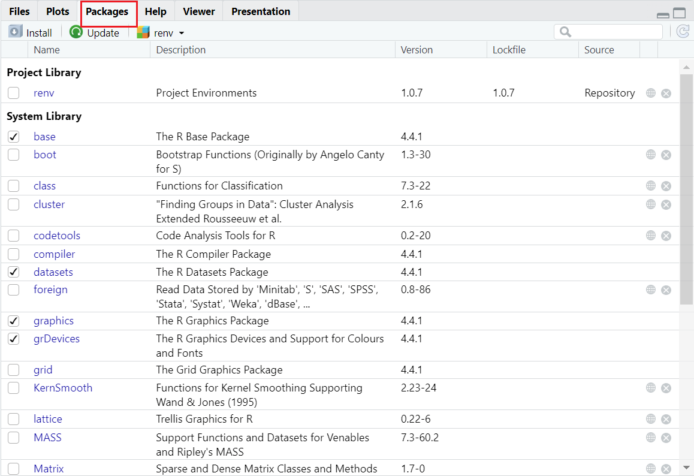
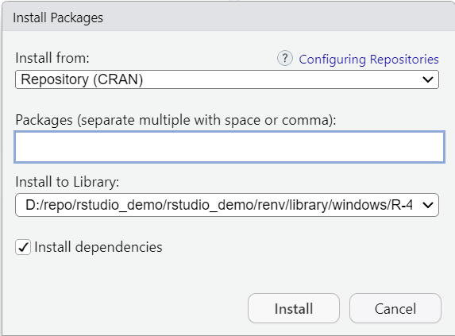
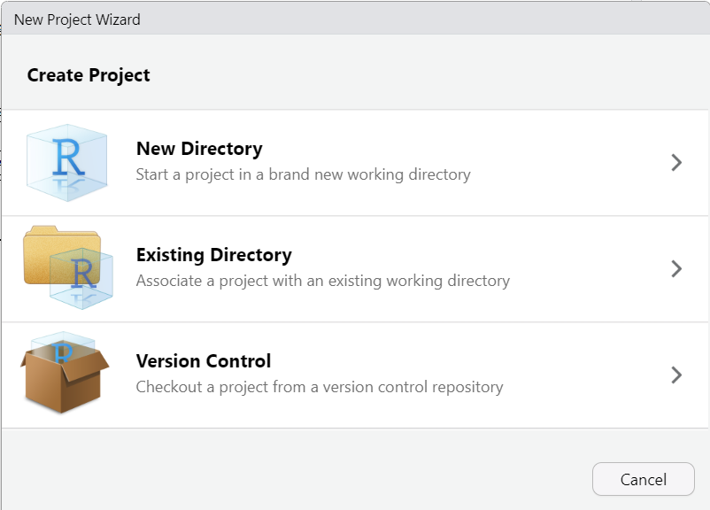
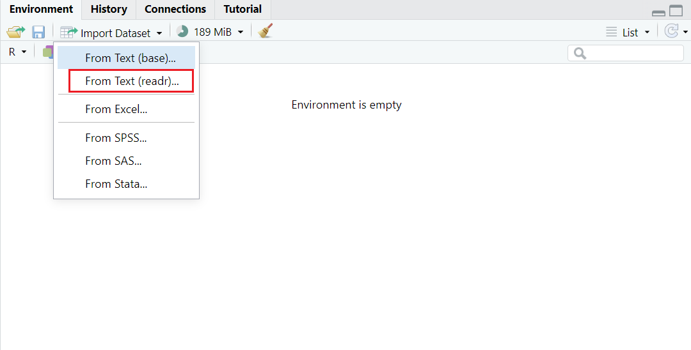
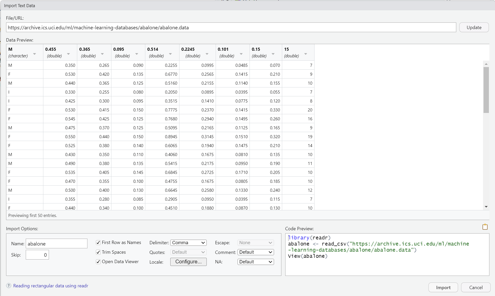

# RStudio 入门

2024-09-03⭐
@author Jiawei Mao
***
## 简介

R 是一个免费的软件工具，包含 R 编程语言和 R 环境。R 通过 CRAN（Comprehensive R Archive Network）发布，从 CRAN 可以下载 R 以及各种扩展包，从过 www.r-project.org 访问 CRAN。

R 环境又称为 repl (read-evaluate-print loop)，它提供一个基于文本的界面，在其中输入命令，R 引擎读取命令（read）、计算值（evaluate），输出结果（print），循环执行。

和 R 一样，RStudio 也是免费开源的，是 R 的集成开发环境（IDE），为 R 语言提供代码编写、编译、运行、测试以及版本控制等便捷工具。

## 安装 RStudio

RStudio 有两种版本：

- 桌面版
- 服务器版本：主要为 linux 服务器设计

安装简单，无须赘述。

## 安装 R 包

RStudio 右下角有一个 Packages 面板：



点击 **Update** 可以更新这些包。菜单栏 Tools -> Check for Package Updates... 也提供了相同功能。

点击 **Install** 安装新的包：

- 在 Packages 窗口内输入包的名称，在输入时，RStudio 会显示具有相似名称的包
- 选择所需包，按 Enter，RStudio 生成对应命令，将其复制到 console，执行命令



在 **Packages 面板**，勾选多许包，即完成加载。

## R 会话

### 创建 R 项目

首先创建 R 项目：**File | New Project**



选择目录后，将其命名为 hello_world。

导入数据集：



在 URL 中输入鲍鱼（abalone ）数据集链接：https://archive.ics.uci.edu/ml/machine-learning-databases/abalone/abalone.data，点击 **Update**。



在下面可以看到导入选项（Import Options），包括：

- 数据集名称
- 是否将第一行作为标题
- 是否去掉字段前后空格
- 分隔符
- ...

初始选项是 readr 自动推断，不一定正确，可以根据需要进行修改。比如上图中，需要去掉勾选 **First Row as Names**。

视图中间预览前 50 行数据。

最后，点击 **Import** 导入数据。

`readr` 读取数据，并创建名为 `abalone` 的 tibble 数据框。

下面设置 column 名称，并将数据框输出为 csv 文件：

```R
> names(abalone) <- c("Sex","Length","Diameter","Height","Whole weight"
+                     ,"Shucked weight","Viscera weight","Shell weight"
+                     ,"Rings")
> write_csv(abalone, "abalone.csv")
```

### 创建 R 脚本

File | New File | R Script 创建 R 脚本。

在脚本输入如下代码：

```R
abalone <- read.csv("abalone.csv") # 加载数据
table(abalone$Sex) # 计算 sex 频率
plot(Length ~ Sex, data=abalone) # 绘制 Length 相对 Sex 的 box plot
```

保存脚本文件，使用 `Ctrl+Shift+Enter` 运行脚本。