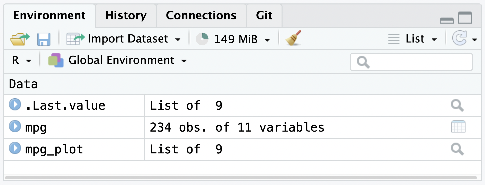
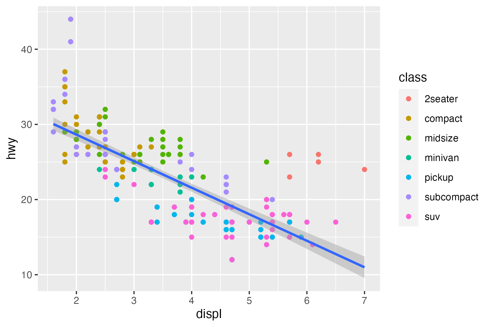
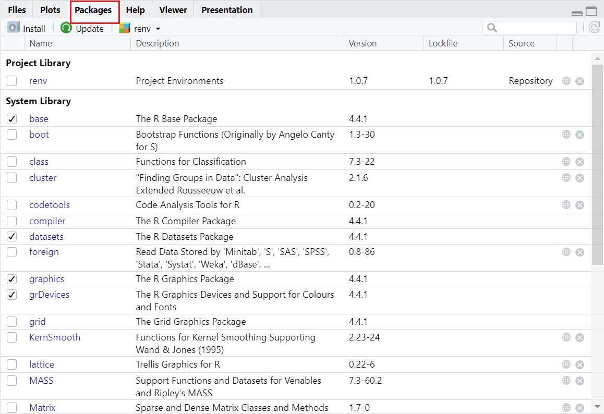
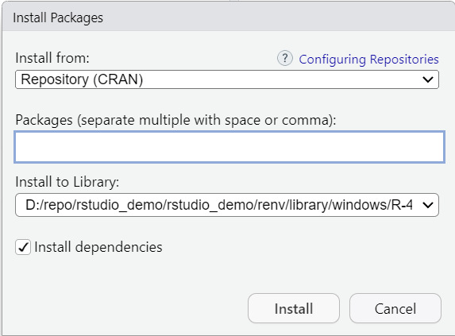

# RStudio 入门

2026-08-20：更新
2024-09-03⭐
@author Jiawei Mao

***
## 简介

R 是一个免费的软件工具，包含 R 编程语言和 R 环境。R 通过 CRAN（Comprehensive R Archive Network）发布，从 CRAN 可以下载 R 以及各种扩展包，从过 www.r-project.org 访问 CRAN。

R 环境又称为 repl (read-evaluate-print loop)，它提供一个基于文本的界面，在其中输入命令，R 引擎读取命令（read）、计算值（evaluate），输出结果（print），循环执行。

和 R 一样，RStudio 也是免费开源的，是 R 的集成开发环境（IDE），为 R 语言提供代码编写、编译、运行、测试以及版本控制等便捷工具。

RStudio 分为**开源版与商业版**，可在桌面端（Windows 11、macOS 14+、Linux）运行；也可通过浏览器连接 RStudio‑Server 或 Posit Workbench 进行网页访问。开源版与商业版 RStudio IDE 的开发均由 Posit Software, PBC（原名为 RStudio, PBC）提供支持。

RStudio 内置控制台、支持**语法高亮**且可直接运行代码的编辑器，同时配套一系列强大工具，用于绘图、历史记录查看、程序调试以及工作空间管理。

## 安装 RStudio

RStudio 有两种版本：

- 桌面版
- 服务器版本：主要为 linux 服务器设计

安装简单，无须赘述。下载位置：https://docs.posit.co/ide/user/#rstudio-ide-oss-downloads

## RStudio 界面

启动 RStudio 后，界面上会出现四个核心区域（也叫 “面板”）：

1. 源代码面板（Source pane）：用于编辑、保存  R 脚本，也可以编写 Quarto 和 R Markdown
2. 控制台面板（Console pane）：用来输入简短的交互式 R 命令
3. 环境面板（Environment pane）：显示当前 R 会话运行过程中创建的临时 R 对象
4. 输出面板（Output pane）：展示代码运行生成的图片、表格、HTML 结果，同时可以查看磁盘上存储的文件


## 空白初始环境

退出 R 时，不将工作空间保存到 .Rdata 文件；启动 R 时，不从 .Rdata 文件重新加载工作空间。每次重启都清空 R 的内存，能够显著提升代码长期可复现性。以干净空白的环境启动，可以及时反馈运行问题，促使你写出完整、自包含的脚本。

在 RStudio 中可通过 `Tools > Global Options` 完成该项设置：取消勾选  “Restore .RData into Workspace at Startup”，并在 “Save workspace to .RData on exit” 选项中选择  **Never**。


## Hello RStudio

下面通过示例介绍如何借助 R 语言的 **ggplot2** 程序包与 RStudio 完成基础的数据可视化。

`ggplot2` 属于 tidyverse 工具包生态中的一员。tidyverse 是一套带有统一设计理念的 R 程序包合集，专为数据科学打造。所有包遵循相同的底层设计思想、语法体系以及数据结构规范。

### 创建 RStudio 项目

RStudio 项目能够便捷地将你的工作划分为多个独立工作环境，每个项目拥有独立的工作目录、工作空间、命令历史记录以及源代码文件。

在 RStudio 中新建项目，点击菜单：**File > New Project**。

在弹出的新建项目向导中，依次选择 **New Directory** → **New Project**。将项目命名为 `hello‑ggplot2`，随后点击 **Create Project** 按钮。

此时 RStudio 将切换至新项目环境，所有文件存放于在新建的 `hello‑ggplot2` 文件夹内。

RStudio 项目为你提供一套稳健的工作流程，长期使用将受益匪浅：

- 每一项数据分析任务单独创建一个 RStudio 项目。
- 将数据文件存放于项目文件夹中，后续会讲解如何将数据载入 R。
- 在项目内编写脚本；可分段运行代码或者完整执行整个脚本。
- 将输出结果（绘图、清洗后的数据）保存到项目目录。
- 所有相关文件集中存放，并且和你其他的分析项目完全隔离开，互不干扰。

### Hello ggplot2

R 语言拥有许多绘图系统，而 ggplot2 是其中最为优雅、功能也最为全面的绘图工具之一。

接下来我们使用 ggplot2 在 R 中绘制一张基础图形。

- 在 R 控制台运行下方代码，安装 ggplot2 扩展包

```R
install.packages("ggplot2")
```

程序包仅需安装一次，但是每次开启新的 R 会话时，都需要使用 `library()` 函数将其加载进来。

- 在 RStudio 中，通过菜单「File Menu > New File > R Script」创建一个全新的 `.R` 文件，并将其命名为 `ggplot2.R`。

`ggplot2.R` 文件将会在**源代码面板**中打开，该面板默认位于窗口的左上角。

由于已经安装了 ggplot2，因此可以在 `ggplot2.R` 脚本的第一行写入下面这段代码，为当前会话加载 ggplot2 程序包。

```R
library(ggplot2)
```

`library()` 函数用于加载指定的 R 程序包（本例为 ggplot2），加载后你就可以调用该包内部提供的各类函数。对 ggplot2 而言，它内置了大量函数，能够在 R 中绘制实用且精美的图表。

若要在 R 控制台中运行这段代码，可以将光标定位到对应的代码行，然后点击 RStudio 中的「运行」按钮，或者使用快捷键 `Ctrl + Enter`（Mac 系统为 `Cmd + Enter`）。

### 加载数据

下面通过绘图来探究一个问题：**大排量发动机汽车是否比小排量汽车消耗更多燃油？**

使用 ggplot2 内置数据集 `mpg`。**数据框（data frame）**是一种矩形数据表：

- 列代表变量（variable）
- 行代表样本（observations）

`mpg` 数据集包含美国环境保护署采集的 38 款车型的观测数据。

我们可以使用赋值运算符 `<-`，将该数据框临时保存为 R 对象并在环境面板中显示。环境面板内的对象仅在当前会话期间有效，重启 R 或 RStudio 之后便会消失。

对于 R 新手来说，你可以把环境（也就是环境面板列出的对象）看作真实的数据来源。但从长期来看，把 **R 脚本当作真正可信的数据源**会更可靠。依靠脚本和原始数据文件，你随时可以重新生成环境里的所有对象；可反过来，你却很难仅凭内存环境反向复原出完整的 R 脚本。

```R
mpg <- ggplot2::mpg
```

### 显示数据

可以使用如下代码查看 `mpg` 数据框的前几行内容：

```R
> head(mpg)
  manufacturer model displ year cyl      trans drv cty hwy fl   class
1         audi    a4   1.8 1999   4   auto(l5)   f  18  29  p compact
2         audi    a4   1.8 1999   4 manual(m5)   f  21  29  p compact
3         audi    a4   2.0 2008   4 manual(m6)   f  20  31  p compact
4         audi    a4   2.0 2008   4   auto(av)   f  21  30  p compact
5         audi    a4   2.8 1999   6   auto(l5)   f  16  26  p compact
6         audi    a4   2.8 1999   6 manual(m5)   f  18  26  p compact
```

`mpg` 数据集包含以下变量：

- `displ`：汽车发动机排量，单位为升。
- `hwy`：汽车在高速公路上的燃油效率，单位为英里 / 加仑（miles per gallon, mpg）。行驶相同距离时，燃油效率越低的汽车，耗油量越高。

如果想要以电子表格的形式浏览查看这份数据，可以使用 `View()` 函数：

```R
View(mpg)
```

该命令会在源代码面板中打开一个标题为「mpg」的新标签页。你可以在此处交互式浏览数据。如需回到 `ggplot2.R` 脚本文件，点击源代码面板里的 `ggplot2.R` 标签即可。


### 绘制图表

接下来，在源代码面板的 `ggplot2.R` 文件中，输入下面这段代码：

```R
mpg_plot <- ggplot(data = mpg, mapping = aes(x = displ, y = hwy)) +
  geom_point(mapping = aes(colour = class)) +
  geom_smooth(method = "lm", formula = "y ~ x")
```

可以点击「Run」按钮，或是使用快捷键（`Ctrl + Enter`，Mac 系统为`Cmd + Enter`）执行这段代码。请注意，这里使用 `<-` 赋值运算符，将这幅绘图保存到 `mpg_plot` 对象中。此时你就可以在右上角的环境面板看到 `mpg_plot` 对象。



### 输出图表

如果要在输出面板中显示绘制好的图形，可以再添加一行代码并运行：

```R
mpg_plot
```

随后图表就会显示在输出面板的「绘图 (Plots)」标签页中。



该图显示发动机排量（`displ`）与燃油效率（`hwy`）之间呈负相关关系。换言之，小排量汽车燃油效率更高；总体来看，随着发动机排量增大，燃油效率随之下降。

### 保存图表

最后，我们可以将图片保存下来！你既可以使用下面的 ggplot2 代码将图片保存至本地磁盘，也可以点击绘图面板上的「导出 (Export)」按钮。

```R
ggsave("my-first-plot.png", plot = mpg_plot, height = 4, width = 6)
```

文件已经保存到本地磁盘，你只需从「绘图 (Plot)」标签页切换到「文件 (Files)」标签页，就可以找到它；这两个标签页默认都位于输出面板中。

如果你还没有保存 `ggplot2.R` 文件，这时也应当保存。在「Files」标签页中可以找到导出的图片文件 `my‑first‑plot.png`；如果 `ggplot2.R` 也存放在同一个文件夹下。

> [!NOTE]
>
> 依靠你的 R 脚本与数据文件，你就可以重新生成这个临时会话环境！

为验证这一点，保存好 `ggplot2.R` 文件后，你可以通过 RStudio 菜单栏重启会话：**会话 (Session) > 重启 R (Restart R)**。即便在这个全新的环境中，只要重新运行源代码并加载相同的数据，就可以再次绘制出这幅图表！

## 结语

尽管本次实操练习看似简单，但我们已经学到了不少关于 RStudio 的知识：

RStudio 包含 4 个核心面板，用于开展数据分析工作：

- **源代码面板（Source Pane）**：用来编写较长的脚本，可逐行运行代码并保存至本地磁盘。
- **控制台面板（Console Pane）**：用于交互式运行简短代码。
- **环境面板（Environment Pane）**：临时存放当前会话创建的各类对象。
- **输出面板（Output Pane）**：内置「绘图 (Plot)」标签页（展示图形）和「文件 (Files)」标签页（浏览源代码与输出结果文件）。

如果你想要深入学习 ggplot2 以及 tidyverse 生态的其他工具，可以参考《R for Data Science》。该书既有纸质印刷版，也有完全免费的[在线网页版](https://r4ds.hadley.nz/)。

## 安装 R 包（GUI）

RStudio 右下角有一个 Packages 面板：



点击 **Update** 可以更新这些包。菜单栏 Tools -> Check for Package Updates... 也提供了相同功能。

点击 **Install** 安装新的包：

- 在 Packages 窗口内输入包的名称，在输入时，RStudio 会显示具有相似名称的包
- 选择所需包，按 Enter，RStudio 生成对应命令，将其复制到 console，执行命令



在 **Packages 面板**，勾选多许包，即完成加载。

## 参考

- https://docs.posit.co/ide/user/