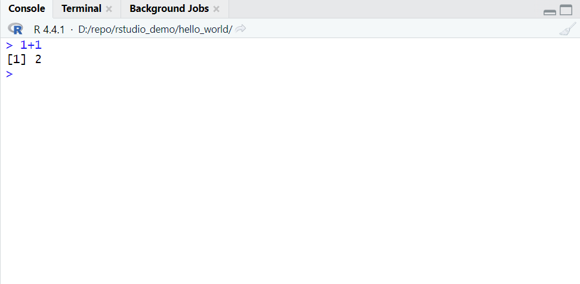

# 编写 R 脚本

## RStudio GUI 介绍

下面介绍 R Studio 的四个主要面板：

- source editor 和 data viewer：这个面板可以容纳许多选项卡，每个选项卡包含一个打开的源码文件或一个数据框视图。
- history 和 environment
- R console
- Files, Plots, Packages, Help, Viewer

除了鼠标点击，还可以使用快捷键在不同面板跳转。快捷键都是 Ctrl+数字 组合，具体参考 [RStudio 快捷键](./rstudio_keys.md)。

## R console

console 是执行 R 命令的最前线，可以直接在 console 输入命令。



console 窗口顶部有三个按钮：

- 顶部右侧：最小化和最大化按钮
- Console 下方：当前工作目录，点击目录右侧的箭头，可以在 Files 面板跳转到工作目录

在 console **执行命令**：在提示符 `>` 后输入命令，回车执行。

```R
> 100:130
 [1] 100 101 102 103 104 105 106 107 108 109 110 111 112 113 114 115 116 117 118
[20] 119 120 121 122 123 124 125 126 127 128 129 130
```

输出 `[1]` 表示这一行的第一个元素是所有元素的第一个，`[20]` 表示第二行的第一个元素是所有元素的第 20 个。

> [!NOTE]
>
> `:` 输出整数序列，100:130 输出 100 到 130（包含）的所有数字。
>
> R 是动态语言，不编译代码。

如果输入命令不完整，按 Enter，R 会显示 `+` 提示符，表示等待输入命令的余下部分。此时可以选择：

- 按 Escape 重新开始
- 完善命令，按 Enter 运行

> [!NOTE]
>
> 取消执行：Ctrl+c

## Source editor

